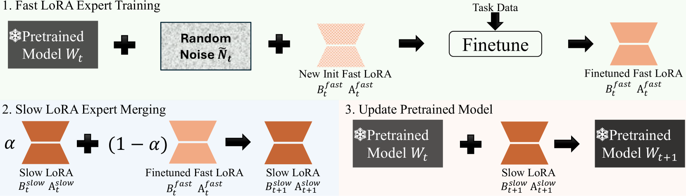
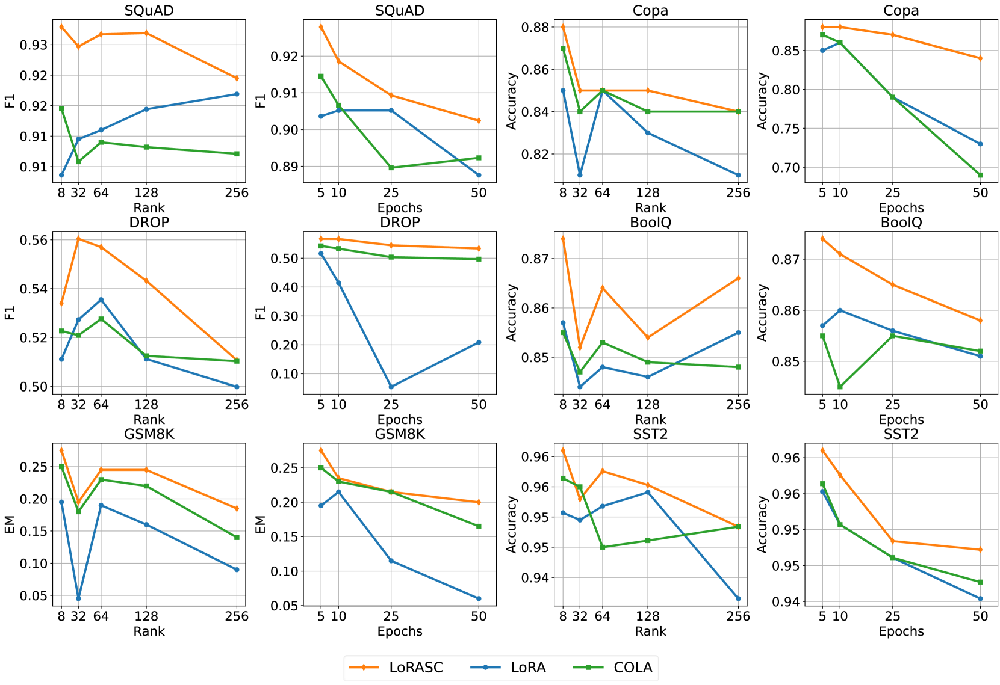

# 通过缓慢级联学习，实现大型模型的低秩适应，兼具表达性与泛化能力。

发布时间：2024年07月01日

`LLM理论` `人工智能` `机器学习`

> Expressive and Generalizable Low-rank Adaptation for Large Models via Slow Cascaded Learning

# 摘要

> 在现代大型模型中，高效微调至关重要，而低秩适应方法尤为引人注目。然而，现有LoRA方法存在表达力不足、易过拟合及对超参数敏感等问题。为此，我们创新性地提出了LoRA慢级联学习（LoRASC）技术，旨在提升LoRA的表达与泛化能力，同时保持高效训练。通过级联学习策略，我们实现了混合低秩适应，增强了模型捕捉复杂模式的能力。此外，引入的慢-快更新机制和级联噪声调整进一步强化了泛化性能。实验结果显示，LoRASC不仅大幅超越现有方法，还显著改善了过拟合、模型稳定性和OOD鲁棒性。相关代码即将在GitHub上发布。

> Efficient fine-tuning plays a fundamental role in modern large models, with low-rank adaptation emerging as a particularly promising approach. However, the existing variants of LoRA are hampered by limited expressiveness, a tendency to overfit, and sensitivity to hyperparameter settings. This paper presents LoRA Slow Cascade Learning (LoRASC), an innovative technique designed to enhance LoRA's expressiveness and generalization capabilities while preserving its training efficiency. Our approach augments expressiveness through a cascaded learning strategy that enables a mixture-of-low-rank adaptation, thereby increasing the model's ability to capture complex patterns. Additionally, we introduce a slow-fast update mechanism and cascading noisy tuning to bolster generalization. The extensive experiments on various language and vision datasets, as well as robustness benchmarks, demonstrate that the proposed method not only significantly outperforms existing baselines, but also mitigates overfitting, enhances model stability, and improves OOD robustness. Code will be release in https://github.com/microsoft/LoRASC very soon.

[Arxiv](https://arxiv.org/abs/2407.01491)