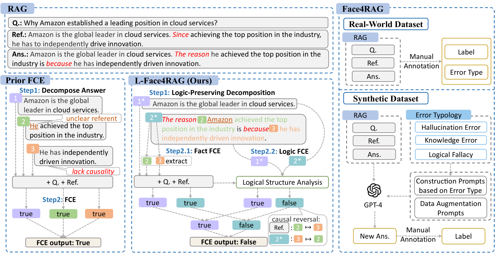
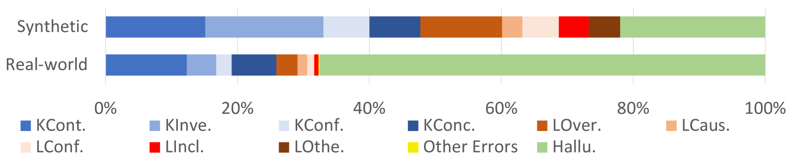
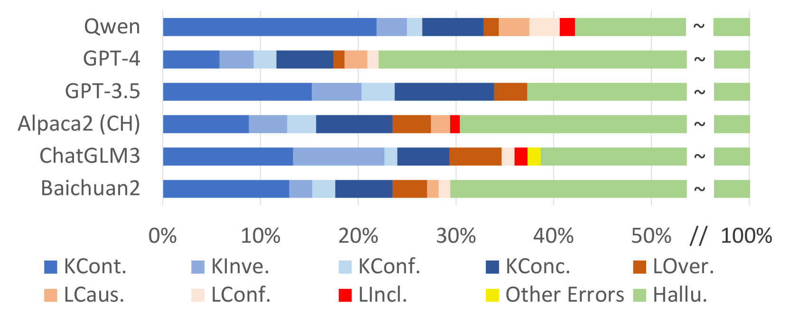
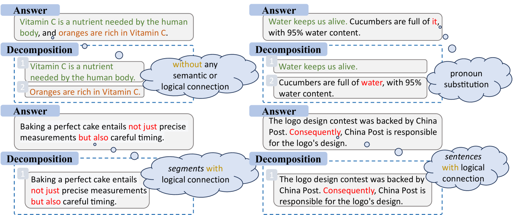
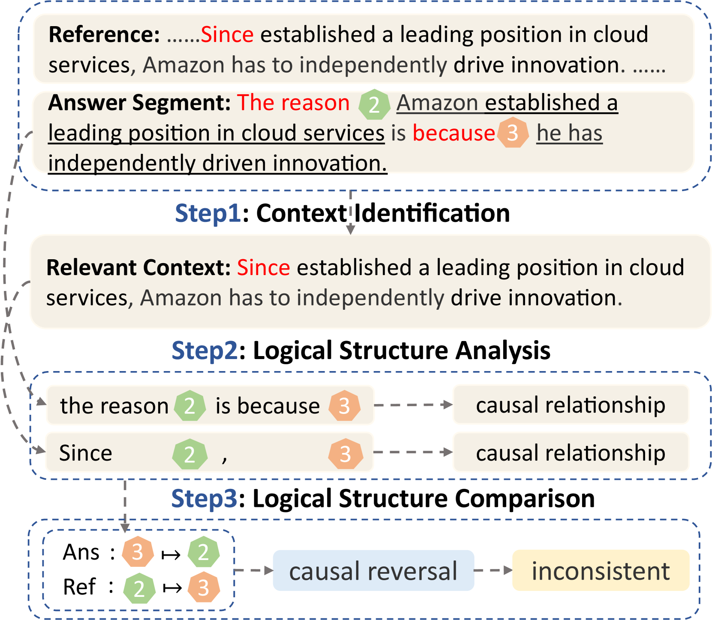

# Face4RAG：评估中文检索增强生成的事实一致性工具

发布时间：2024年07月01日

`RAG` `人工智能`

> Face4RAG: Factual Consistency Evaluation for Retrieval Augmented Generation in Chinese

# 摘要

> 传统RAG模型中常见的事实不一致错误，催生了事实一致性评估（FCE）的研究。尽管已有多种FCE方法，但它们仅在特定LLM生成的数据集上评估，缺乏全面基准，导致这些方法在其他LLM或新错误类型上的表现未被探索。为此，我们提出了首个独立于LLM的RAG事实一致性评估基准Face4RAG，包含合成与真实数据集，支持特定错误类型与真实分布的评估。我们发现现有FCE方法无法识别逻辑谬误，即答案与参考间的逻辑结构不匹配。为此，我们提出了L-Face4RAG方法，通过逻辑保持答案分解与事实逻辑FCE设计，显著提升了事实不一致检测的性能，超越了最初的RAG任务。基准与方法均已公开。

> The prevailing issue of factual inconsistency errors in conventional Retrieval Augmented Generation (RAG) motivates the study of Factual Consistency Evaluation (FCE). Despite the various FCE methods proposed earlier, these methods are evaluated on datasets generated by specific Large Language Models (LLMs). Without a comprehensive benchmark, it remains unexplored how these FCE methods perform on other LLMs with different error distributions or even unseen error types, as these methods may fail to detect the error types generated by other LLMs. To fill this gap, in this paper, we propose the first comprehensive FCE benchmark \emph{Face4RAG} for RAG independent of the underlying LLM. Our benchmark consists of a synthetic dataset built upon a carefully designed typology for factuality inconsistency error and a real-world dataset constructed from six commonly used LLMs, enabling evaluation of FCE methods on specific error types or real-world error distributions. On the proposed benchmark, we discover the failure of existing FCE methods to detect the logical fallacy, which refers to a mismatch of logic structures between the answer and the retrieved reference. To fix this issue, we further propose a new method called \emph{L-Face4RAG} with two novel designs of logic-preserving answer decomposition and fact-logic FCE. Extensive experiments show L-Face4RAG substantially outperforms previous methods for factual inconsistency detection on a wide range of tasks, notably beyond the RAG task from which it is originally motivated. Both the benchmark and our proposed method are publicly available.\footnote{\url{https://huggingface.co/datasets/yq27/Face4RAG}\label{link_face4rag}}

[Arxiv](https://arxiv.org/abs/2407.01080)