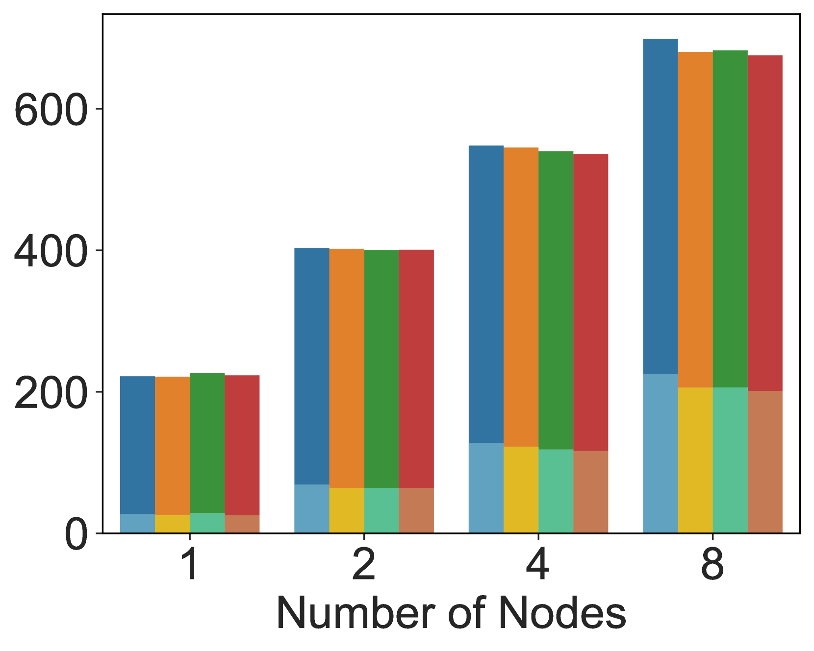
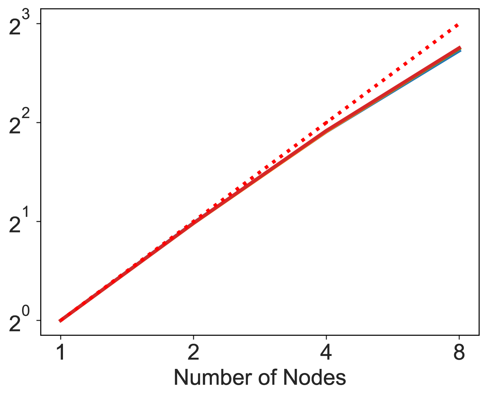
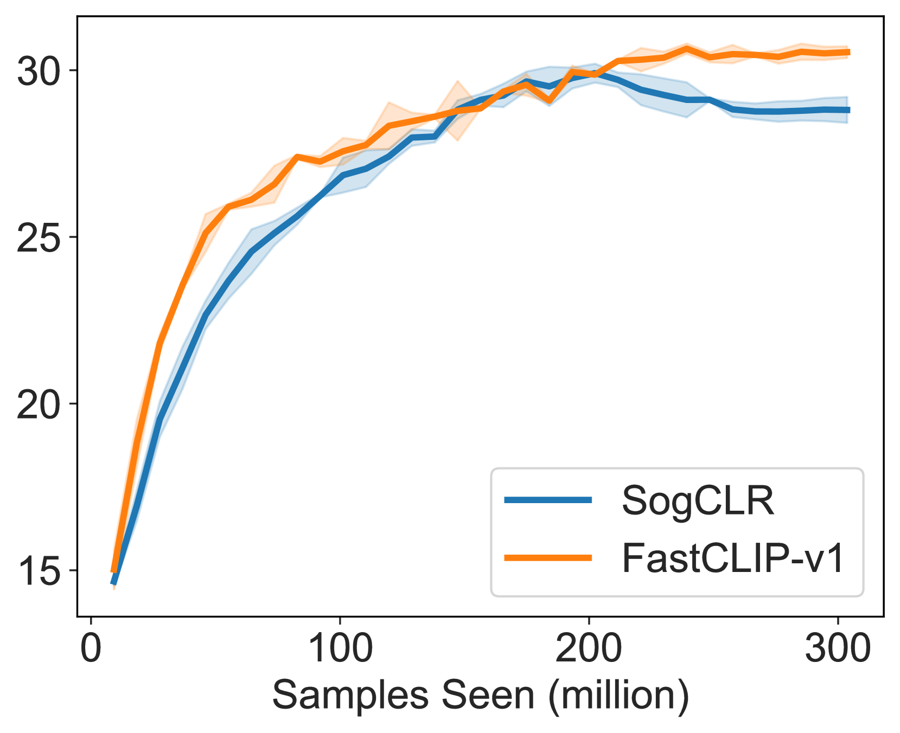
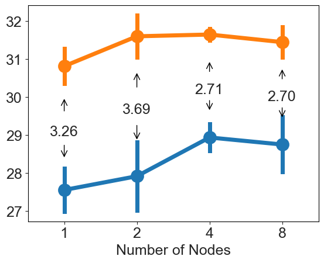

# FastCLIP：一套优化技术，专为在资源有限的情况下加速 CLIP 训练而设计

发布时间：2024年07月01日

`LLM应用` `计算机科学` `人工智能`

> FastCLIP: A Suite of Optimization Techniques to Accelerate CLIP Training with Limited Resources

# 摘要

> 现有研究在大型数据集上训练CLIP模型需要大量GPU资源，这对大多数人来说难以企及。尽管组合优化技术已证明能有效减少对大批次的需求，但它们在大规模数据上的性能仍有待优化。本文探讨了在有限资源下进行CLIP训练的多个方面。我们提出了FastCLIP框架，该框架基于先进的组合优化技术，专为分布式环境设计，通过高效的梯度减少策略降低通信开销。此外，我们从优化角度研究了框架的关键组成部分，以进一步提升训练效率。实验结果显示，FastCLIP在资源有限的环境中显著优于现有基准。FastCLIP的代码已公开发布，供进一步研究和应用。

> Existing studies of training state-of-the-art Contrastive Language-Image Pretraining (CLIP) models on large-scale data involve hundreds of or even thousands of GPUs due to the requirement of a large batch size. However, such a large amount of resources is not accessible to most people. While advanced compositional optimization techniques for optimizing global contrastive losses have been demonstrated effective for removing the requirement of large batch size, their performance on large-scale data remains underexplored and not optimized. To bridge the gap, this paper explores several aspects of CLIP training with limited resources (e.g., up to tens of GPUs). First, we introduce FastCLIP, a general CLIP training framework built on advanced compositional optimization techniques while designed and optimized for the distributed setting. Our framework is equipped with an efficient gradient reduction strategy to reduce communication overhead. Second, to further boost training efficiency, we investigate three components of the framework from an optimization perspective: the schedule of the inner learning rate, the update rules of the temperature parameter and the model parameters, respectively. Experiments on different strategies for each component shed light on how to conduct CLIP training more efficiently. Finally, we benchmark the performance of FastCLIP and the state-of-the-art training baseline (OpenCLIP) on different compute scales up to 32 GPUs on 8 nodes, and three data scales ranging from 2.7 million, 9.1 million to 315 million image-text pairs to demonstrate the significant improvement of FastCLIP in the resource-limited setting. We release the code of FastCLIP at https://github.com/Optimization-AI/fast_clip .

[Arxiv](https://arxiv.org/abs/2407.01445)