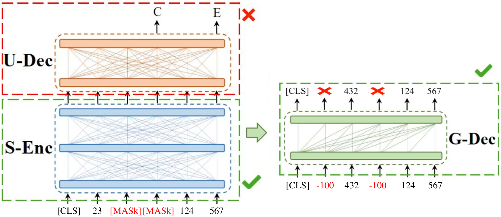

# 2023年全球AI技术创新大赛第一赛道冠军方案

发布时间：2024年07月01日

`LLM应用` `人工智能`

> First Place Solution of 2023 Global Artificial Intelligence Technology Innovation Competition Track 1

# 摘要

> 本文介绍了我们在全球人工智能技术创新竞赛第一赛道——医学影像诊断报告生成中的冠军方案。我们选用CPT-BASE作为基础模型，在预训练阶段，我们摒弃了传统的掩码语言建模，转而采用跨度掩码策略，逐步提升掩码比例，进行去噪自编码预训练。微调阶段，我们创新性地引入了迭代检索增强和噪声感知相似度桶提示策略，构建迷你知识库，丰富模型输入，同时通过相似度桶精准识别噪声，引导模型生成更优质的诊断报告。最终，我们的单模型在A榜上斩获2.321分，多模型融合更是在A、B榜上分别取得2.362和2.320的高分，稳居榜首。

> In this paper, we present our champion solution to the Global Artificial Intelligence Technology Innovation Competition Track 1: Medical Imaging Diagnosis Report Generation. We select CPT-BASE as our base model for the text generation task. During the pre-training stage, we delete the mask language modeling task of CPT-BASE and instead reconstruct the vocabulary, adopting a span mask strategy and gradually increasing the number of masking ratios to perform the denoising auto-encoder pre-training task. In the fine-tuning stage, we design iterative retrieval augmentation and noise-aware similarity bucket prompt strategies. The retrieval augmentation constructs a mini-knowledge base, enriching the input information of the model, while the similarity bucket further perceives the noise information within the mini-knowledge base, guiding the model to generate higher-quality diagnostic reports based on the similarity prompts. Surprisingly, our single model has achieved a score of 2.321 on leaderboard A, and the multiple model fusion scores are 2.362 and 2.320 on the A and B leaderboards respectively, securing first place in the rankings.

[Arxiv](https://arxiv.org/abs/2407.01271)