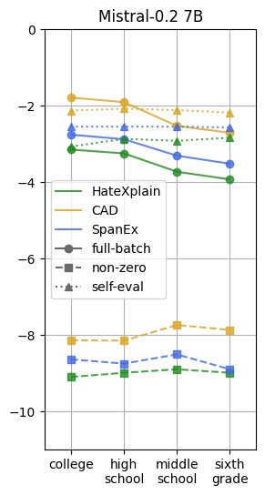

# 在可读性控制下生成自由文本理由

发布时间：2024年07月01日

`LLM应用` `人工智能`

> Free-text Rationale Generation under Readability Level Control

# 摘要

> 自由文本理由以自然语言阐释模型决策，因此在多种任务的解释方法中备受欢迎且易于理解。然而，其有效性可能因误解和幻觉而受限。我们通过扰动测试探究了大型语言模型（LLM）在可读性水平控制下，即针对特定专业水平（如六年级或大学）提供理由时，如何执行自然语言解释（NLE）任务。研究发现，解释能适应指令，但请求的可读性与文本复杂性常不匹配。质量评估显示，LLM对理由的评价与NLG中的偏好模式相似。人类评估则表明，各可读性水平的理由普遍令人满意，高中水平尤为受欢迎。

> Free-text rationales justify model decisions in natural language and thus become likable and accessible among approaches to explanation across many tasks. However, their effectiveness can be hindered by misinterpretation and hallucination. As a perturbation test, we investigate how large language models (LLMs) perform the task of natural language explanation (NLE) under the effects of readability level control, i.e., being prompted for a rationale targeting a specific expertise level, such as sixth grade or college. We find that explanations are adaptable to such instruction, but the requested readability is often misaligned with the measured text complexity according to traditional readability metrics. Furthermore, the quality assessment shows that LLMs' ratings of rationales across text complexity exhibit a similar pattern of preference as observed in natural language generation (NLG). Finally, our human evaluation suggests a generally satisfactory impression on rationales at all readability levels, with high-school-level readability being most commonly perceived and favored.

[Arxiv](https://arxiv.org/abs/2407.01384)