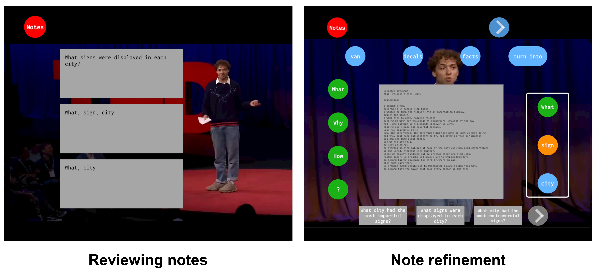
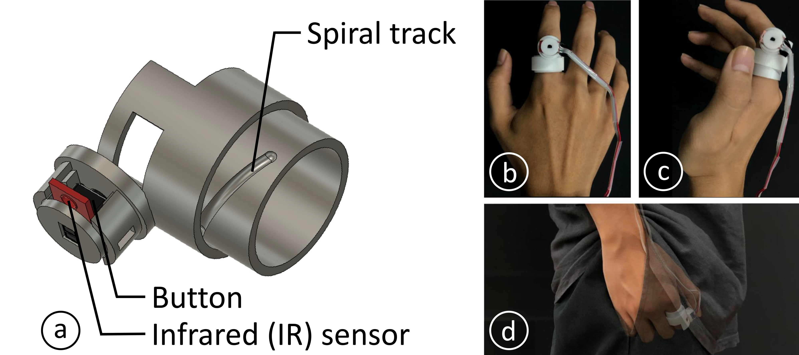
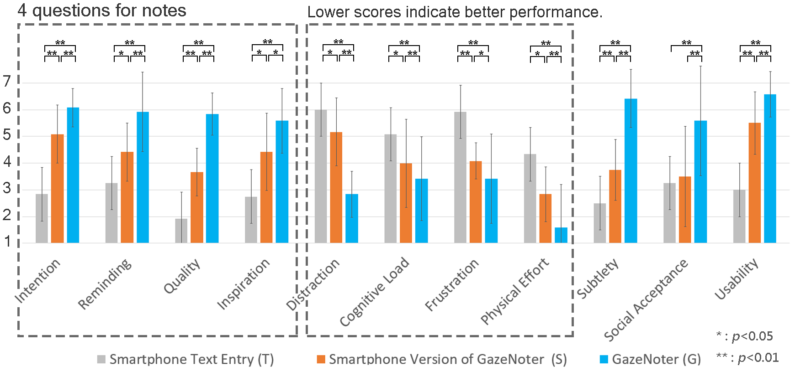

# GazeNoter：一种协同增强现实笔记工具，通过目光选择大型语言模型建议，精准匹配用户意图。

发布时间：2024年07月01日

`LLM应用` `增强现实`

> GazeNoter: Co-Piloted AR Note-Taking via Gaze Selection of LLM Suggestions to Match Users' Intentions

# 摘要

> 在演讲和讨论中，记笔记不仅有助于后续的总结和整理，还能在问答环节中实时提醒问题和意见，或在讨论中及时表达观点。然而，在智能手机上手动打字记笔记可能会分散注意力，增加认知负担。尽管大型语言模型（LLM）能自动生成总结和重点，但缺乏用户互动可能导致AI生成的内容与用户意图不符。为此，我们设计了GazeNoter，一个AI辅助的增强现实（AR）系统，用户通过AR头显上的注视快速选择LLM生成的建议，实现实时笔记记录。GazeNoter让用户能快速调整LLM输出，形成一个包含用户的AI系统，适用于各种笔记场景。我们通过两项用户研究，验证了GazeNoter在静态和移动条件下的实用性。

> Note-taking is critical during speeches and discussions, serving not only for later summarization and organization but also for real-time question and opinion reminding in question-and-answer sessions or timely contributions in discussions. Manually typing on smartphones for note-taking could be distracting and increase cognitive load for users. While large language models (LLMs) are used to automatically generate summaries and highlights, the content generated by artificial intelligence (AI) may not match users' intentions without user input or interaction. Therefore, we propose an AI-copiloted augmented reality (AR) system, GazeNoter, to allow users to swiftly select diverse LLM-generated suggestions via gaze on an AR headset for real-time note-taking. GazeNoter leverages an AR headset as a medium for users to swiftly adjust the LLM output to match their intentions, forming a user-in-the-loop AI system for both within-context and beyond-context notes. We conducted two user studies to verify the usability of GazeNoter in attending speeches in a static sitting condition and walking meetings and discussions in a mobile walking condition, respectively.

[Arxiv](https://arxiv.org/abs/2407.01161)