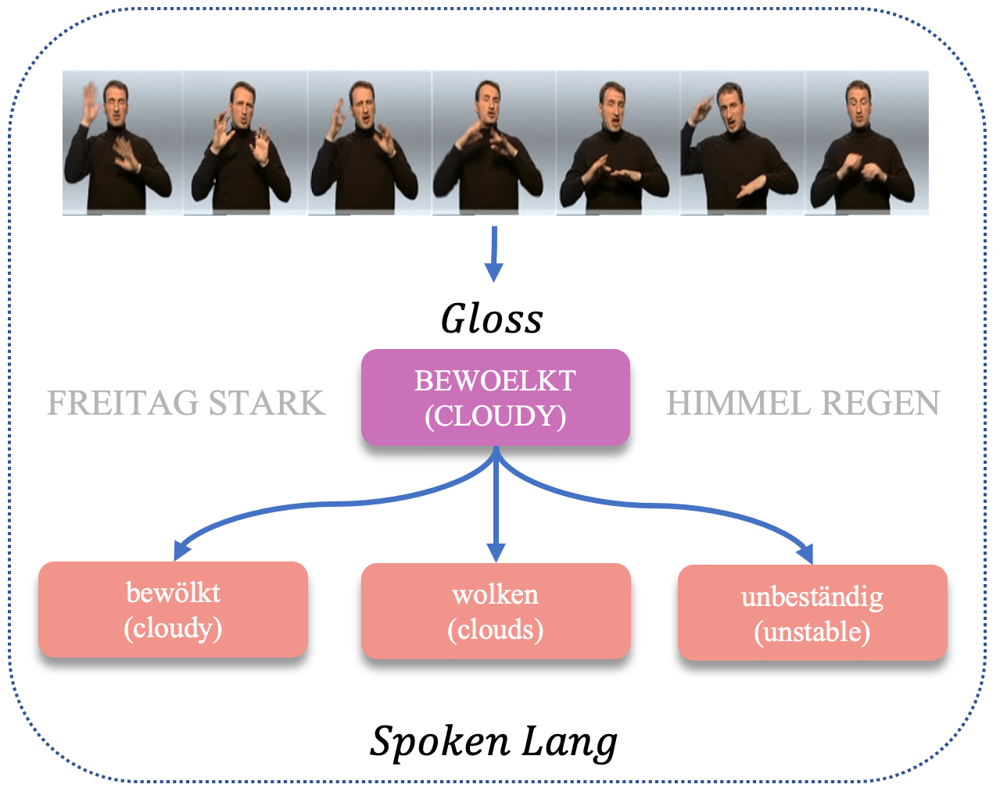
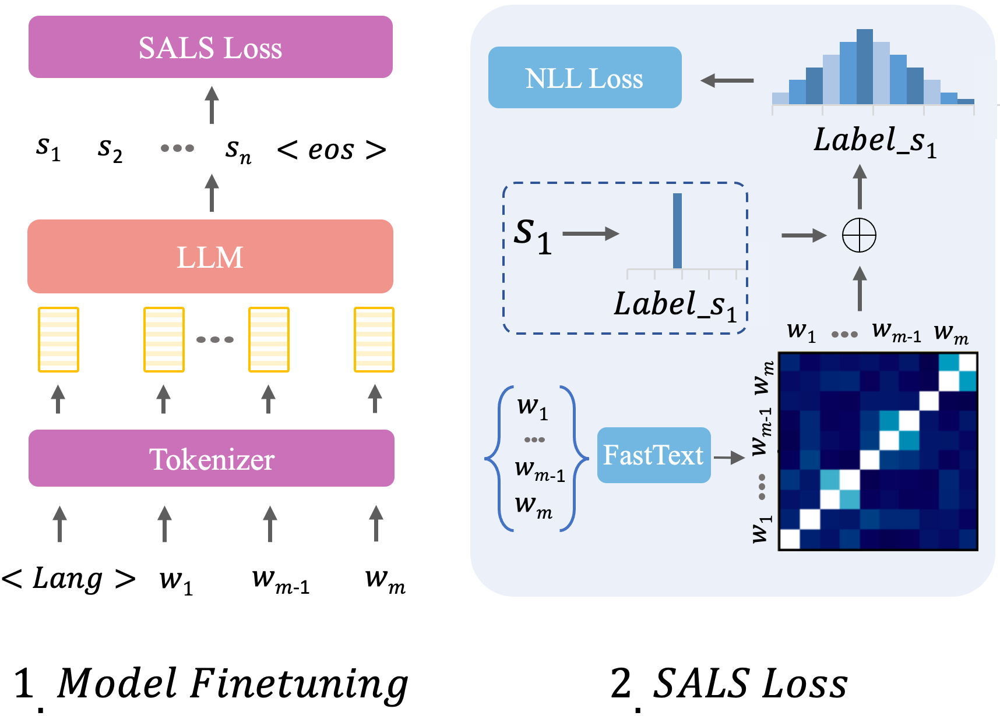
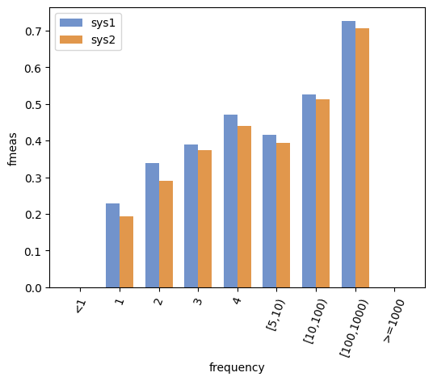
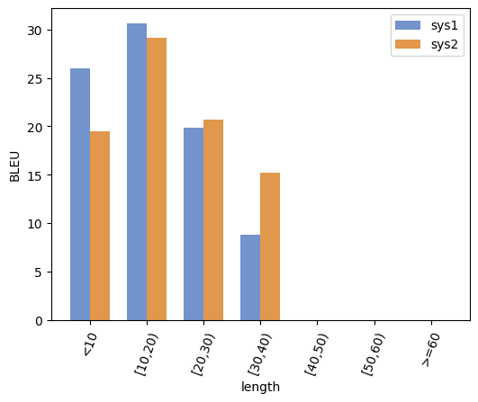

# Gloss2Text：借助 LLMs 与语义感知标签平滑技术，实现手语词汇的精准翻译

发布时间：2024年07月01日

`LLM应用` `手语翻译` `人工智能`

> Gloss2Text: Sign Language Gloss translation using LLMs and Semantically Aware Label Smoothing

# 摘要

> 手语从视频到口语文本的翻译因独特的语法、表达细节及视觉多样性而充满挑战。我们聚焦于 {\em Gloss2Text} 翻译环节，借助预训练 LLM、数据增强及创新标签平滑损失函数，有效利用 gloss 翻译的歧义，大幅提升现有技术的性能。在 PHOENIX Weather 2014T 数据集上的深入实验与分析显示，我们的方法在 {\em Gloss2Text} 翻译领域超越了前沿水平，不仅验证了其在手语翻译中的高效性，也为未来研究开辟了新路径。

> Sign language translation from video to spoken text presents unique challenges owing to the distinct grammar, expression nuances, and high variation of visual appearance across different speakers and contexts. The intermediate gloss annotations of videos aim to guide the translation process. In our work, we focus on {\em Gloss2Text} translation stage and propose several advances by leveraging pre-trained large language models (LLMs), data augmentation, and novel label-smoothing loss function exploiting gloss translation ambiguities improving significantly the performance of state-of-the-art approaches. Through extensive experiments and ablation studies on the PHOENIX Weather 2014T dataset, our approach surpasses state-of-the-art performance in {\em Gloss2Text} translation, indicating its efficacy in addressing sign language translation and suggesting promising avenues for future research and development.

[Arxiv](https://arxiv.org/abs/2407.01394)