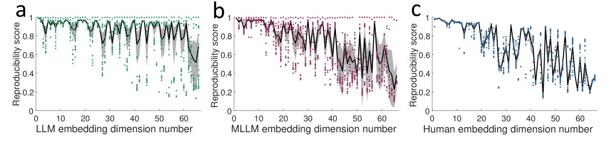

# 多模态大型语言模型中，类人对象概念的表示自然而然地形成。

发布时间：2024年07月01日

`LLM理论` `认知科学` `神经科学`

> Human-like object concept representations emerge naturally in multimodal large language models

# 摘要

> 人类对自然物体的概念化与分类一直是认知科学和神经科学的研究热点，揭示了人类感知与认知的核心机制。随着大型语言模型（LLMs）的迅猛发展，一个引人入胜的问题浮现：这些模型能否通过海量语言与多模态数据的输入，形成类似人类的物体认知？本研究通过行为与神经影像分析，探索了LLMs中物体概念的表示与人类认知的契合度。我们收集了470万个来自LLM与多模态LLM（MLLM）的三元组判断，构建了1,854个自然物体的低维嵌入，这些66维嵌入不仅稳定且富有预测性，更呈现出与人类心理相似的语义聚类。令人瞩目的是，这些嵌入的维度清晰可解，暗示LLM与MLLM已形成类似人类的概念性物体认知。深入分析表明，模型嵌入与大脑多个功能区域的神经活动模式高度吻合，证实了LLMs的物体表示虽与人类不尽相同，却共享着反映人类概念知识核心结构的基本共性。这项研究深化了我们对机器智能的认识，并为构建更贴近人类的人工认知系统提供了宝贵洞见。

> The conceptualization and categorization of natural objects in the human mind have long intrigued cognitive scientists and neuroscientists, offering crucial insights into human perception and cognition. Recently, the rapid development of Large Language Models (LLMs) has raised the attractive question of whether these models can also develop human-like object representations through exposure to vast amounts of linguistic and multimodal data. In this study, we combined behavioral and neuroimaging analysis methods to uncover how the object concept representations in LLMs correlate with those of humans. By collecting large-scale datasets of 4.7 million triplet judgments from LLM and Multimodal LLM (MLLM), we were able to derive low-dimensional embeddings that capture the underlying similarity structure of 1,854 natural objects. The resulting 66-dimensional embeddings were found to be highly stable and predictive, and exhibited semantic clustering akin to human mental representations. Interestingly, the interpretability of the dimensions underlying these embeddings suggests that LLM and MLLM have developed human-like conceptual representations of natural objects. Further analysis demonstrated strong alignment between the identified model embeddings and neural activity patterns in many functionally defined brain ROIs (e.g., EBA, PPA, RSC and FFA). This provides compelling evidence that the object representations in LLMs, while not identical to those in the human, share fundamental commonalities that reflect key schemas of human conceptual knowledge. This study advances our understanding of machine intelligence and informs the development of more human-like artificial cognitive systems.

[Arxiv](https://arxiv.org/abs/2407.01067)