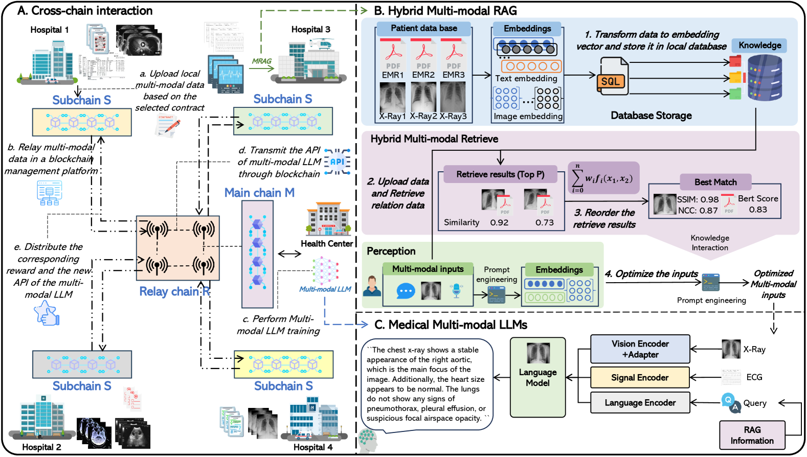
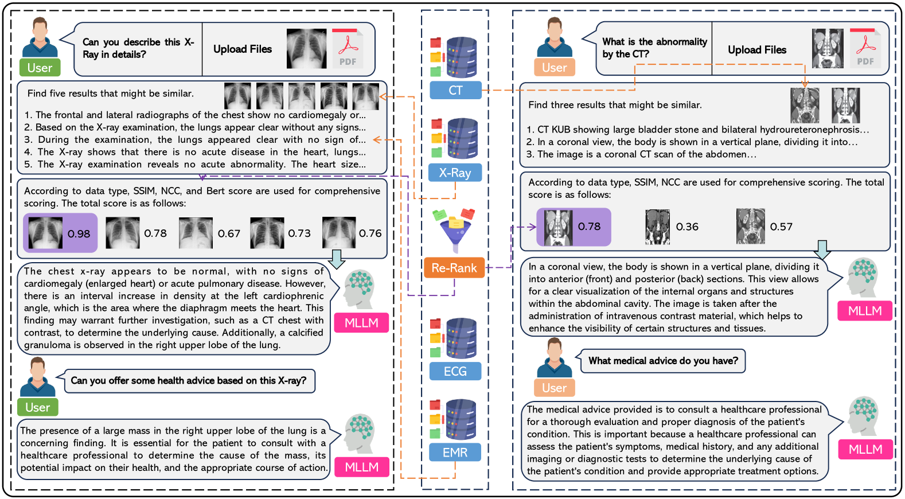
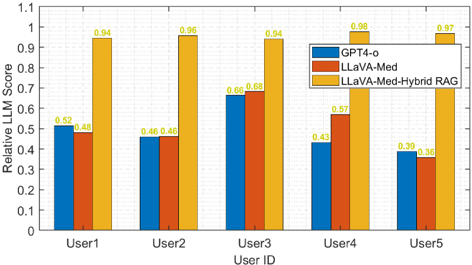
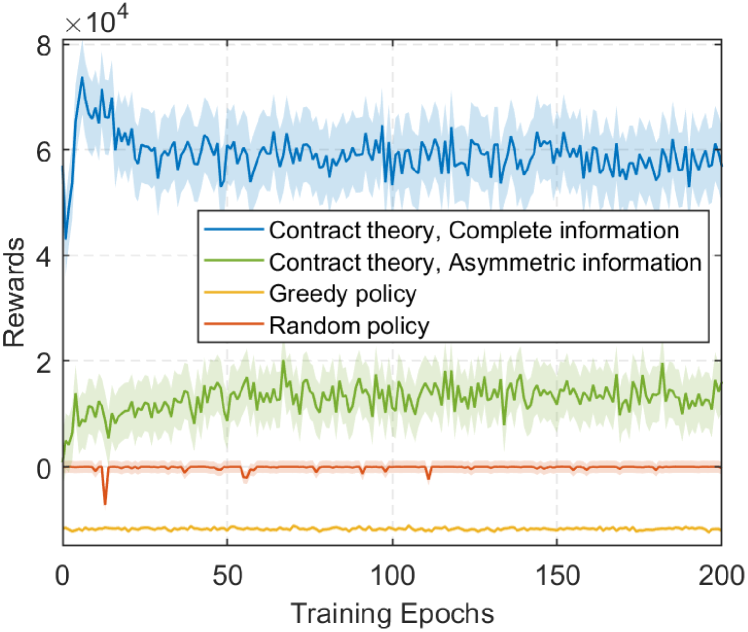
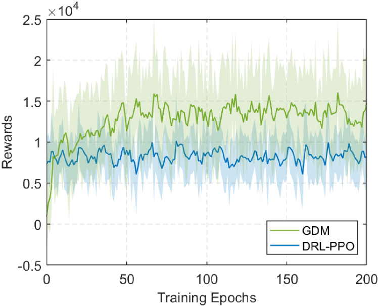
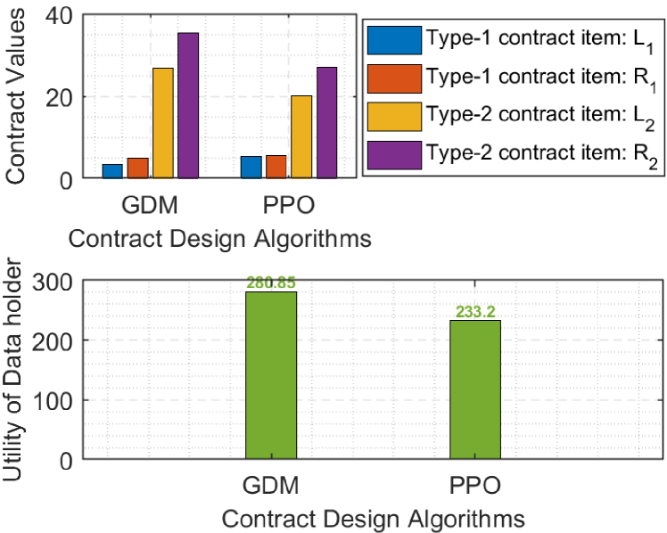

# 采用混合 RAG 增强的多模态 LLM，结合基于扩散的合同理论，为安全医疗数据管理提供创新解决方案。

发布时间：2024年07月01日

`RAG` `数据管理`

> Hybrid RAG-empowered Multi-modal LLM for Secure Healthcare Data Management: A Diffusion-based Contract Theory Approach

# 摘要

> 在医疗保健领域，安全的数据管理和有效的数据共享变得至关重要。生成式人工智能的发展使得多模态大型语言模型（MLLMs）成为管理医疗数据的关键工具。然而，开发医疗MLLMs仍面临挑战，如数据安全和新鲜度问题，这些问题影响MLLMs的输出质量。本文提出了一种混合检索增强生成（RAG）赋能的医疗MLLMs框架，用于医疗数据管理。该框架通过分层跨链架构确保安全数据训练，并通过混合RAG提高输出质量，该方法利用多模态指标过滤单模态RAG结果，并将这些结果作为额外输入纳入MLLMs。此外，我们使用信息年龄评估数据新鲜度影响，并利用契约理论激励数据持有者分享新鲜数据，减轻数据共享中的信息不对称。最后，我们利用基于生成扩散模型的强化学习算法来识别高效数据共享的最佳契约。数值结果证明了所提方案的有效性，实现了安全和高效的医疗数据管理。

> Secure data management and effective data sharing have become paramount in the rapidly evolving healthcare landscape. The advancement of generative artificial intelligence has positioned Multi-modal Large Language Models (MLLMs) as crucial tools for managing healthcare data. MLLMs can support multi-modal inputs and generate diverse types of content by leveraging large-scale training on vast amounts of multi-modal data. However, critical challenges persist in developing medical MLLMs, including healthcare data security and freshness issues, affecting the output quality of MLLMs. In this paper, we propose a hybrid Retrieval-Augmented Generation (RAG)-empowered medical MLLMs framework for healthcare data management. This framework leverages a hierarchical cross-chain architecture to facilitate secure data training. Moreover, it enhances the output quality of MLLMs through hybrid RAG, which employs multi-modal metrics to filter various unimodal RAG results and incorporates these retrieval results as additional inputs to MLLMs. Additionally, we employ age of information to indirectly evaluate the data freshness impact of MLLMs and utilize contract theory to incentivize healthcare data holders to share fresh data, mitigating information asymmetry in data sharing. Finally, we utilize a generative diffusion model-based reinforcement learning algorithm to identify the optimal contract for efficient data sharing. Numerical results demonstrate the effectiveness of the proposed schemes, which achieve secure and efficient healthcare data management.

[Arxiv](https://arxiv.org/abs/2407.00978)