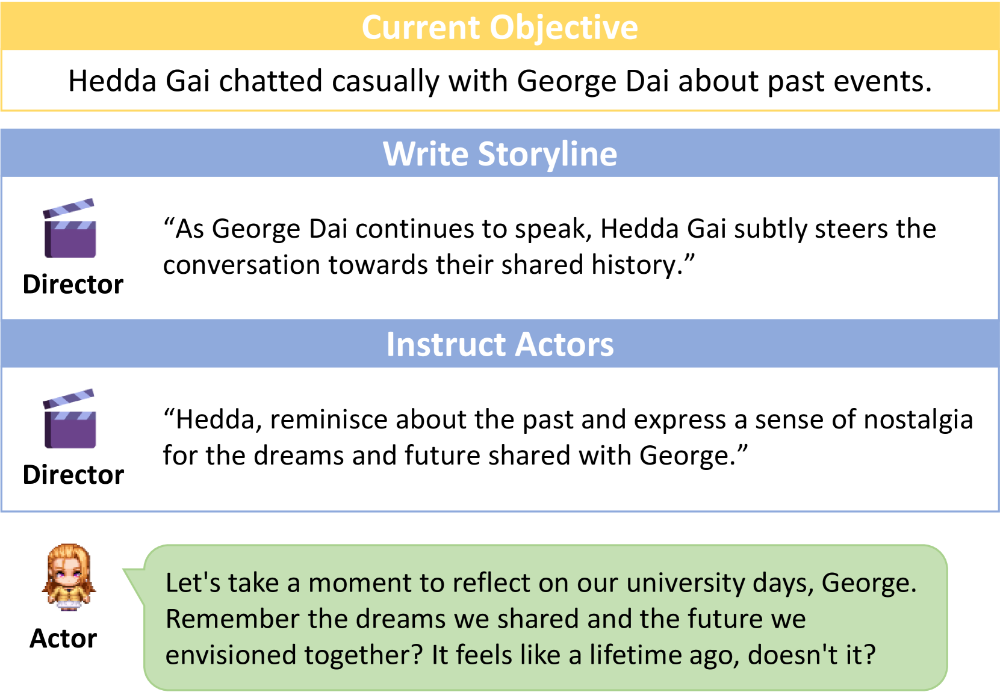
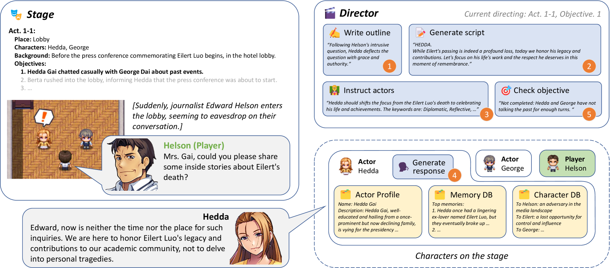
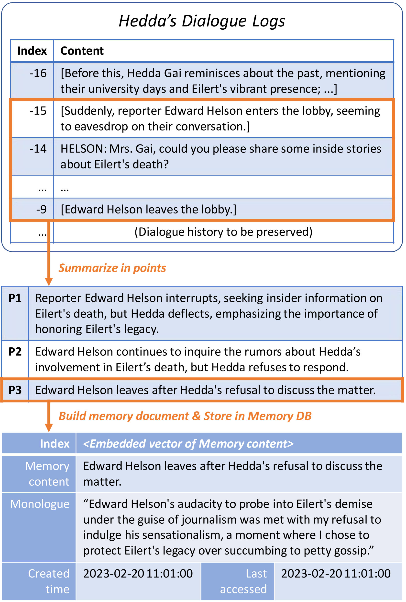
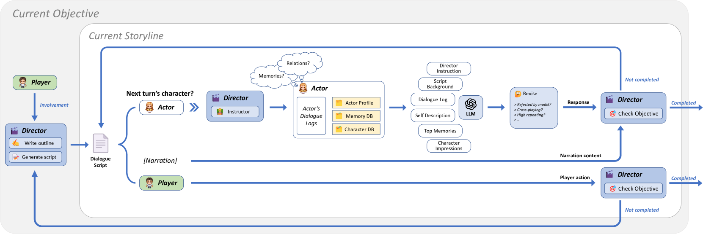
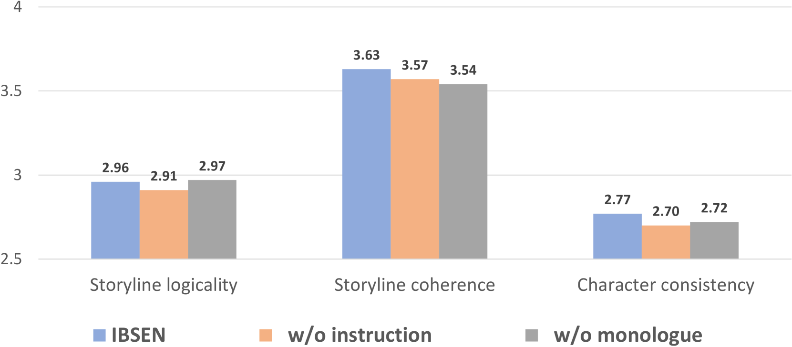
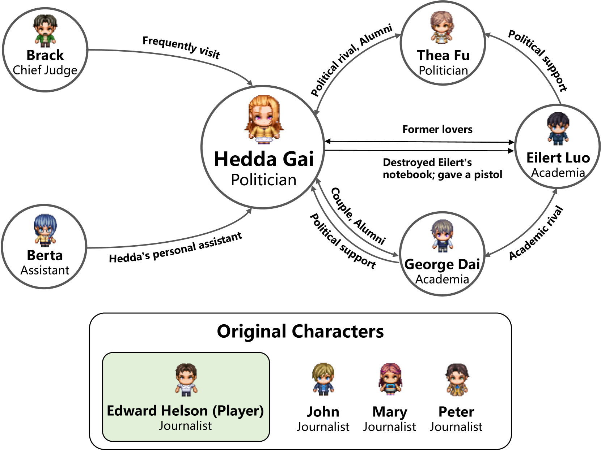
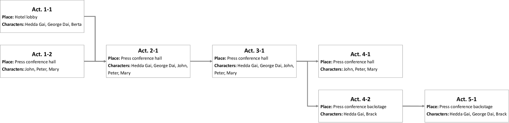

# IBSEN 系统通过导演与演员代理的协作，实现了可控且互动的戏剧剧本生成。

发布时间：2024年07月01日

`Agent` `人工智能`

> IBSEN: Director-Actor Agent Collaboration for Controllable and Interactive Drama Script Generation

# 摘要

> 大型语言模型在故事创作和角色扮演方面表现出色，但现有代理主要关注个体行为合理性，难以全局控制故事发展。为此，我们提出IBSEN框架，通过导演与演员代理的协作，生成可控的戏剧剧本。导演代理根据用户需求编写情节大纲，指导演员代理进行角色扮演，并根据人类玩家参与情况调整情节，确保故事向预定目标推进。我们通过创建新戏剧情节并观察代理互动来评估框架，结果表明，该框架能从简要大纲生成丰富多样的完整剧本，同时保持角色特性。相关代码和资源已公开在https://github.com/OpenDFM/ibsen。

> Large language models have demonstrated their capabilities in storyline creation and human-like character role-playing. Current language model agents mainly focus on reasonable behaviors from the level of individuals, and their behaviors might be hard to constraint on the level of the whole storyline. In this paper we introduce IBSEN, a director-actor coordinate agent framework that generates drama scripts and makes the plot played by agents more controllable. The director agent writes plot outlines that the user desires to see, instructs the actor agents to role-play their characters, and reschedules the plot when human players participate in the scenario to ensure the plot is progressing towards the objective. To evaluate the framework, we create a novel drama plot that involves several actor agents and check the interactions between them under the instruction of the director agent. Evaluation results show that our framework could generate complete, diverse drama scripts from only a rough outline of plot objectives, meanwhile maintaining the characteristics of characters in the drama. Our codes and prompts are available at https://github.com/OpenDFM/ibsen.

[Arxiv](https://arxiv.org/abs/2407.01093)