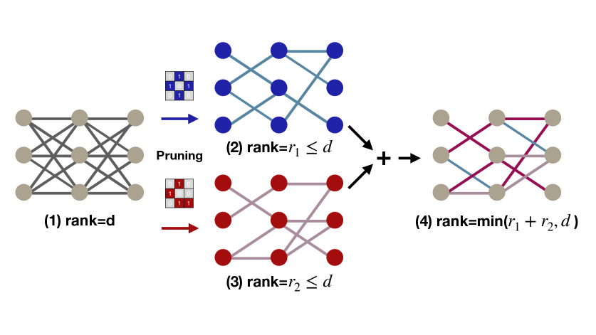
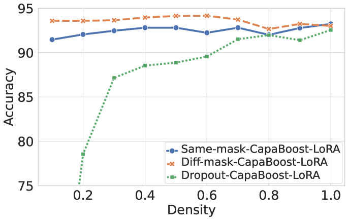

# 免费提升模型容量：一种简便的参数高效微调方法

发布时间：2024年07月01日

`LLM理论` `机器学习`

> Increasing Model Capacity for Free: A Simple Strategy for Parameter Efficient Fine-tuning

# 摘要

> 近期，微调如175B GPT-3这样的大型预训练模型在下游任务中备受瞩目。尽管参数高效的微调方法已被证明有效，但其性能仍受限于增量模块的容量，尤其是在参数预算有限时。为此，我们推出了CapaBoost策略，通过在目标层中并行权重模块的低秩更新，简单而有效地提升模型容量。通过静态随机掩码的应用，CapaBoost构建了多样化的权重矩阵，有效提升增量权重秩，且不增加参数。此方法能无缝融入现有参数高效微调技术。我们在自然语言理解、问答及图像分类等多样下游任务中验证了CapaBoost的显著效果，且无额外计算或存储负担。代码已公开在[GitHub](https://github.com/LINs-lab/CapaBoost)。

> Fine-tuning large pre-trained foundation models, such as the 175B GPT-3, has attracted more attention for downstream tasks recently. While parameter-efficient fine-tuning methods have been proposed and proven effective without retraining all model parameters, their performance is limited by the capacity of incremental modules, especially under constrained parameter budgets. \\ To overcome this challenge, we propose CapaBoost, a simple yet effective strategy that enhances model capacity by leveraging low-rank updates through parallel weight modules in target layers. By applying static random masks to the shared weight matrix, CapaBoost constructs a diverse set of weight matrices, effectively increasing the rank of incremental weights without adding parameters. Notably, our approach can be seamlessly integrated into various existing parameter-efficient fine-tuning methods. We extensively validate the efficacy of CapaBoost through experiments on diverse downstream tasks, including natural language understanding, question answering, and image classification. Our results demonstrate significant improvements over baselines, without incurring additional computation or storage costs. Our code is available at \url{https://github.com/LINs-lab/CapaBoost}.

[Arxiv](https://arxiv.org/abs/2407.01320)