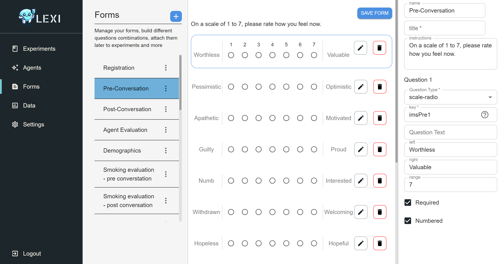

# LEXI：大型语言模型实验平台

发布时间：2024年07月01日

`LLM应用` `社交互动` `人机交互`

> LEXI: Large Language Models Experimentation Interface

# 摘要

> 大型语言模型 (LLM) 的最新进展，为人工代理的社交互动研究带来了重大突破。这些代理广泛应用于多种场景，对用户产生深远影响。然而，由 LLM 驱动的代理的社交互动研究尚处于初级阶段，面临技术与数据访问的限制、标准化接口的缺失以及使用商业平台建立受控实验的挑战。为此，我们推出了 LEXI，一个开源的 LLM 实验接口，旨在促进社交互动行为实验中人工代理的部署。LEXI 通过直观的图形界面，让研究人员能够轻松构建和部署代理，同时收集详尽的互动数据。该工具不仅提升了人-代理交互 (HAI) 研究的实证方法，还为不同背景的研究者提供了便捷的实验平台。可用性测试显示，LEXI 具有极高的实用性和用户友好性，且认知负荷极低，跨学科应用效果显著。一项概念验证研究证实了 LEXI 在评估社交 HAI 中的高效性，产生了高质量的数据。研究还发现，人们更偏爱同理心代理，并倾向于向其发送更长、更积极的讯息。

> The recent developments in Large Language Models (LLM), mark a significant moment in the research and development of social interactions with artificial agents. These agents are widely deployed in a variety of settings, with potential impact on users. However, the study of social interactions with agents powered by LLM is still emerging, limited by access to the technology and to data, the absence of standardised interfaces, and challenges to establishing controlled experimental setups using the currently available business-oriented platforms. To answer these gaps, we developed LEXI, LLMs Experimentation Interface, an open-source tool enabling the deployment of artificial agents powered by LLM in social interaction behavioural experiments. Using a graphical interface, LEXI allows researchers to build agents, and deploy them in experimental setups along with forms and questionnaires while collecting interaction logs and self-reported data. %LEXI is aimed at improving human-agent interaction (HAI) empirical research methodology while allowing researchers with diverse backgrounds and technical proficiency to deploy artificial agents powered by LLM in HAI behavioural experiments. The outcomes of usability testing indicate LEXI's broad utility, high usability and minimum mental workload requirement, with distinctive benefits observed across disciplines. A proof-of-concept study exploring the tool's efficacy in evaluating social HAIs was conducted, resulting in high-quality data. A comparison of empathetic versus neutral agents indicated that people perceive empathetic agents as more social, and write longer and more positive messages towards them.

[Arxiv](https://arxiv.org/abs/2407.01488)