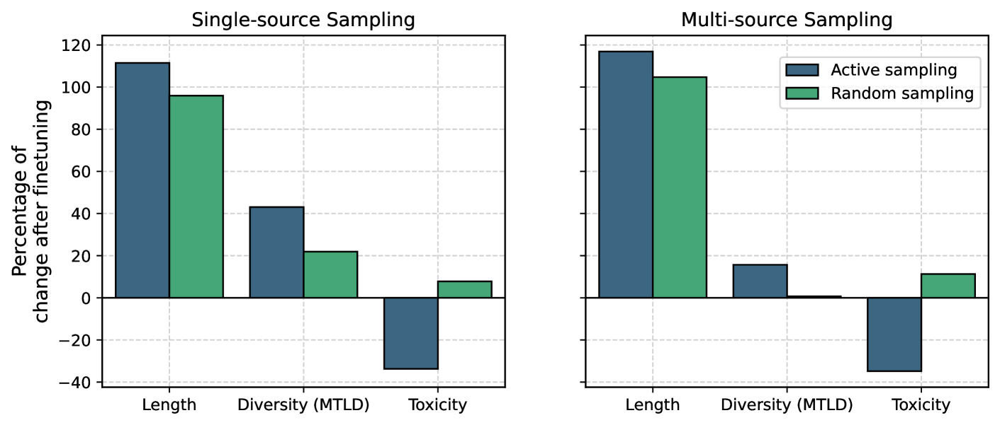
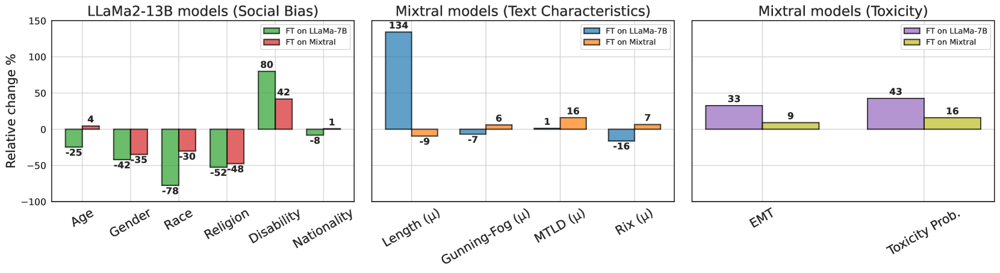
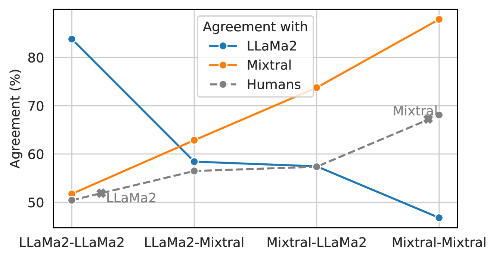
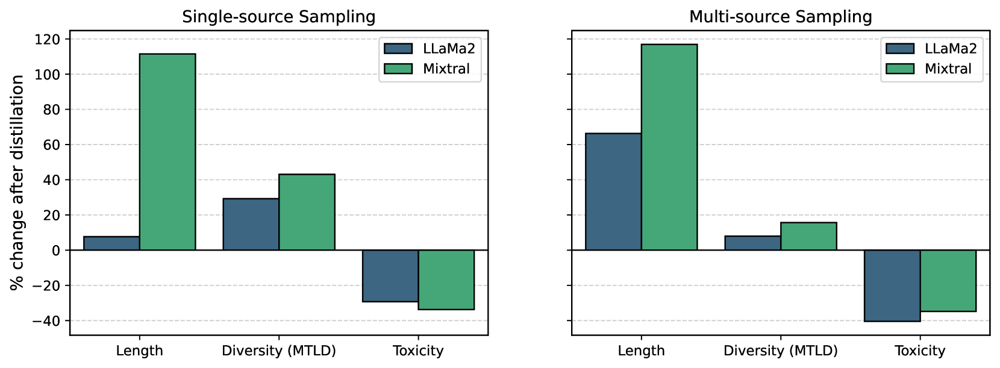

# LLM 观察，LLM 行动：引导数据生成，瞄准非可微目标

发布时间：2024年07月01日

`LLM理论` `人工智能` `数据科学`

> LLM See, LLM Do: Guiding Data Generation to Target Non-Differentiable Objectives

# 摘要

> 合成数据的普及引发了一个新问题：数据生成模型如何通过精炼数据影响其他大型语言模型。我们的研究深入探讨了模型属性被动继承的影响，并全面分析了合成数据整合的后果。我们提供了迄今为止最详尽的研究，揭示了合成数据来源如何影响模型的内部偏见、校准以及文本生成属性和偏好。令人惊讶的是，即使合成数据提示看似中性，模型对某些属性的敏感度依然显著，这引发了是否可以善用这种敏感性的疑问。我们的研究还提出了一个新问题：我们能否在测试时通过操控数据生成过程，明确引导模型朝着我们期望的属性发展？过去，由于收集特定特征或目标数据的成本高昂，这被视为不可能。但随着合成数据质量的提升和通用模型的兴起，这一问题变得尤为重要。我们引入了“主动继承”这一概念，用以描述根据不可微目标有意识地约束合成数据的行为。我们展示了如何通过主动继承，引导模型的生成特征朝着高词汇多样性或低毒性等理想属性发展。

> The widespread adoption of synthetic data raises new questions about how models generating the data can influence other large language models (LLMs) via distilled data. To start, our work exhaustively characterizes the impact of passive inheritance of model properties by systematically studying the consequences of synthetic data integration. We provide one of the most comprehensive studies to-date of how the source of synthetic data shapes models' internal biases, calibration and generations' textual attributes and preferences. We find that models are surprisingly sensitive towards certain attributes even when the synthetic data prompts appear "neutral". which invites the question whether this sensitivity can be exploited for good.
  Our findings invite the question can we explicitly steer the models towards the properties we want at test time by exploiting the data generation process? This would have historically been considered infeasible due to the cost of collecting data with a specific characteristic or objective in mind. However, improvement in the quality of synthetic data, as well as a shift towards general-purpose models designed to follow a diverse way of instructions, means this question is timely. We propose active inheritance as a term to describe intentionally constraining synthetic data according to a non-differentiable objective. We demonstrate how active inheritance can steer the generation profiles of models towards desirable non-differentiable attributes, e.g. high lexical diversity or low toxicity.

[Arxiv](https://arxiv.org/abs/2407.01490)