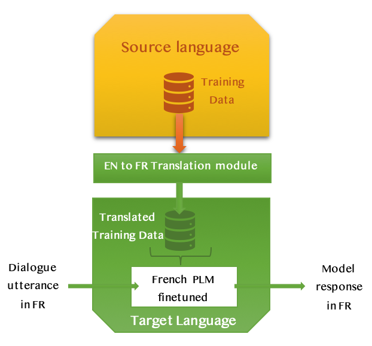

# 预训练语言模型在开放域对话中，从高资源到低资源语言的语言可移植性策略研究

发布时间：2024年07月01日

`LLM应用` `对话系统` `语言处理`

> Language Portability Strategies for Open-domain Dialogue with Pre-trained Language Models from High to Low Resource Languages

# 摘要

> 本文探讨了大型预训练语言模型（PLMs）在高资源语言开放领域对话系统中的语言可移植性策略。我们以法语模拟低资源目标语言（L_T），因其缺乏特定任务资源，便于进行人类评估，而源语言（L_S）为英语。当前，这类模型多以英语开发，但为每种目标语言定制PLMs需收集新数据，成本高昂。因此，我们尝试整合L_S与L_T的现有资源，评估在L_T中通过不同方法的性能。我们评估了两种NMT应用：TrainOnTarget先翻译L_S数据集再在L_T中微调；TestOnSource则在推理时结合L_S模型与NMT模块。BLOOM[2]作为首个开放访问的多语言大型PLM，开启了新方法的探索，不仅利用其全面可访问性，还发挥其多语言和翻译能力。我们首先在L_S中学习任务，再通过MAD-X Adapter架构[16]适应至L_T。实验中，模型在口语对话环境下接受评估，人类评估者可比较不同策略在交互质量上的表现。

> In this paper we propose a study of linguistic portability strategies of large pre-trained language models (PLMs) used for open-domain dialogue systems in a high-resource language for this task. In particular the target low-resource language (L_T) will be simulated with French, as it lacks of task-specific resources and allows our human evaluation, when the source language (L_S) is English. For obvious reasons, recent works using such models for open-domain dialogue are mostly developed in English. Yet building specific PLMs for each possible target language supposes collecting new datasets and is costly. For this reason, trying to leverage all existing resources (PLMs and data) in both L_S and L_T , we wish to assess the performance achievable in L_T with different approaches. The first two approaches evaluate the usage of Neural Machine Translation (NMT) at different levels: TrainOnTarget where a L_S dataset is translated before fine-tuning in L_T and TestOnSource where a L_S model is coupled with NMT modules during inference. Then, the advent of BLOOM [2], the world first open-access multilingual large PLM, allow researchers to develop new approaches aiming to leverage not only the model's full accessibility but also its multilingualism and translation abilities. In this context the task is learned in L_S first and adapted to L_T using the MAD-X Adapter architecture [16]. In the two sets of experiments models are evaluated in spoken dialogue conditions with human and the strategies can be compared in terms of perceived interaction quality.

[Arxiv](https://arxiv.org/abs/2407.01315)