# 大型语言模型能够零-shot 识别日常活动

发布时间：2024年07月01日

`LLM应用` `智能家居` `医疗保健`

> Large Language Models are Zero-Shot Recognizers for Activities of Daily Living

# 摘要

> 在智能家居环境中，基于传感器的日常活动（ADLs）识别技术为能源管理、安全、福祉和医疗保健等领域带来了多种应用。虽然ADLs识别通常依赖于需要大量数据训练的深度学习方法，但近期研究表明，大型语言模型（LLMs）能够有效捕捉人类活动的常识知识。尽管如此，LLMs在智能家居ADLs识别中的实际效果仍需深入探讨。为此，我们开发了ADL-LLM，一个创新的基于LLM的ADLs识别系统。该系统将传感器数据转化为文本形式，再由LLM进行处理，实现零-shot ADLs识别。同时，在拥有少量标记数据的情况下，ADL-LLM还能通过少量提示进一步提升性能。我们在两个公开数据集上的实验证明了ADL-LLM在这一领域的有效性。

> The sensor-based recognition of Activities of Daily Living (ADLs) in smart home environments enables several applications in the areas of energy management, safety, well-being, and healthcare. ADLs recognition is typically based on deep learning methods requiring large datasets to be trained. Recently, several studies proved that Large Language Models (LLMs) effectively capture common-sense knowledge about human activities. However, the effectiveness of LLMs for ADLs recognition in smart home environments still deserves to be investigated. In this work, we propose ADL-LLM, a novel LLM-based ADLs recognition system. ADLLLM transforms raw sensor data into textual representations, that are processed by an LLM to perform zero-shot ADLs recognition. Moreover, in the scenario where a small labeled dataset is available, ADL-LLM can also be empowered with few-shot prompting. We evaluated ADL-LLM on two public datasets, showing its effectiveness in this domain.

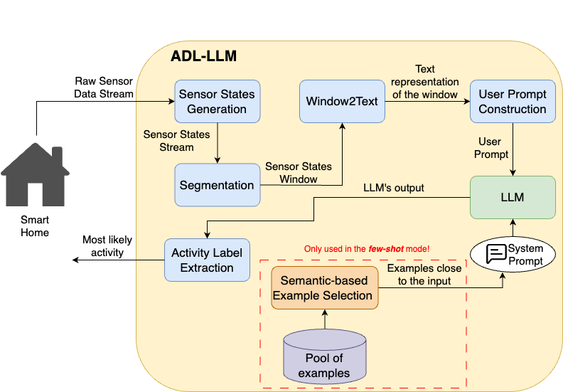

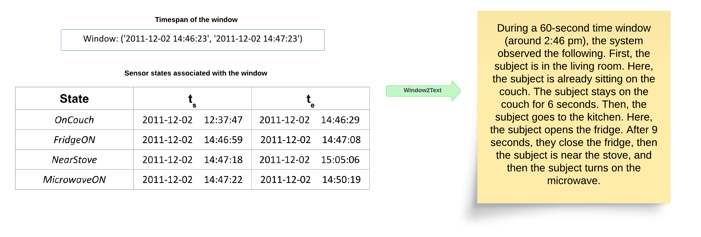

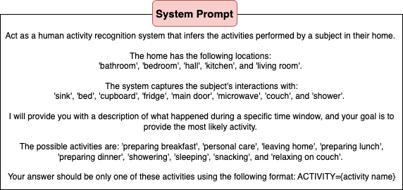

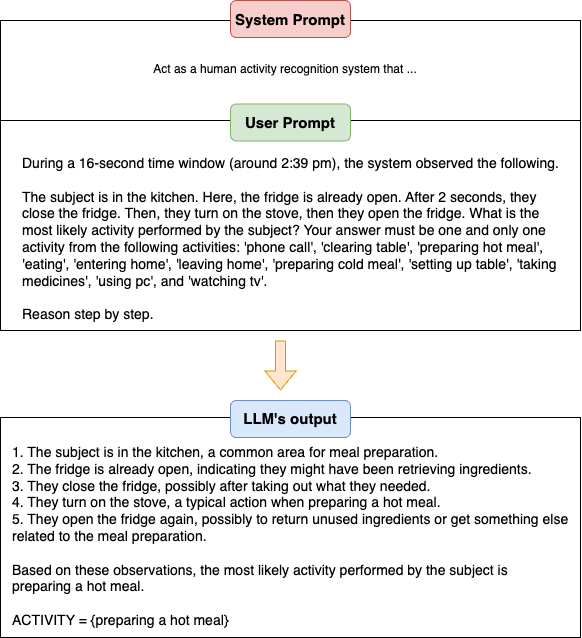

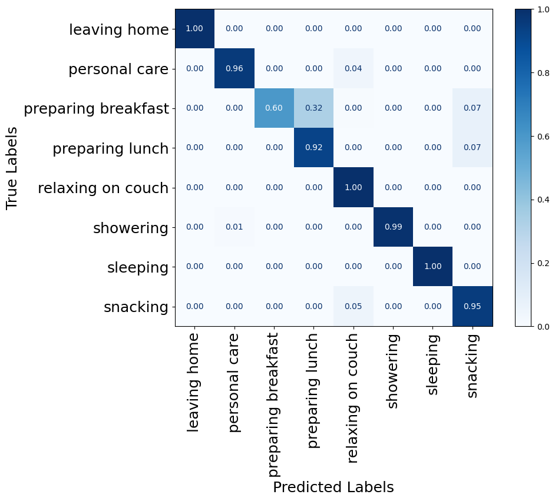

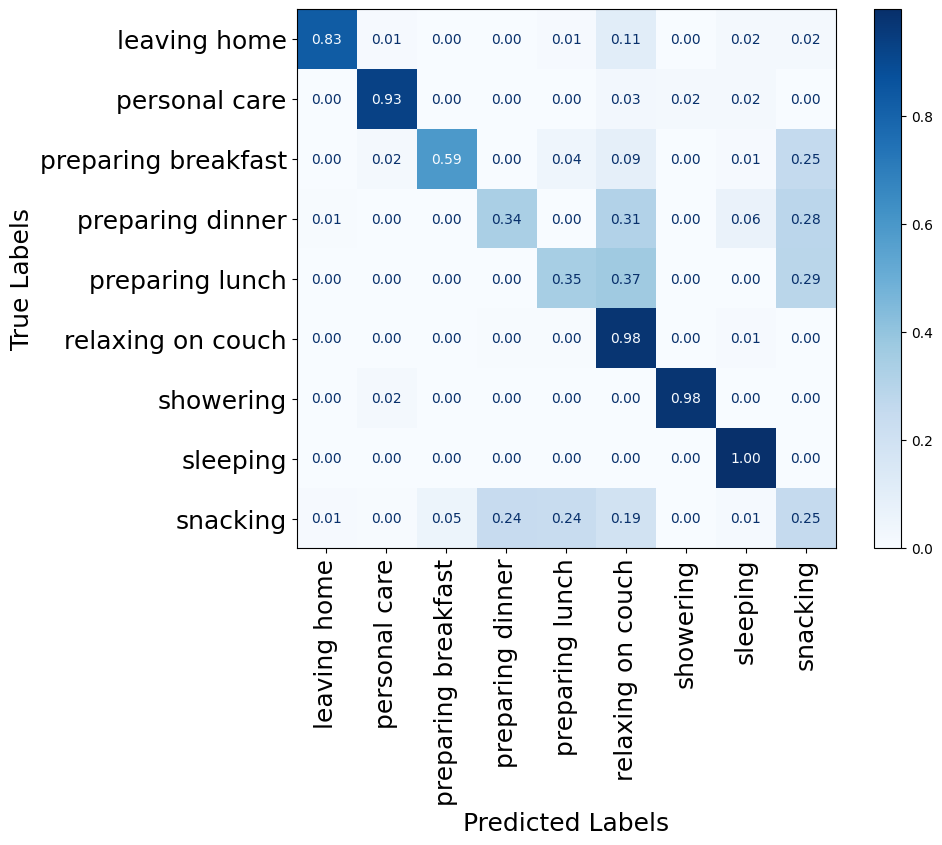

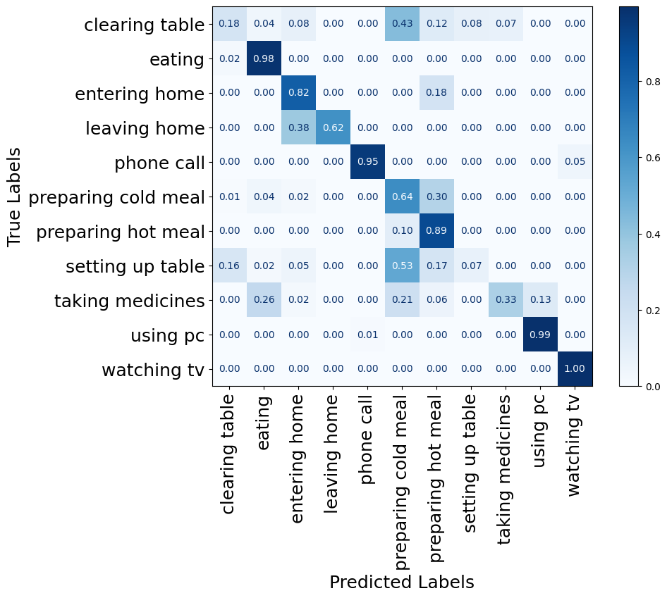

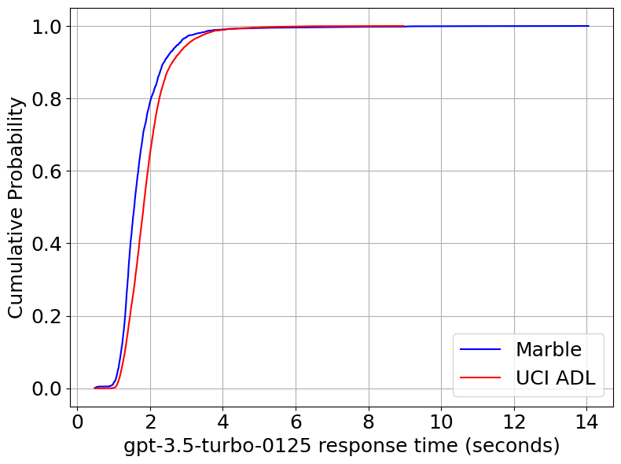

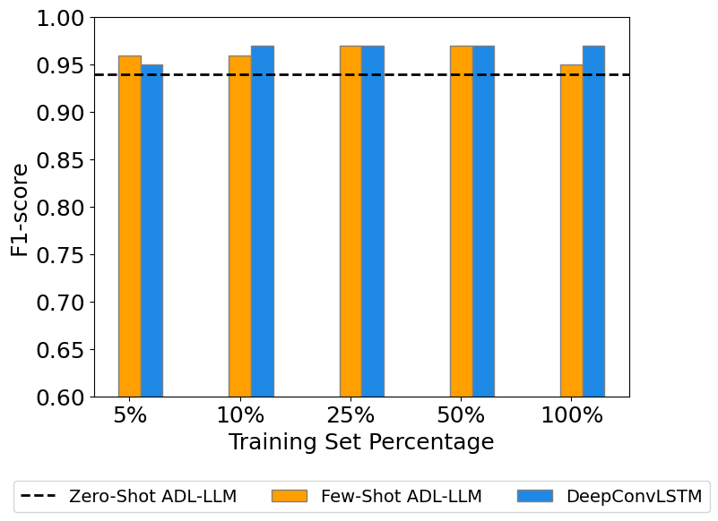

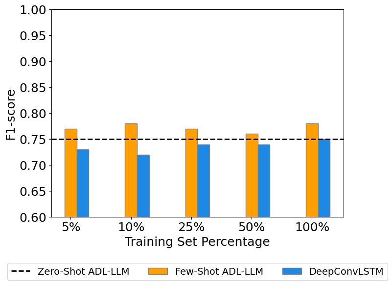

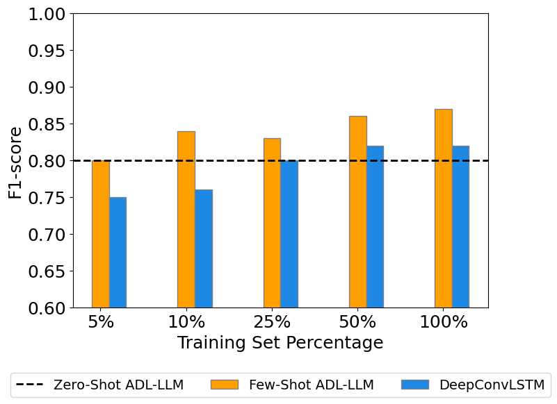

[Arxiv](https://arxiv.org/abs/2407.01238)