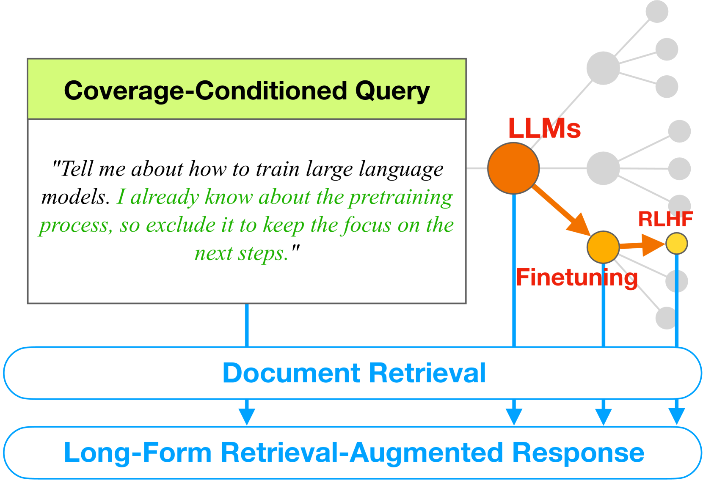
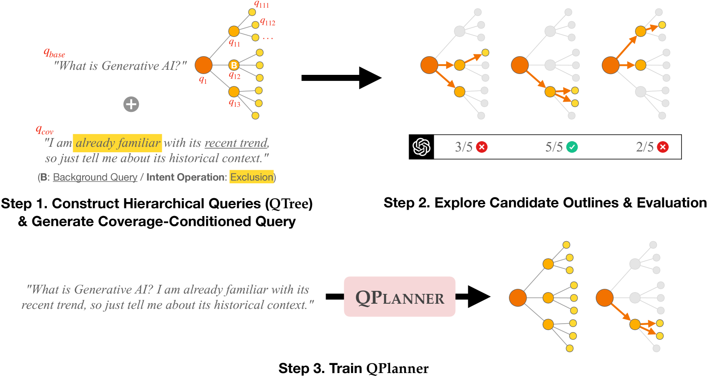
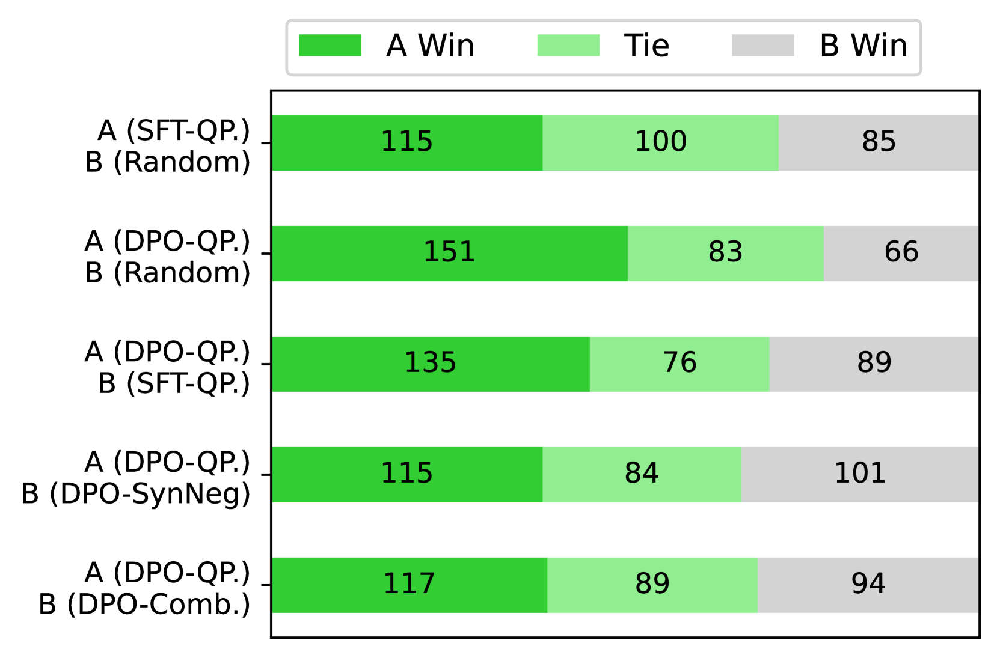
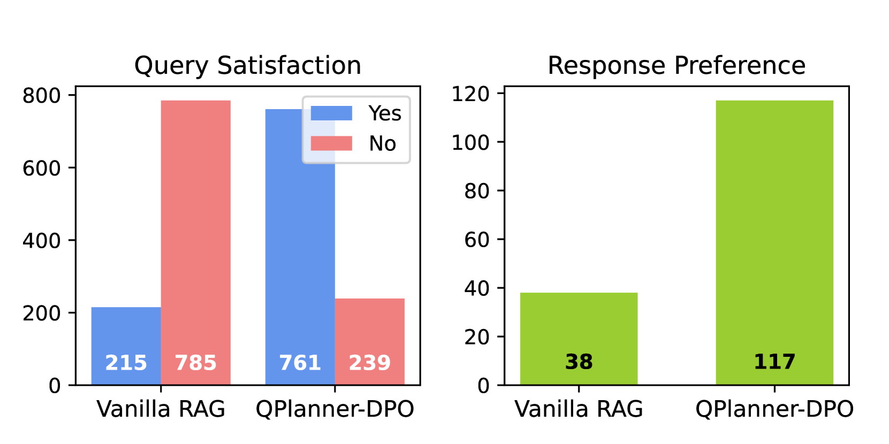
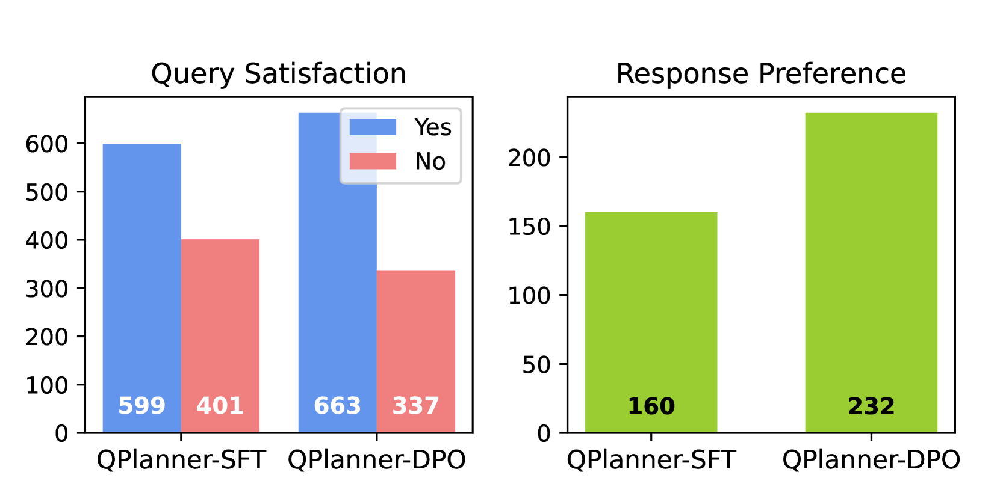

# 探索与选择学习：覆盖条件下的检索增强生成

发布时间：2024年07月01日

`LLM应用` `信息技术` `人工智能`

> Learning to Explore and Select for Coverage-Conditioned Retrieval-Augmented Generation

# 摘要

> 与数十亿参数的大型语言模型交互时，长篇回复常见，这归功于其强大的参数能力和检索增强功能。虽然详细回复提供了深入见解，但往往包含冗余内容，难以吸引用户。本研究聚焦于用户请求特定信息时查询概述的作用，即在$C^2$场景中。我们构建了QTree，包含10K组多视角信息查询，用于模拟此类场景。利用QTree，我们训练了QPlanner，一个7B模型，生成定制查询概述，遵循覆盖条件。通过自动和人工评估，我们分析了这些概述在增强检索生成中的有效性。实验显示，经过对齐训练的QPlanner能提供满足多样化用户需求的概述。资源已公开在https://github.com/youngerous/qtree。

> Interactions with billion-scale large language models typically yield long-form responses due to their extensive parametric capacities, along with retrieval-augmented features. While detailed responses provide insightful viewpoint of a specific subject, they frequently generate redundant and less engaging content that does not meet user interests. In this work, we focus on the role of query outlining (i.e., selected sequence of queries) in scenarios that users request a specific range of information, namely coverage-conditioned ($C^2$) scenarios. For simulating $C^2$ scenarios, we construct QTree, 10K sets of information-seeking queries decomposed with various perspectives on certain topics. By utilizing QTree, we train QPlanner, a 7B language model generating customized query outlines that follow coverage-conditioned queries. We analyze the effectiveness of generated outlines through automatic and human evaluation, targeting on retrieval-augmented generation (RAG). Moreover, the experimental results demonstrate that QPlanner with alignment training can further provide outlines satisfying diverse user interests. Our resources are available at https://github.com/youngerous/qtree.

[Arxiv](https://arxiv.org/abs/2407.01158)