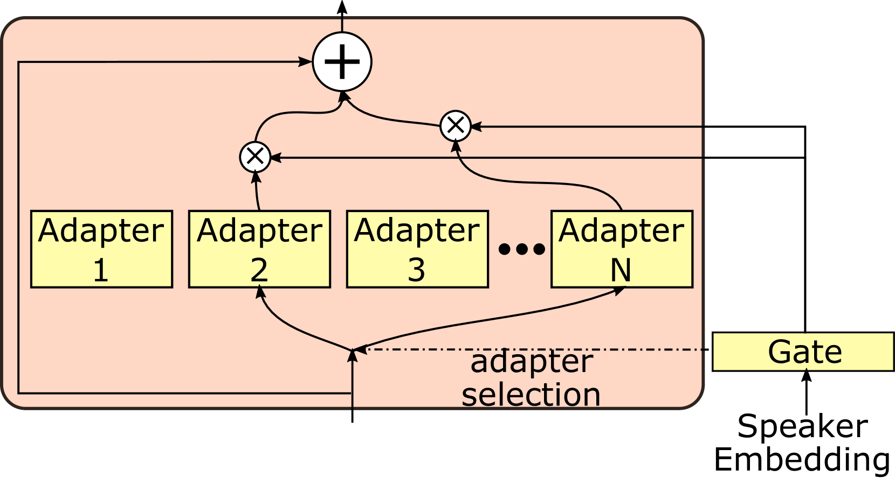

# 轻量级零-shot 文本转语音技术采用适配器混合方法

发布时间：2024年07月01日

`LLM应用` `语音技术` `人工智能`

> Lightweight Zero-shot Text-to-Speech with Mixture of Adapters

# 摘要

> 基于大规模模型的零-shot 文本到语音技术虽已展现高保真度，但模型体积过大，不便日常使用。为此，我们创新性地提出了一种轻量级零-shot TTS 方法，采用适配器混合技术 (MoA)。该方法通过将 MoA 模块嵌入非自回归 TTS 模型的解码器和变异适配器，实现了对多样说话者特征的精准适配。仅需少量额外参数，便能合成高质量语音。经客观与主观双重评估，我们的方法在参数减少 40% 的同时，推理速度提升 1.9 倍，性能超越基线。欢迎访问我们的演示页面 (https://ntt-hilab-gensp.github.io/is2024lightweightTTS/) 试听音频样本。

> The advancements in zero-shot text-to-speech (TTS) methods, based on large-scale models, have demonstrated high fidelity in reproducing speaker characteristics. However, these models are too large for practical daily use. We propose a lightweight zero-shot TTS method using a mixture of adapters (MoA). Our proposed method incorporates MoA modules into the decoder and the variance adapter of a non-autoregressive TTS model. These modules enhance the ability to adapt a wide variety of speakers in a zero-shot manner by selecting appropriate adapters associated with speaker characteristics on the basis of speaker embeddings. Our method achieves high-quality speech synthesis with minimal additional parameters. Through objective and subjective evaluations, we confirmed that our method achieves better performance than the baseline with less than 40\% of parameters at 1.9 times faster inference speed. Audio samples are available on our demo page (https://ntt-hilab-gensp.github.io/is2024lightweightTTS/).

[Arxiv](https://arxiv.org/abs/2407.01291)