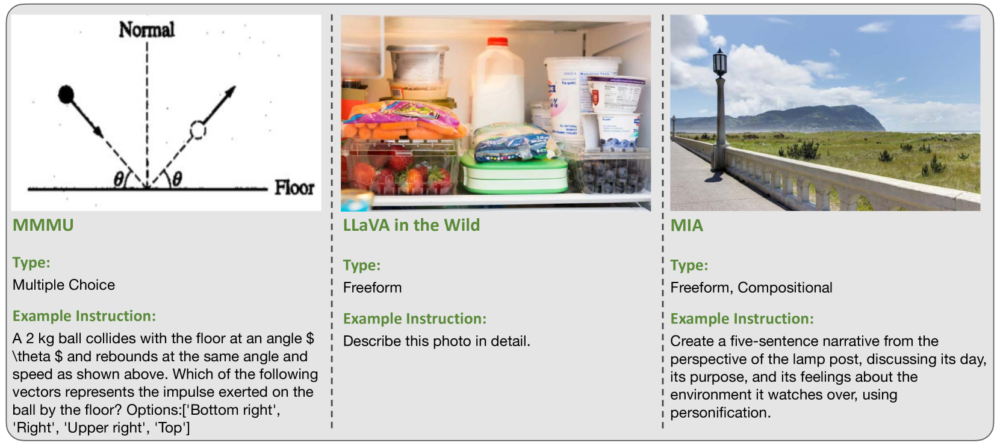

# MIA-Bench：旨在提升多模态 LLM 指令遵循能力的评估工具

发布时间：2024年07月01日

`LLM应用` `人工智能` `计算机视觉`

> MIA-Bench: Towards Better Instruction Following Evaluation of Multimodal LLMs

# 摘要

> 我们推出了 MIA-Bench，一个专为测试多模态大型语言模型 (MLLM) 严格遵守复杂指令能力而设计的新基准。该基准包含 400 个精心设计的图像-提示对，旨在考验模型在生成符合特定模式的准确响应时，能否遵循多层次的指令。评估显示，不同 MLLM 的性能差异显著，指出了提升指令执行准确性的关键领域。同时，我们通过增加训练数据和实施监督微调，旨在提升模型遵循指令的能力，同时保持其在其他任务上的表现。我们期待 MIA-Bench 不仅能作为评估工具，还能引领 MLLM 训练方法的未来进步。

> We introduce MIA-Bench, a new benchmark designed to evaluate multimodal large language models (MLLMs) on their ability to strictly adhere to complex instructions. Our benchmark comprises a diverse set of 400 image-prompt pairs, each crafted to challenge the models' compliance with layered instructions in generating accurate responses that satisfy specific requested patterns. Evaluation results from a wide array of state-of-the-art MLLMs reveal significant variations in performance, highlighting areas for improvement in instruction fidelity. Additionally, we create extra training data and explore supervised fine-tuning to enhance the models' ability to strictly follow instructions without compromising performance on other tasks. We hope this benchmark not only serves as a tool for measuring MLLM adherence to instructions, but also guides future developments in MLLM training methods.

[Arxiv](https://arxiv.org/abs/2407.01509)