# MIRAI：评估大型语言模型代理在事件预测中的效能

发布时间：2024年07月01日

`Agent` `国际关系` `政策制定`

> MIRAI: Evaluating LLM Agents for Event Forecasting

# 摘要

> 大型语言模型 (LLM) 的进步赋予了 LLM 代理自主收集全球信息并进行推理解决复杂问题的能力。因此，利用 LLM 代理预测国际事件的兴趣日益浓厚，这些预测能影响全球决策和政策制定。然而，关于 LLM 代理预测能力的严格基准尚缺。为此，我们推出了 MIRAI，一个专为系统评估 LLM 代理在国际事件预测中表现的新基准。MIRAI 提供了一个包含丰富历史和新闻数据的代理环境，并通过精细处理 GDELT 数据库，设计了涵盖短期到长期预测的任务，全面测试 LLM 代理的能力。此外，我们还开发了 API，使代理能通过代码接口灵活使用工具。MIRAI 从三个维度评估代理：自主整合全球信息、编写专用代码使用工具、结合多元历史知识精准预测未来。通过这一全面基准，我们旨在构建一个可靠框架，推动开发更精准可信的国际关系分析模型。

> Recent advancements in Large Language Models (LLMs) have empowered LLM agents to autonomously collect world information, over which to conduct reasoning to solve complex problems. Given this capability, increasing interests have been put into employing LLM agents for predicting international events, which can influence decision-making and shape policy development on an international scale. Despite such a growing interest, there is a lack of a rigorous benchmark of LLM agents' forecasting capability and reliability. To address this gap, we introduce MIRAI, a novel benchmark designed to systematically evaluate LLM agents as temporal forecasters in the context of international events. Our benchmark features an agentic environment with tools for accessing an extensive database of historical, structured events and textual news articles. We refine the GDELT event database with careful cleaning and parsing to curate a series of relational prediction tasks with varying forecasting horizons, assessing LLM agents' abilities from short-term to long-term forecasting. We further implement APIs to enable LLM agents to utilize different tools via a code-based interface. In summary, MIRAI comprehensively evaluates the agents' capabilities in three dimensions: 1) autonomously source and integrate critical information from large global databases; 2) write codes using domain-specific APIs and libraries for tool-use; and 3) jointly reason over historical knowledge from diverse formats and time to accurately predict future events. Through comprehensive benchmarking, we aim to establish a reliable framework for assessing the capabilities of LLM agents in forecasting international events, thereby contributing to the development of more accurate and trustworthy models for international relation analysis.

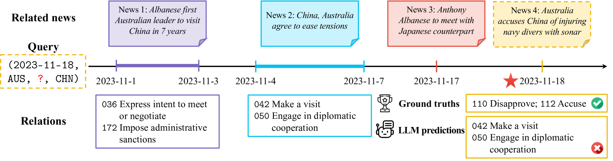

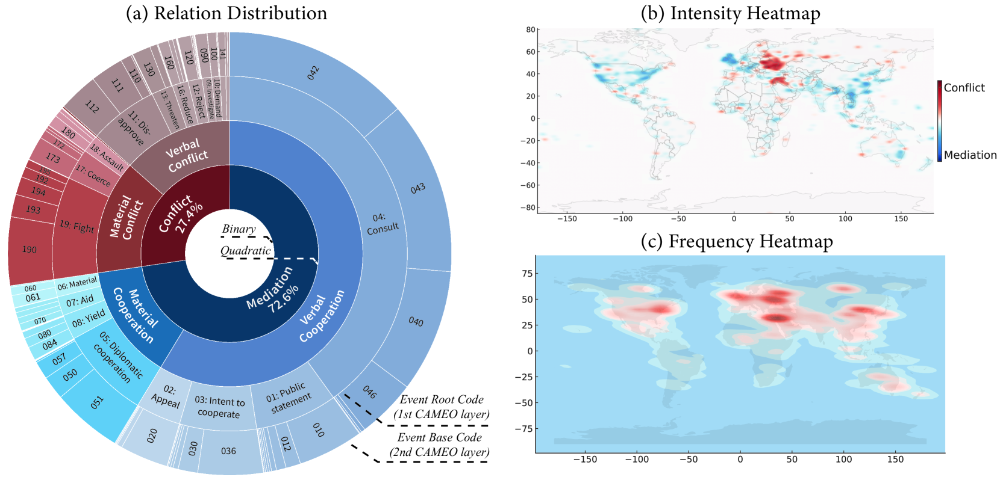

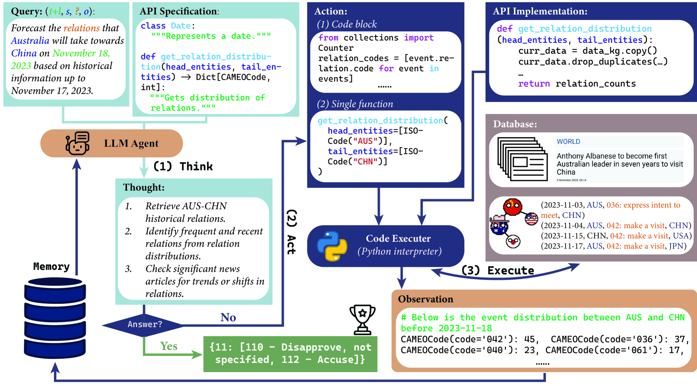

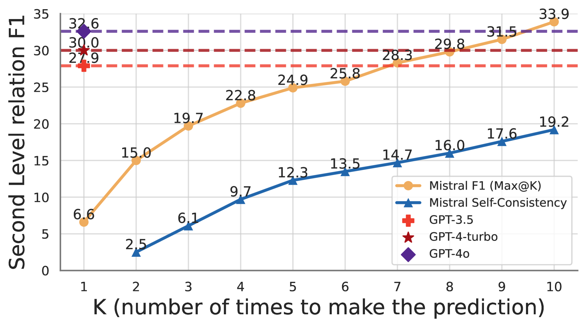

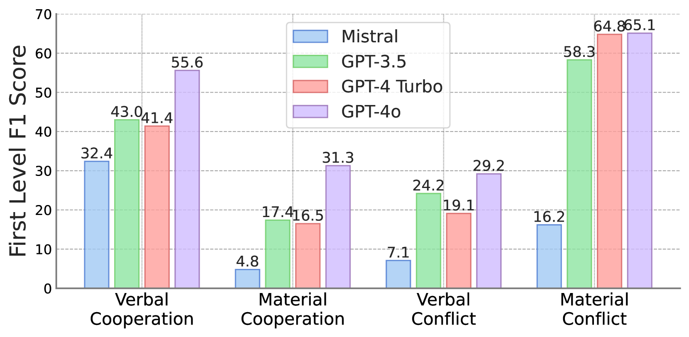

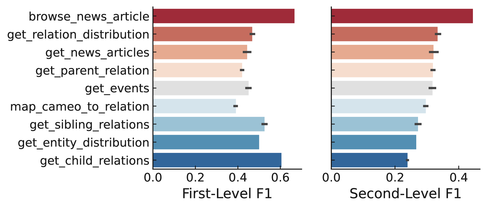

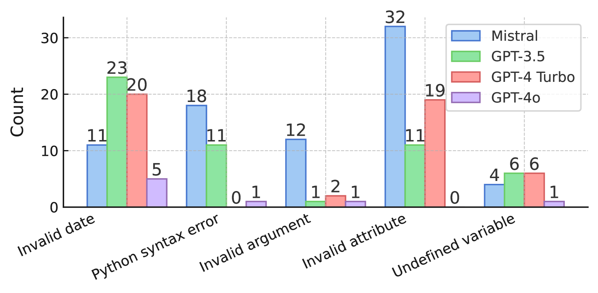

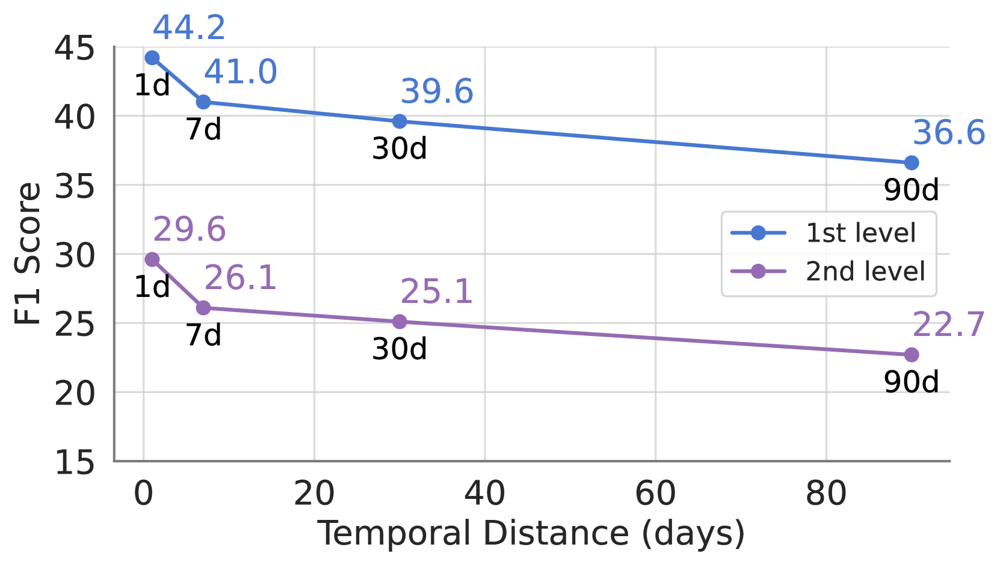

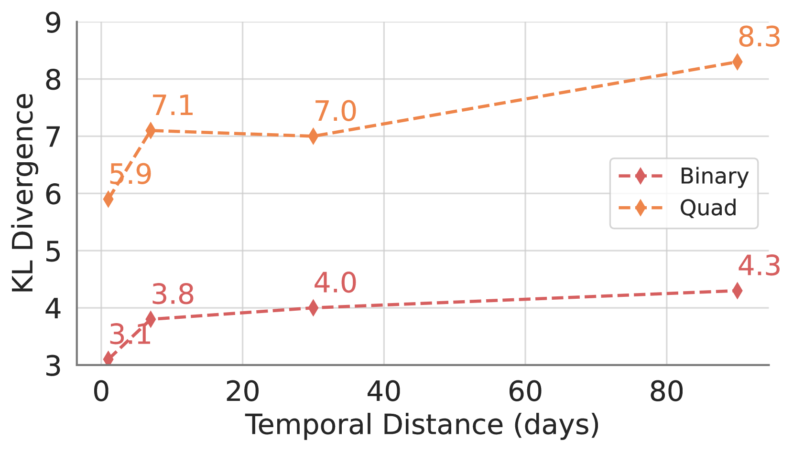

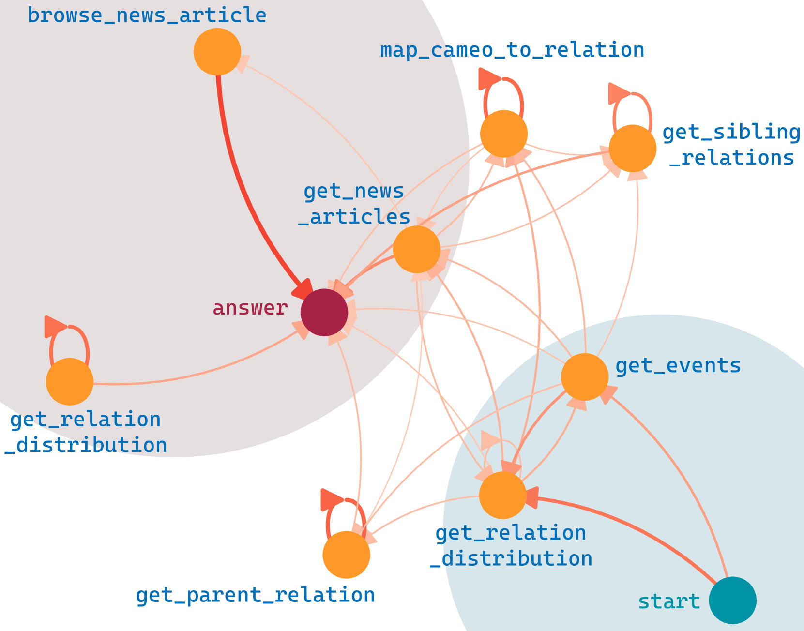

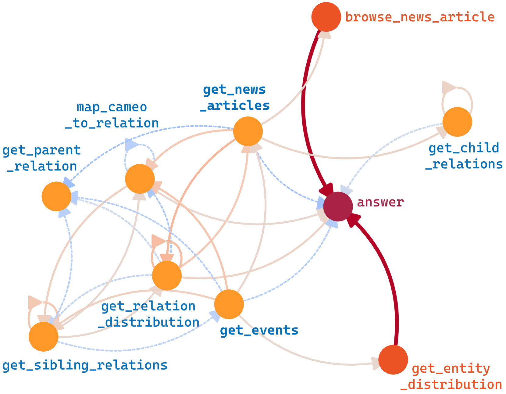

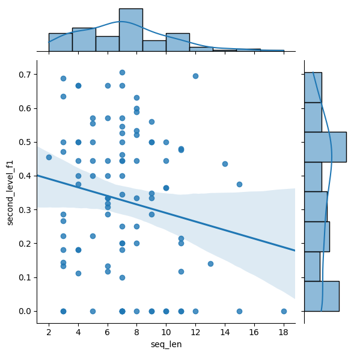

[Arxiv](https://arxiv.org/abs/2407.01231)