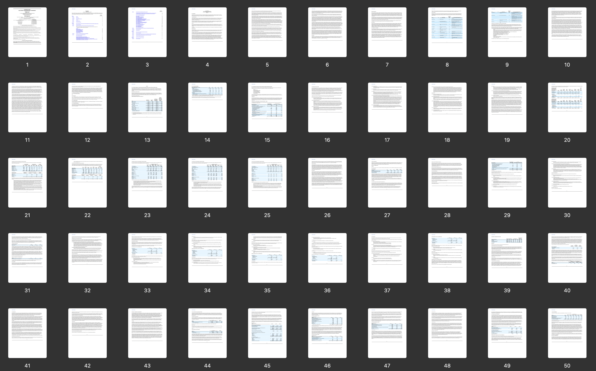
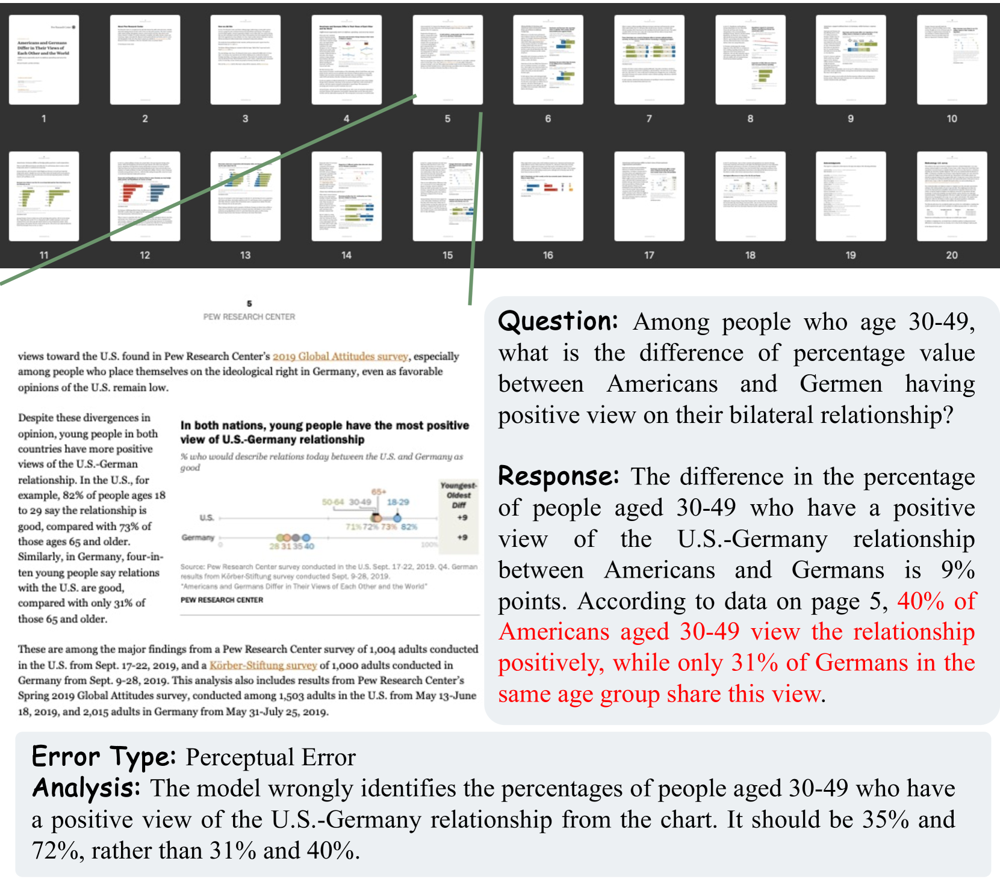

# MMLongBench-Doc：借助可视化工具，对长篇文档理解进行基准测试

发布时间：2024年07月01日

`LLM应用` `文档处理` `人工智能`

> MMLongBench-Doc: Benchmarking Long-context Document Understanding with Visualizations

# 摘要

> 理解复杂布局和多模态内容的文档是一项传统且实用的任务。最新的大型视觉-语言模型（LVLMs）在单页文档理解方面取得了显著进步，但在长篇文档理解方面仍面临挑战。我们提出的MMLongBench-Doc基准，包含1,062个专家注释问题，基于130个长篇PDF文档，平均每篇49.4页，文本标记达20,971个。该基准强调了从不同来源和位置获取证据的重要性，其中33.2%的问题需要跨页证据，22.8%的问题设计为无法回答以检测模型幻觉。实验显示，即使是表现最佳的模型GPT-4o，F1分数也仅为42.7%，表明长篇文档理解对当前模型极具挑战性。这些发现强调了开发更强大的长上下文LVLMs的迫切需求。项目详情见：https://mayubo2333.github.io/MMLongBench-Doc

> Understanding documents with rich layouts and multi-modal components is a long-standing and practical task. Recent Large Vision-Language Models (LVLMs) have made remarkable strides in various tasks, particularly in single-page document understanding (DU). However, their abilities on long-context DU remain an open problem. This work presents MMLongBench-Doc, a long-context, multi-modal benchmark comprising 1,062 expert-annotated questions. Distinct from previous datasets, it is constructed upon 130 lengthy PDF-formatted documents with an average of 49.4 pages and 20,971 textual tokens. Towards comprehensive evaluation, answers to these questions rely on pieces of evidence from (1) different sources (text, image, chart, table, and layout structure) and (2) various locations (i.e. page number). Moreover, 33.2% of the questions are cross-page questions requiring evidence across multiple pages. 22.8% of the questions are designed to be unanswerable for detecting potential hallucinations. Experiments on 14 LVLMs demonstrate that long-context DU greatly challenges current models. Notably, the best-performing model, GPT-4o, achieves an F1 score of only 42.7%, while the second-best, GPT-4V, scores 31.4%. Furthermore, 12 LVLMs (all except GPT-4o and GPT-4V) even present worse performance than their LLM counterparts which are fed with lossy-parsed OCR documents. These results validate the necessity of future research toward more capable long-context LVLMs. Project Page: https://mayubo2333.github.io/MMLongBench-Doc

[Arxiv](https://arxiv.org/abs/2407.01523)