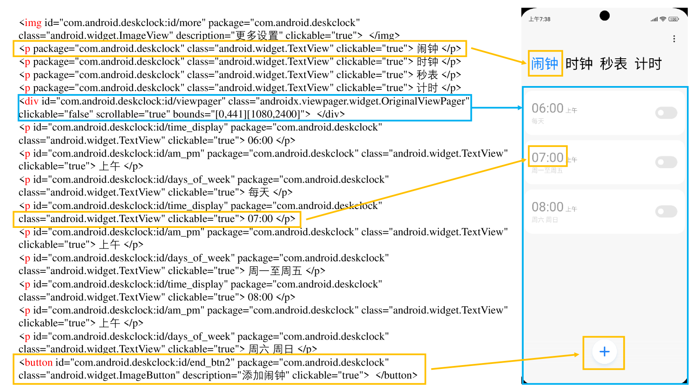

# 移动-Bench：一个针对基于 LLM 的移动代理的评估基准

发布时间：2024年07月01日

`Agent` `人机交互` `移动应用`

> Mobile-Bench: An Evaluation Benchmark for LLM-based Mobile Agents

# 摘要

> 随着LLM技术的飞速发展，基于LLM的智能代理在人机交互研究中备受瞩目。但遗憾的是，针对这些移动代理的基准测试却寥寥无几。这些测试面临三大难题：一是仅依赖界面操作的效率低下，二是单一应用内的指令无法全面评估代理的复杂推理与决策能力，三是现有评估标准难以准确衡量连续动作的执行过程。为此，我们创新性地推出了Mobile-Bench基准，旨在全面评估LLM移动代理的各项能力。我们通过引入103个API，优化了传统界面操作，大幅提升了任务执行效率。同时，我们精心收集了结合真实用户需求与LLM增强的评估数据，并将其细分为SAST、SAMT和MAMT三个层次，以适应不同难度的任务需求。Mobile-Bench共收录832项数据，其中200余项专为多应用协作场景设计。此外，我们还首创了CheckPoint评估指标，精准判断代理在规划与推理过程中的关键节点。

> With the remarkable advancements of large language models (LLMs), LLM-based agents have become a research hotspot in human-computer interaction. However, there is a scarcity of benchmarks available for LLM-based mobile agents. Benchmarking these agents generally faces three main challenges: (1) The inefficiency of UI-only operations imposes limitations to task evaluation. (2) Specific instructions within a singular application lack adequacy for assessing the multi-dimensional reasoning and decision-making capacities of LLM mobile agents. (3) Current evaluation metrics are insufficient to accurately assess the process of sequential actions. To this end, we propose Mobile-Bench, a novel benchmark for evaluating the capabilities of LLM-based mobile agents. First, we expand conventional UI operations by incorporating 103 collected APIs to accelerate the efficiency of task completion. Subsequently, we collect evaluation data by combining real user queries with augmentation from LLMs. To better evaluate different levels of planning capabilities for mobile agents, our data is categorized into three distinct groups: SAST, SAMT, and MAMT, reflecting varying levels of task complexity. Mobile-Bench comprises 832 data entries, with more than 200 tasks specifically designed to evaluate multi-APP collaboration scenarios. Furthermore, we introduce a more accurate evaluation metric, named CheckPoint, to assess whether LLM-based mobile agents reach essential points during their planning and reasoning steps.

[Arxiv](https://arxiv.org/abs/2407.00993)