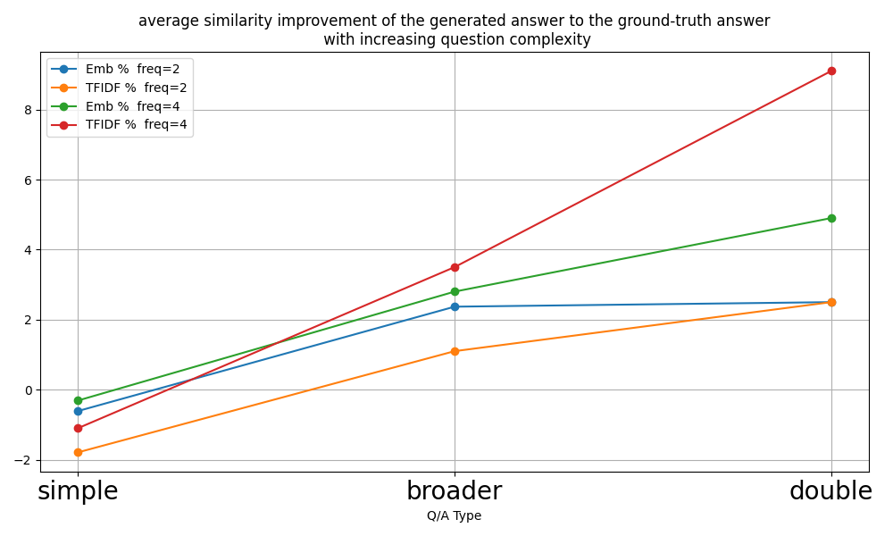

# 优化检索增强生成上下文，结合异常检测技术

发布时间：2024年07月01日

`LLM应用` `问答系统` `人工智能`

> Optimization of Retrieval-Augmented Generation Context with Outlier Detection

# 摘要

> 本文探讨了如何精简问题回答系统中提示上下文的大小并提升其质量。增加检索文档数量以扩充上下文虽能丰富信息，但也可能加重处理负担，影响LLM的响应效率。我们深知，大量检索文档中常混杂无关信息，易引发答案失真。为此，我们力求筛选出语义最相关的文档，视其余为异常。我们创新性地提出并验证了利用嵌入向量距离识别异常值的方法，通过与GPT-4o模型的基准答案对比，评估了这些方法的有效性。实验显示，随着问答复杂度的提升，我们的方法带来了显著的性能提升。

> In this paper, we focus on methods to reduce the size and improve the quality of the prompt context required for question-answering systems. Attempts to increase the number of retrieved chunked documents and thereby enlarge the context related to the query can significantly complicate the processing and decrease the performance of a Large Language Model (LLM) when generating responses to queries. It is well known that a large set of documents retrieved from a database in response to a query may contain irrelevant information, which often leads to hallucinations in the resulting answers. Our goal is to select the most semantically relevant documents, treating the discarded ones as outliers. We propose and evaluate several methods for identifying outliers by creating features that utilize the distances of embedding vectors, retrieved from the vector database, to both the centroid and the query vectors. The methods were evaluated by comparing the similarities of the retrieved LLM responses to ground-truth answers obtained using the OpenAI GPT-4o model. It was found that the greatest improvements were achieved with increasing complexity of the questions and answers.

[Arxiv](https://arxiv.org/abs/2407.01403)