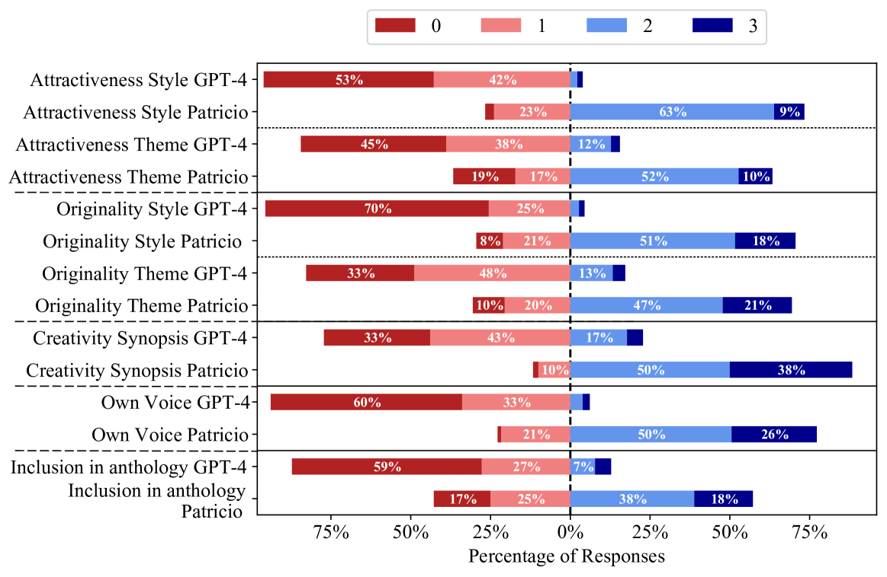
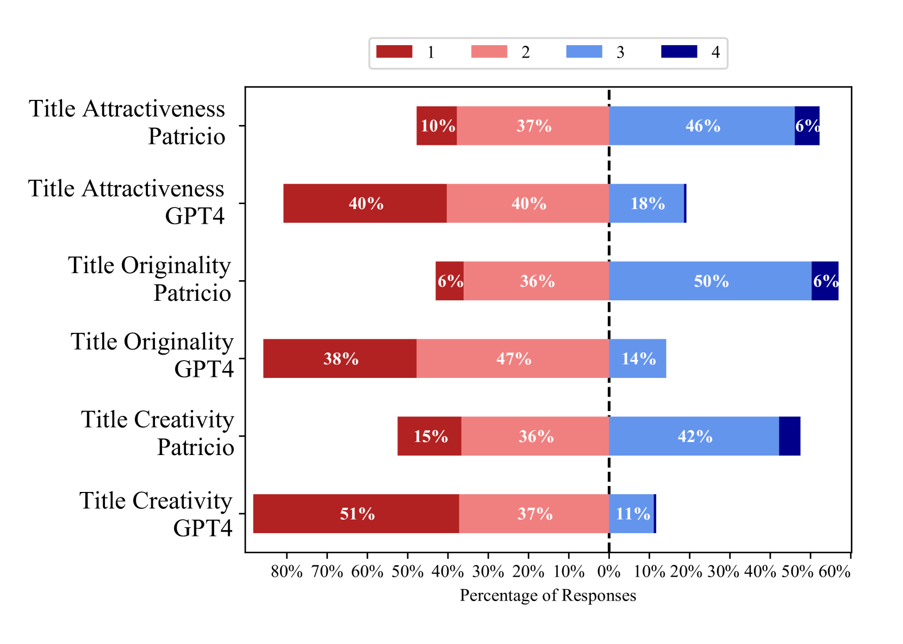
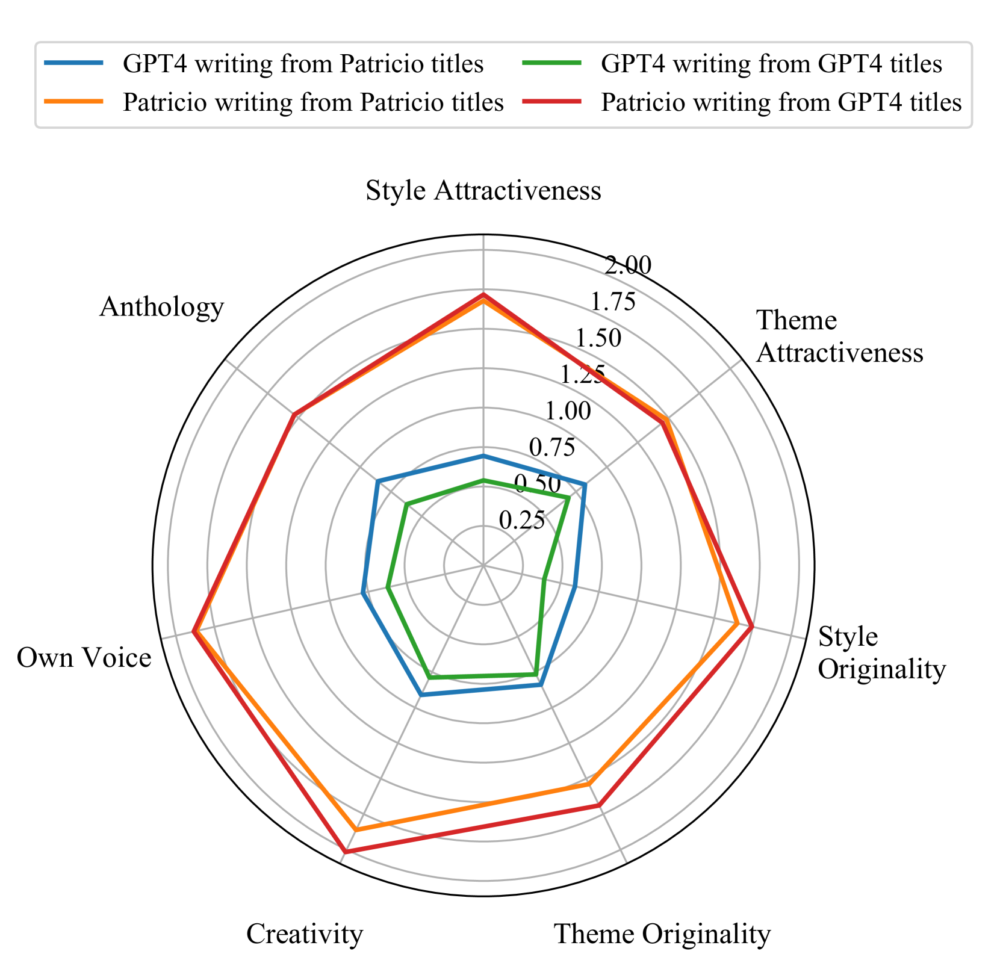
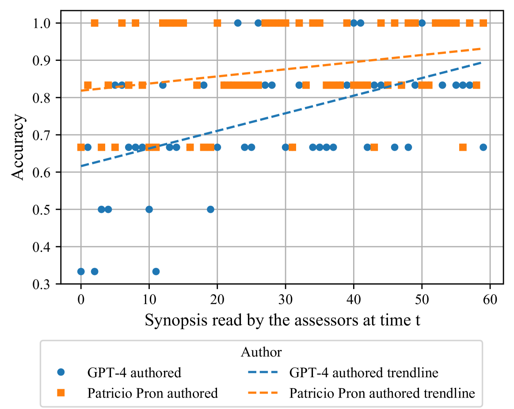
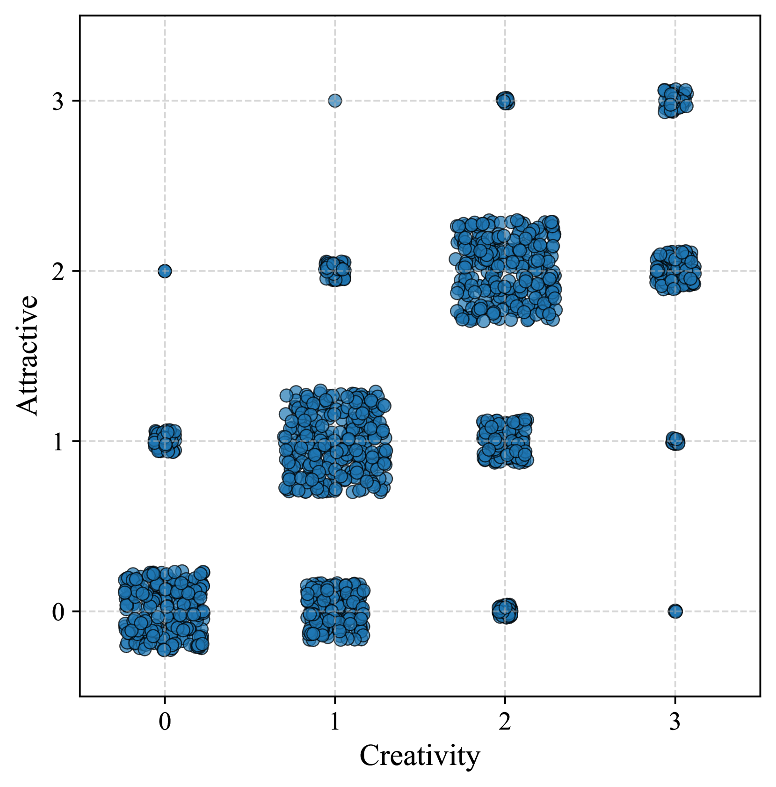
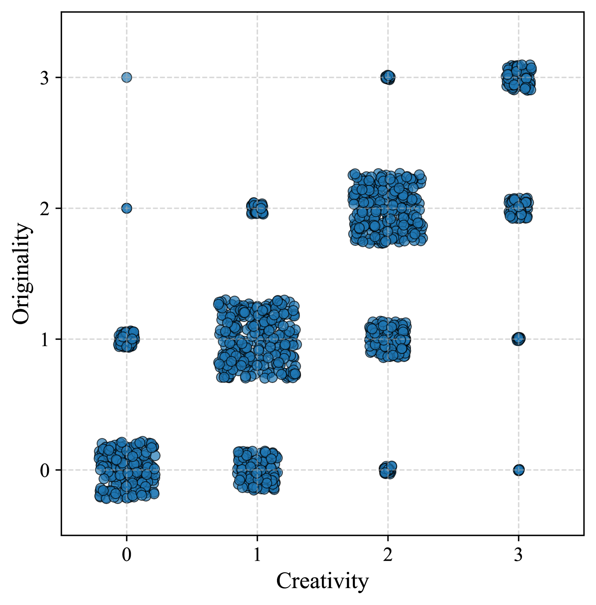

# 大型语言模型与世界级小说作者在创意写作上的较量：Pron vs Prompt，究竟谁能胜出？

发布时间：2024年07月01日

`LLM应用` `人工智能`

> Pron vs Prompt: Can Large Language Models already Challenge a World-Class Fiction Author at Creative Text Writing?

# 摘要

> 在众多语言任务中，大型语言模型（LLMs）超越普通人类已成为常态，创意写作也不例外。然而，我们不禁要问：LLMs能否与顶尖小说家一较高下？为此，我们举办了一场AI与人类的创意对决，邀请了获奖小说家Patricio Pron与顶尖模型GPT-4同台竞技。双方各自构思三十个标题，并据此创作故事。我们借鉴Boden的创造力定义制定了评估标准，并收集了5,400份文学专家的评价。结果显示，LLMs在创意写作领域仍远未达到人类顶尖水平，仅凭扩大模型规模或许难以实现这一飞跃。

> It has become routine to report research results where Large Language Models (LLMs) outperform average humans in a wide range of language-related tasks, and creative text writing is no exception. It seems natural, then, to raise the bid: Are LLMs ready to compete in creative writing skills with a top (rather than average) novelist? To provide an initial answer for this question, we have carried out a contest between Patricio Pron (an awarded novelist, considered one of the best of his generation) and GPT-4 (one of the top performing LLMs), in the spirit of AI-human duels such as DeepBlue vs Kasparov and AlphaGo vs Lee Sidol. We asked Pron and GPT-4 to provide thirty titles each, and then to write short stories for both their titles and their opponent's. Then, we prepared an evaluation rubric inspired by Boden's definition of creativity, and we collected 5,400 manual assessments provided by literature critics and scholars. The results of our experimentation indicate that LLMs are still far from challenging a top human creative writer, and that reaching such level of autonomous creative writing skills probably cannot be reached simply with larger language models.

[Arxiv](https://arxiv.org/abs/2407.01119)