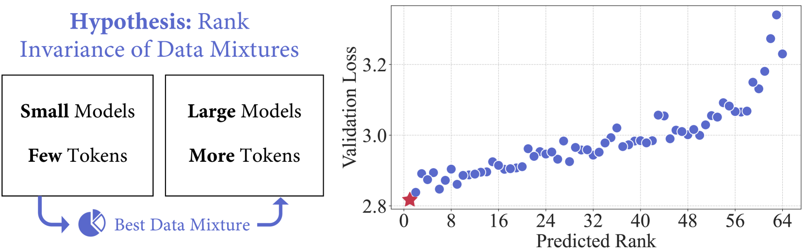

# RegMix：以数据混合为手段，通过回归进行语言模型预训练

发布时间：2024年07月01日

`LLM理论` `人工智能` `数据科学`

> RegMix: Data Mixture as Regression for Language Model Pre-training

# 摘要

> 大型语言模型预训练中的数据混合对性能影响重大，但如何确定有效混合仍是个谜。我们提出RegMix，通过将其视为回归任务，自动识别高性能数据混合。RegMix通过多样数据混合训练小型模型，并拟合回归模型预测性能。利用此模型，我们模拟最佳混合，训练计算量巨大的大型模型。为验证RegMix，我们训练512个1M参数模型，用于1B令牌的不同混合，拟合回归模型并找到最佳混合。使用此混合，我们训练1B参数模型，用于25B令牌，表现优于64个候选模型。此外，RegMix超越人工选择，与DoReMi相媲美或更优，且仅用10%计算预算。实验显示：（1）数据混合显著影响性能，单任务性能变化达14.6%；（2）网络语料库与下游性能正相关最强；（3）领域交互复杂，需自动方法；（4）数据混合效应超越缩放定律，我们方法考虑所有领域捕捉复杂性。代码见https://github.com/sail-sg/regmix。

> The data mixture for large language model pre-training significantly impacts performance, yet how to determine an effective mixture remains unclear. We propose RegMix to automatically identify a high-performing data mixture by formulating it as a regression task. RegMix involves training a set of small models with diverse data mixtures and fitting a regression model to predict their performance given their respective mixtures. With the fitted regression model, we simulate the top-ranked mixture and use it to train a large-scale model with orders of magnitude more compute. To empirically validate RegMix, we train 512 models with 1M parameters for 1B tokens of different mixtures to fit the regression model and find the optimal mixture. Using this mixture we train a 1B parameter model for 25B tokens (i.e. 1000x larger and 25x longer) which we find performs best among 64 candidate 1B parameter models with other mixtures. Further, our method demonstrates superior performance compared to human selection and achieves results that match or surpass DoReMi, while utilizing only 10% of the compute budget. Our experiments also show that (1) Data mixtures significantly impact performance with single-task performance variations of up to 14.6%; (2) Web corpora rather than data perceived as high-quality like Wikipedia have the strongest positive correlation with downstream performance; (3) Domains interact in complex ways often contradicting common sense, thus automatic approaches like RegMix are needed; (4) Data mixture effects transcend scaling laws, and our approach captures the complexity by considering all domains together. Our code is available at https://github.com/sail-sg/regmix.

[Arxiv](https://arxiv.org/abs/2407.01492)