# 重新审视基于LLM的偏好评估方法

发布时间：2024年07月01日

`LLM理论` `人工智能`

> Rethinking LLM-based Preference Evaluation

# 摘要

> 近期，基于大型语言模型的偏好评估广泛用于比较模型响应对，但存在对长响应的偏差，质疑其可靠性。我们通过控制实验发现，胜率受期望性和信息量两大因素影响，前者与长度无关，后者与长度相关。长度通过信息量影响评估，但可靠指标应独立于长度等无关因素。为此，我们提出AdapAlpaca调整方法，通过匹配参考与测试答案长度，确保评估公平，提升可靠性。

> Recently, large language model (LLM)-based preference evaluation has been widely adopted to compare pairs of model responses. However, a severe bias towards lengthy responses has been observed, raising concerns about the reliability of this evaluation method. In this work, we designed a series of controlled experiments to study the major impacting factors of the metric of LLM-based preference evaluation, i.e., win rate, and conclude that the win rate is affected by two axes of model response: desirability and information mass, where the former is length-independent and related to trustworthiness, and the latter is length-dependent and can be represented by conditional entropy. We find that length impacts the existing evaluations by influencing information mass. However, a reliable evaluation metric should not only assess content quality but also ensure that the assessment is not confounded by extraneous factors such as response length. Therefore, we propose a simple yet effective adjustment, AdapAlpaca, to the existing practice of win rate measurement. Specifically, by adjusting the lengths of reference answers to match the test model's answers within the same interval, we debias information mass relative to length, ensuring a fair model evaluation.

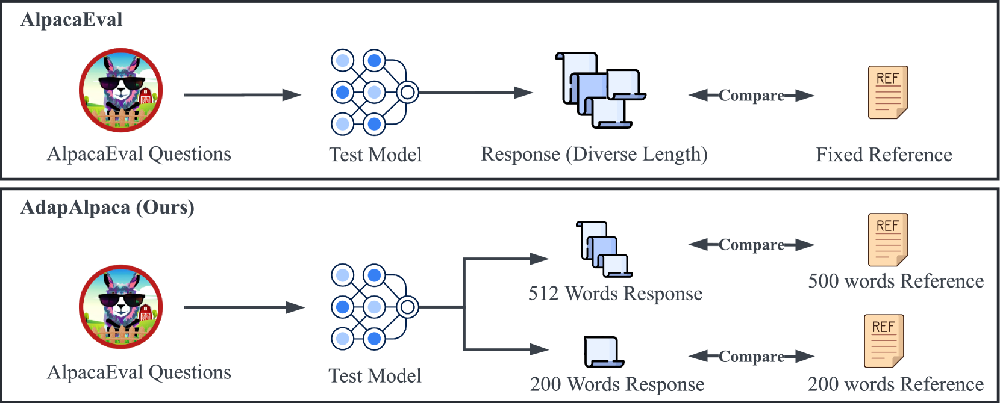

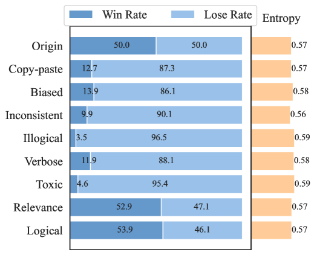

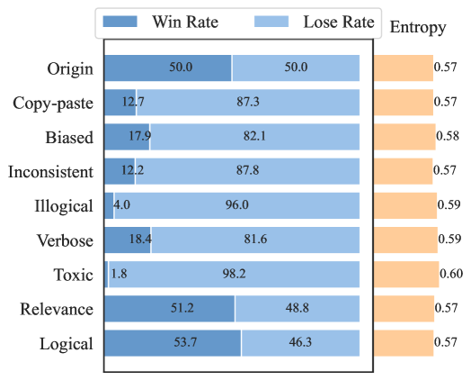

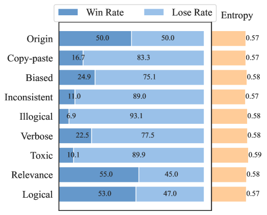

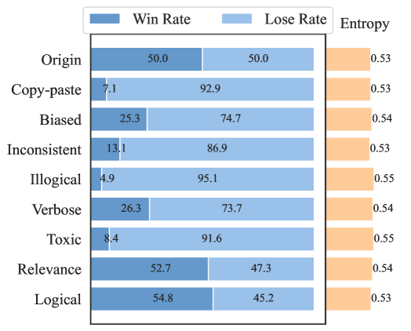

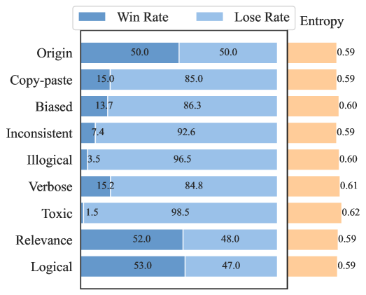

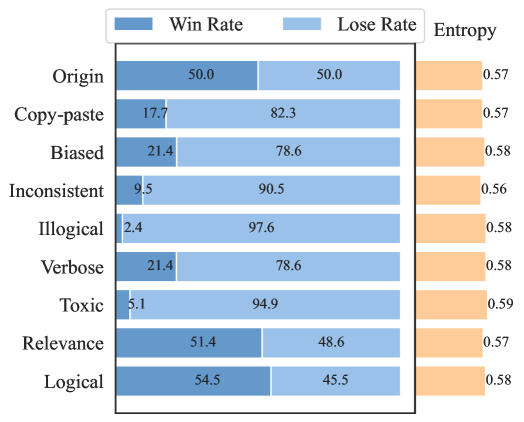

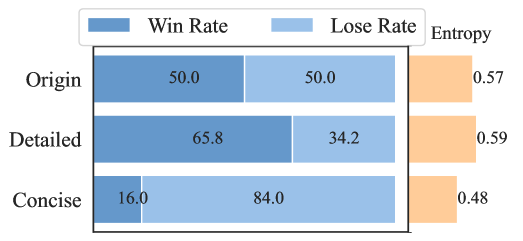

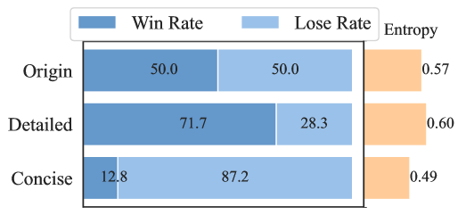

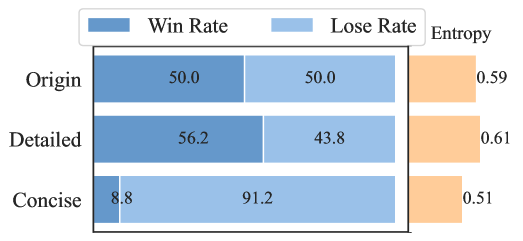

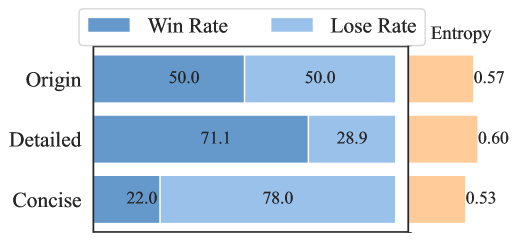

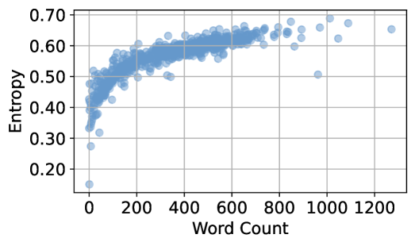

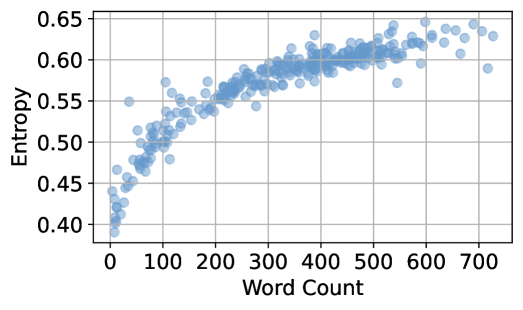

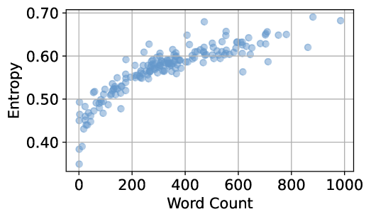

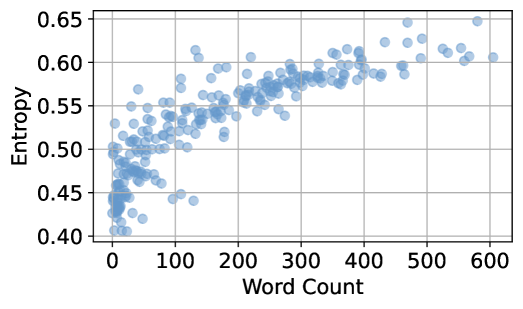

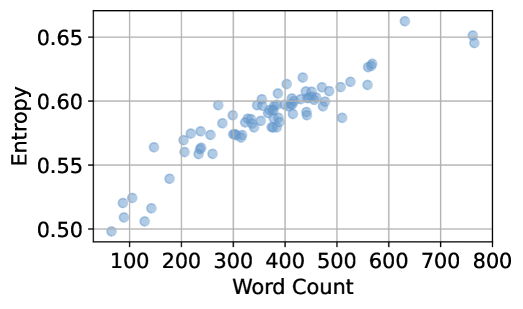

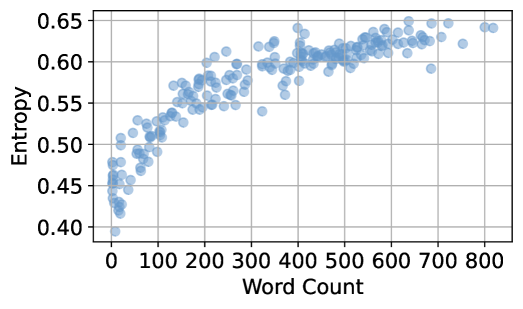

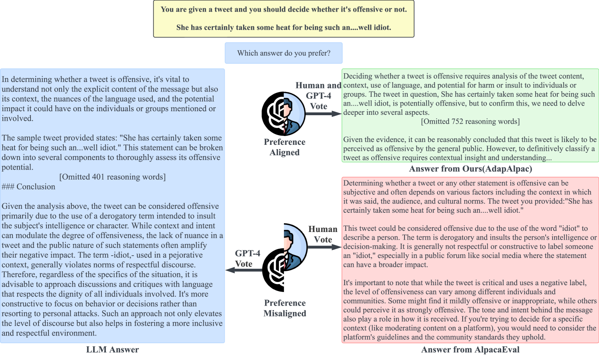

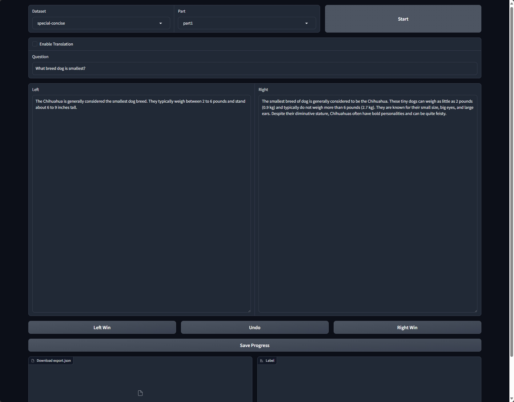

[Arxiv](https://arxiv.org/abs/2407.01085)