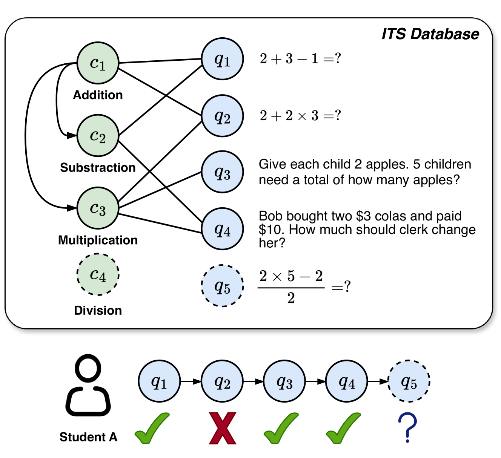

# SINKT：结合大型语言模型的结构感知归纳知识追踪模型

发布时间：2024年07月01日

`LLM应用` `智能辅导系统`

> SINKT: A Structure-Aware Inductive Knowledge Tracing Model with Large Language Model

# 摘要

> 知识追踪 (KT) 是智能辅导系统中的关键任务，旨在预测学生能否正确回答下一个问题。然而，传统基于转导 ID 的方法常受数据稀疏和冷启动问题困扰，且未能直接建模概念与问题间的复杂关系。为此，我们提出结构感知归纳知识追踪模型 SINKT，首次结合大型语言模型 (LLM) 实现归纳知识追踪。SINKT 通过 LLM 构建概念间的结构关系和异构图，并融入语义信息以提升预测准确性。最终，通过与学生知识状态和问题表示的交互，SINKT 预测学生对新问题的回答。实验显示，SINKT 在多个数据集上超越现有模型，达到最优性能，并深入分析了其在归纳 KT 任务中的表现。

> Knowledge Tracing (KT) aims to determine whether students will respond correctly to the next question, which is a crucial task in intelligent tutoring systems (ITS). In educational KT scenarios, transductive ID-based methods often face severe data sparsity and cold start problems, where interactions between individual students and questions are sparse, and new questions and concepts consistently arrive in the database. In addition, existing KT models only implicitly consider the correlation between concepts and questions, lacking direct modeling of the more complex relationships in the heterogeneous graph of concepts and questions. In this paper, we propose a Structure-aware Inductive Knowledge Tracing model with large language model (dubbed SINKT), which, for the first time, introduces large language models (LLMs) and realizes inductive knowledge tracing. Firstly, SINKT utilizes LLMs to introduce structural relationships between concepts and constructs a heterogeneous graph for concepts and questions. Secondly, by encoding concepts and questions with LLMs, SINKT incorporates semantic information to aid prediction. Finally, SINKT predicts the student's response to the target question by interacting with the student's knowledge state and the question representation. Experiments on four real-world datasets demonstrate that SINKT achieves state-of-the-art performance among 12 existing transductive KT models. Additionally, we explore the performance of SINKT on the inductive KT task and provide insights into various modules.

[Arxiv](https://arxiv.org/abs/2407.01245)