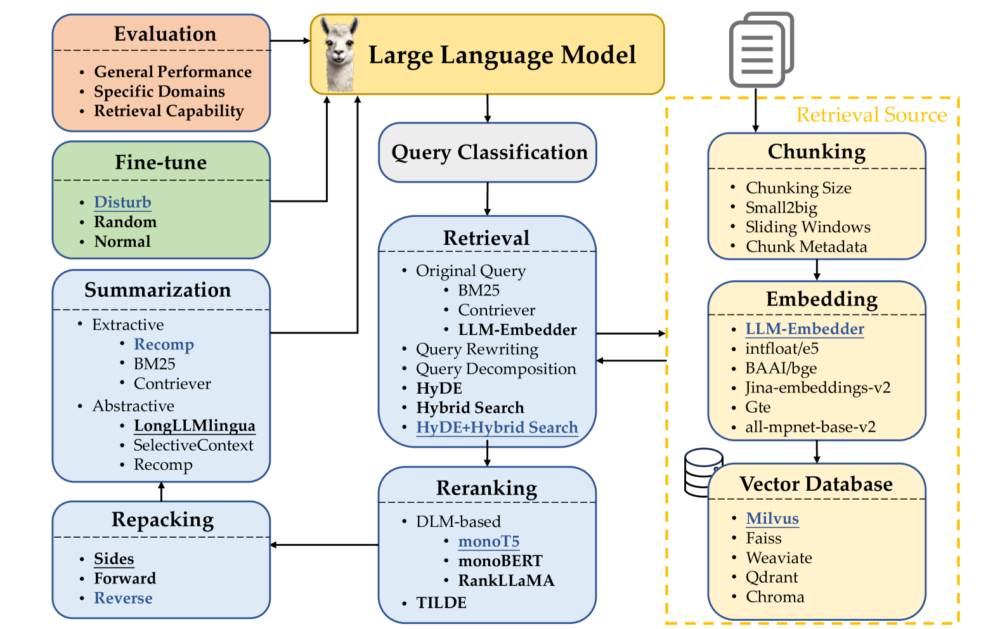
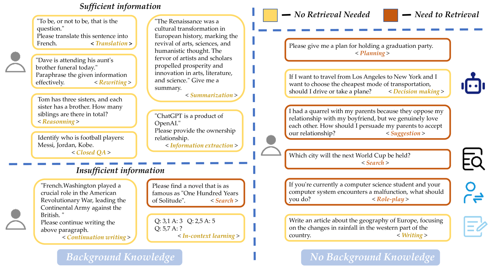
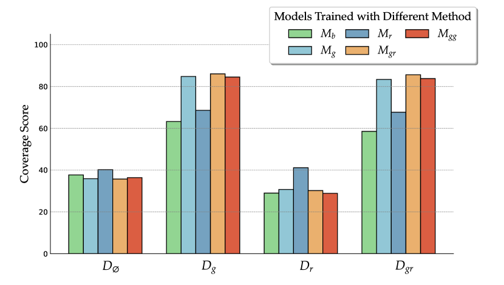
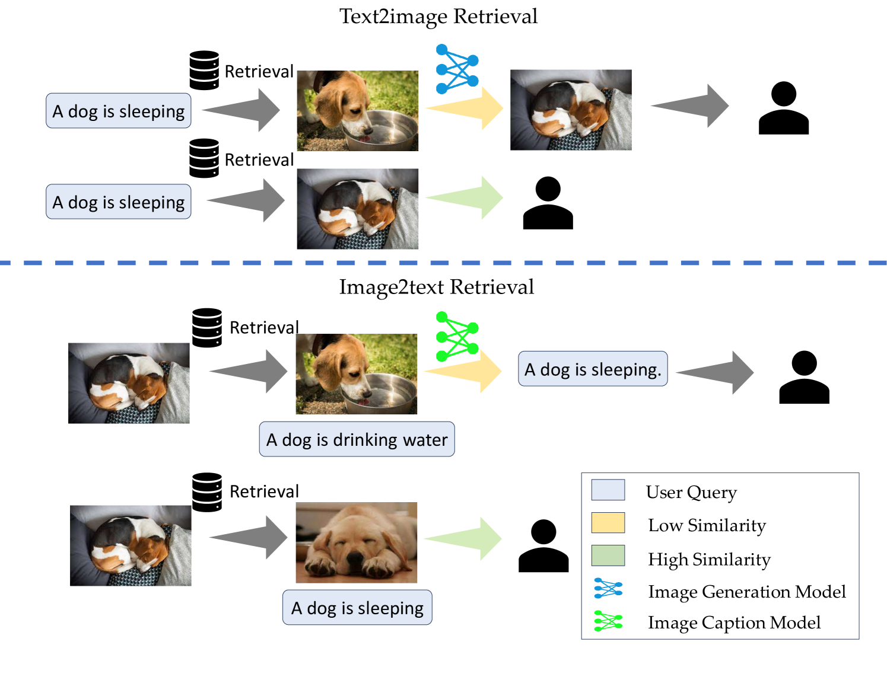

# 探寻检索增强生成领域的最佳实践

发布时间：2024年07月01日

`RAG` `专业领域` `多模态内容生成`

> Searching for Best Practices in Retrieval-Augmented Generation

# 摘要

> RAG技术在整合最新信息、减少幻觉和提升响应质量方面表现出色，尤其是在专业领域。然而，尽管有许多依赖查询的检索方法被提出以增强大型语言模型，这些方法的复杂实现和较长响应时间仍是问题。我们深入研究了现有RAG方法及其组合，旨在找出最佳实践。通过大量实验，我们推荐了几种既能保证性能又能提高效率的RAG部署策略。此外，我们还展示了多模态检索技术如何显著提升对视觉内容的问答能力，并通过“检索即生成”策略加速多模态内容的生成。

> Retrieval-augmented generation (RAG) techniques have proven to be effective in integrating up-to-date information, mitigating hallucinations, and enhancing response quality, particularly in specialized domains. While many RAG approaches have been proposed to enhance large language models through query-dependent retrievals, these approaches still suffer from their complex implementation and prolonged response times. Typically, a RAG workflow involves multiple processing steps, each of which can be executed in various ways. Here, we investigate existing RAG approaches and their potential combinations to identify optimal RAG practices. Through extensive experiments, we suggest several strategies for deploying RAG that balance both performance and efficiency. Moreover, we demonstrate that multimodal retrieval techniques can significantly enhance question-answering capabilities about visual inputs and accelerate the generation of multimodal content using a "retrieval as generation" strategy.

[Arxiv](https://arxiv.org/abs/2407.01219)