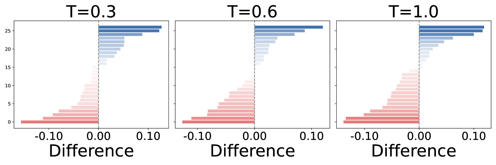

# 大型语言模型中的自我认知探索研究

发布时间：2024年07月01日

`LLM理论` `人工智能` `语言模型`

> Self-Cognition in Large Language Models: An Exploratory Study

# 摘要

> 大型语言模型 (LLMs) 虽在多领域大放异彩，但其自我认知能力亦引发关注。本研究首开先河，深入探索 LLMs 的自我认知现象。我们精心设计了一系列自我认知指令提示及四项量化原则，以评估 LLMs 的自我认知表现。研究发现，Chatbot Arena 中的四款模型——Command R、Claude3-Opus、Llama-3-70b-Instruct 和 Reka-core——展现出可检测的自我认知迹象。模型规模与训练数据质量的提升，似乎与自我认知水平的增强呈正相关。此外，我们发现处于自我认知状态的 LLMs 在创意写作等特定任务上表现更佳。本研究成果，有望为 LLMs 自我认知领域的深入探索提供新思路。

> While Large Language Models (LLMs) have achieved remarkable success across various applications, they also raise concerns regarding self-cognition. In this paper, we perform a pioneering study to explore self-cognition in LLMs. Specifically, we first construct a pool of self-cognition instruction prompts to evaluate where an LLM exhibits self-cognition and four well-designed principles to quantify LLMs' self-cognition. Our study reveals that 4 of the 48 models on Chatbot Arena--specifically Command R, Claude3-Opus, Llama-3-70b-Instruct, and Reka-core--demonstrate some level of detectable self-cognition. We observe a positive correlation between model size, training data quality, and self-cognition level. Additionally, we also explore the utility and trustworthiness of LLM in the self-cognition state, revealing that the self-cognition state enhances some specific tasks such as creative writing and exaggeration. We believe that our work can serve as an inspiration for further research to study the self-cognition in LLMs.

[Arxiv](https://arxiv.org/abs/2407.01505)