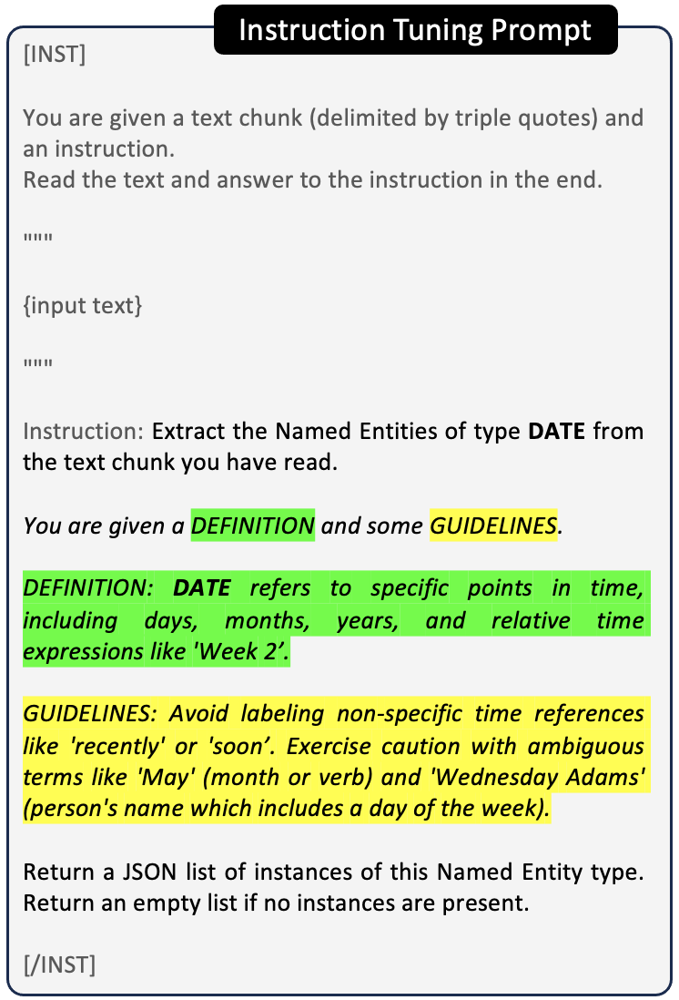

# 精简展示，强化指导：通过定义与指南提升零-shot NER 的提示质量

发布时间：2024年07月01日

`LLM应用` `人工智能`

> Show Less, Instruct More: Enriching Prompts with Definitions and Guidelines for Zero-Shot NER

# 摘要

> 近期，针对命名实体识别 (NER) 的专用指令调整大型语言模型 (LLM) 崭露头角，其泛化能力超越传统方法。传统 LLM 多聚焦于域外零-shot NER，依赖于与测试集高度重叠的大量实体类别进行微调。而我们提出的 SLIMER 方法，则通过精简示例指导和丰富提示中的定义与指南，有效应对新出现的命名实体标签。实验显示，这种方法不仅提升了性能，还加速并强化了学习过程，尤其在处理未知命名实体时表现突出。此外，SLIMER 在域外零-shot NER 任务中与顶尖方法不相上下，且训练标签集更为精简。

> Recently, several specialized instruction-tuned Large Language Models (LLMs) for Named Entity Recognition (NER) have emerged. Compared to traditional NER approaches, these models have strong generalization capabilities. Existing LLMs mainly focus on zero-shot NER in out-of-domain distributions, being fine-tuned on an extensive number of entity classes that often highly or completely overlap with test sets. In this work instead, we propose SLIMER, an approach designed to tackle never-seen-before named entity tags by instructing the model on fewer examples, and by leveraging a prompt enriched with definition and guidelines. Experiments demonstrate that definition and guidelines yield better performance, faster and more robust learning, particularly when labelling unseen Named Entities. Furthermore, SLIMER performs comparably to state-of-the-art approaches in out-of-domain zero-shot NER, while being trained on a reduced tag set.

[Arxiv](https://arxiv.org/abs/2407.01272)