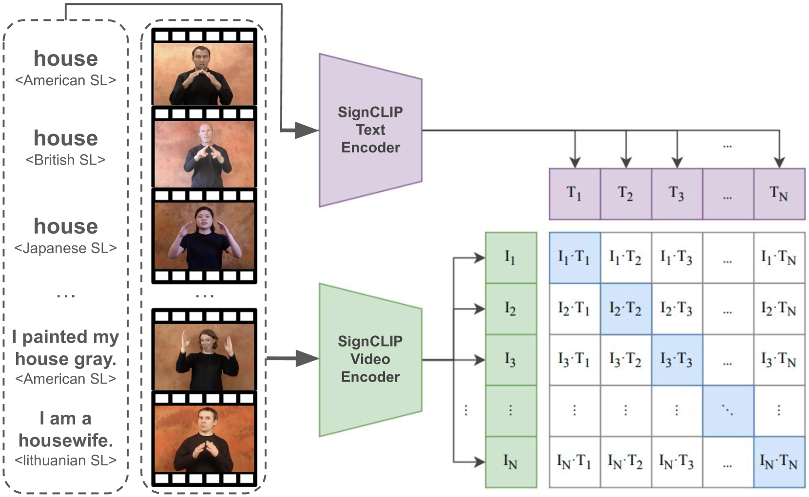
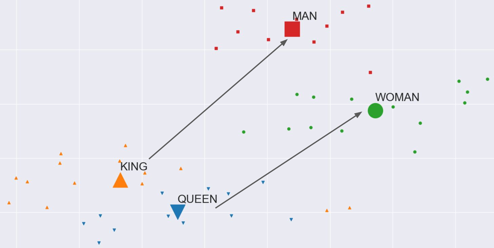
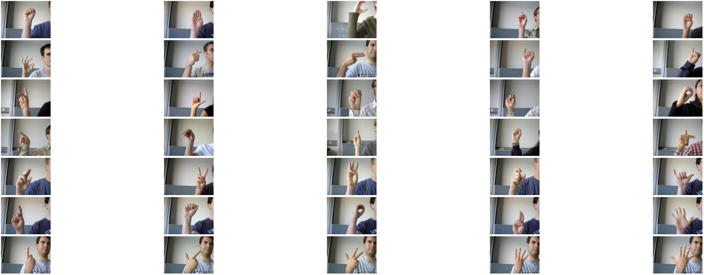
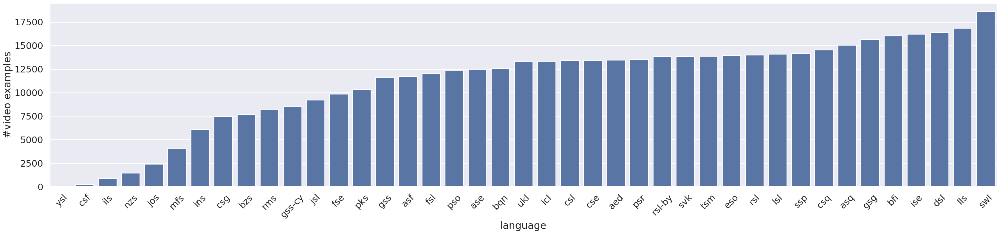
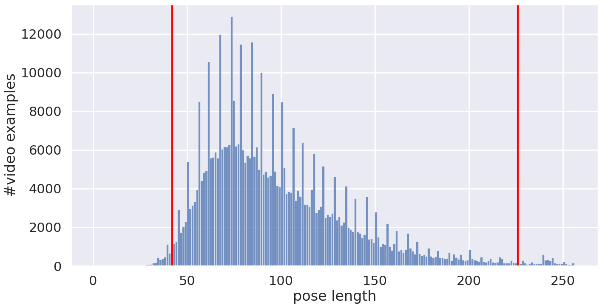
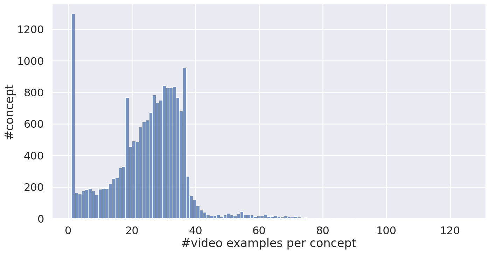

# SignCLIP：借助对比学习，架起文本与手语之间的桥梁

发布时间：2024年07月01日

`LLM应用` `手语识别` `语言学`

> SignCLIP: Connecting Text and Sign Language by Contrastive Learning

# 摘要

> 我们开发了 SignCLIP，通过重新利用 CLIP 技术，将口语和手语这两种不同模态的语言融合至同一空间。SignCLIP 高效地从多语言视频-文本对中提取手语视觉特征，无需针对特定手语或任务进行优化。我们在包含 44 种手语的 Spreadthesign 词典上预训练模型，并在多个下游任务中验证其性能。SignCLIP 在手语识别中展现出高精度的文本-视频互检能力，并在其他领域任务中表现优异，仅需少量学习或微调。此外，我们探索了口语与手语间的潜在空间，揭示了新的语言视角。相关代码和模型已公开分享。

> We present SignCLIP, which re-purposes CLIP (Contrastive Language-Image Pretraining) to project spoken language text and sign language videos, two classes of natural languages of distinct modalities, into the same space. SignCLIP is an efficient method of learning useful visual representations for sign language processing from large-scale, multilingual video-text pairs, without directly optimizing for a specific task or sign language which is often of limited size.
  We pretrain SignCLIP on Spreadthesign, a prominent sign language dictionary consisting of ~500 thousand video clips in up to 44 sign languages, and evaluate it with various downstream datasets. SignCLIP discerns in-domain signing with notable text-to-video/video-to-text retrieval accuracy. It also performs competitively for out-of-domain downstream tasks such as isolated sign language recognition upon essential few-shot prompting or fine-tuning.
  We analyze the latent space formed by the spoken language text and sign language poses, which provides additional linguistic insights. Our code and models are openly available.

[Arxiv](https://arxiv.org/abs/2407.01264)