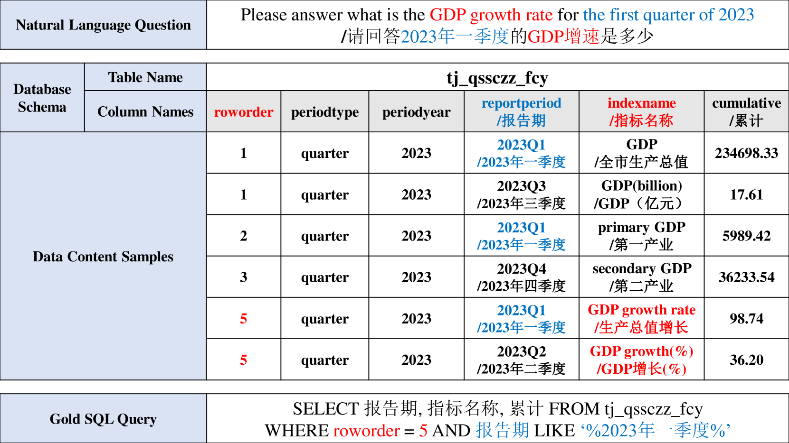
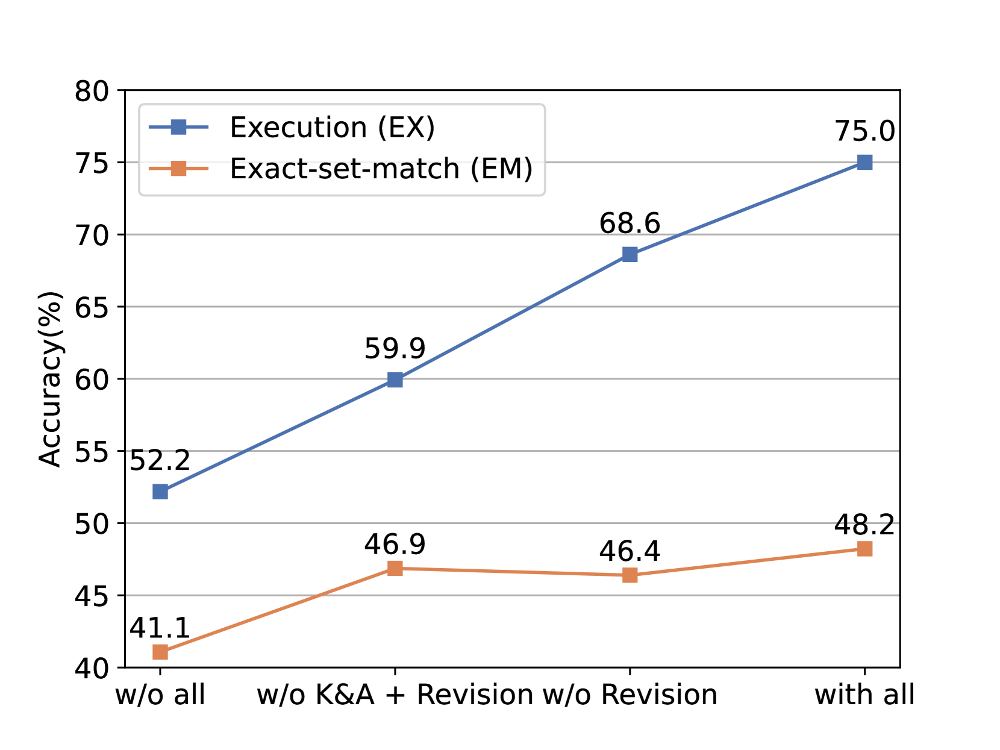
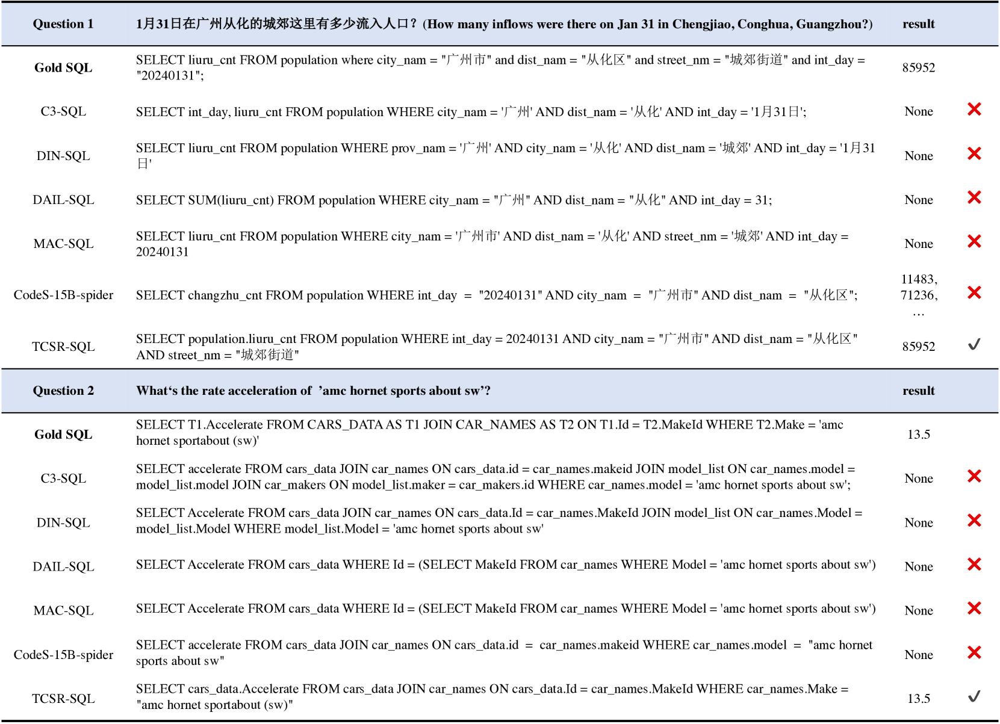
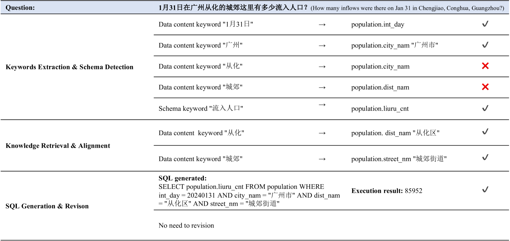
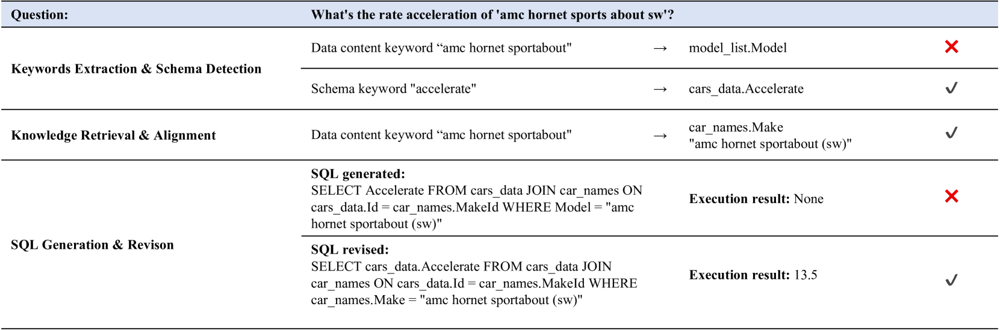

# TCSR-SQL：借助自检索技术，实现对表格内容的智能感知，进而生成SQL语句。

发布时间：2024年07月01日

`LLM应用` `数据库` `软件开发`

> TCSR-SQL: Towards Table Content-aware Text-to-SQL with Self-retrieval

# 摘要

> 基于大型语言模型的Text-to-SQL方法在生成实际应用的SQL查询方面取得了显著进展。然而，面对现实场景中涉及表格内容的复杂问题时，问题中含糊的关键词和不存在的数据库列名常导致现有方法性能不佳。为此，我们创新性地提出了表格内容感知Text-to-SQL自检索（TCSR-SQL）方法，巧妙利用LLM的上下文学习能力，精准提取问题中的数据关键词，并推断相关数据库模式，进而生成种子SQL进行模糊搜索。搜索结果再通过精心设计的编码知识表进行确认，最终通过多轮生成-执行-修订流程，输出精确SQL。为验证这一方法的有效性，我们构建了一个包含1,692对问题-SQL的基准数据集。实验结果显示，TCSR-SQL在执行准确率上比现有顶尖方法提升了至少13.7%，表现卓越。

> Large Language Model-based (LLM-based) Text-to-SQL methods have achieved important progress in generating SQL queries for real-world applications. When confronted with table content-aware questions in real-world scenarios, ambiguous data content keywords and non-existent database schema column names within the question leads to the poor performance of existing methods. To solve this problem, we propose a novel approach towards Table Content-aware Text-to-SQL with Self-Retrieval (TCSR-SQL). It leverages LLM's in-context learning capability to extract data content keywords within the question and infer possible related database schema, which is used to generate Seed SQL to fuzz search databases. The search results are further used to confirm the encoding knowledge with the designed encoding knowledge table, including column names and exact stored content values used in the SQL. The encoding knowledge is sent to obtain the final Precise SQL following multi-rounds of generation-execution-revision process. To validate our approach, we introduce a table-content-aware, question-related benchmark dataset, containing 1,692 question-SQL pairs. Comprehensive experiments conducted on this benchmark demonstrate the remarkable performance of TCSR-SQL, achieving an improvement of at least 13.7% in execution accuracy compared to other state-of-the-art methods.

[Arxiv](https://arxiv.org/abs/2407.01183)