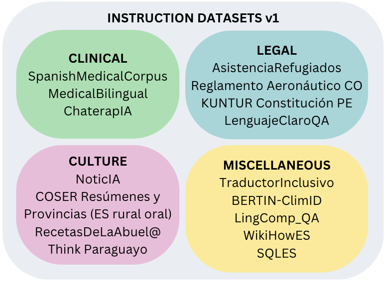
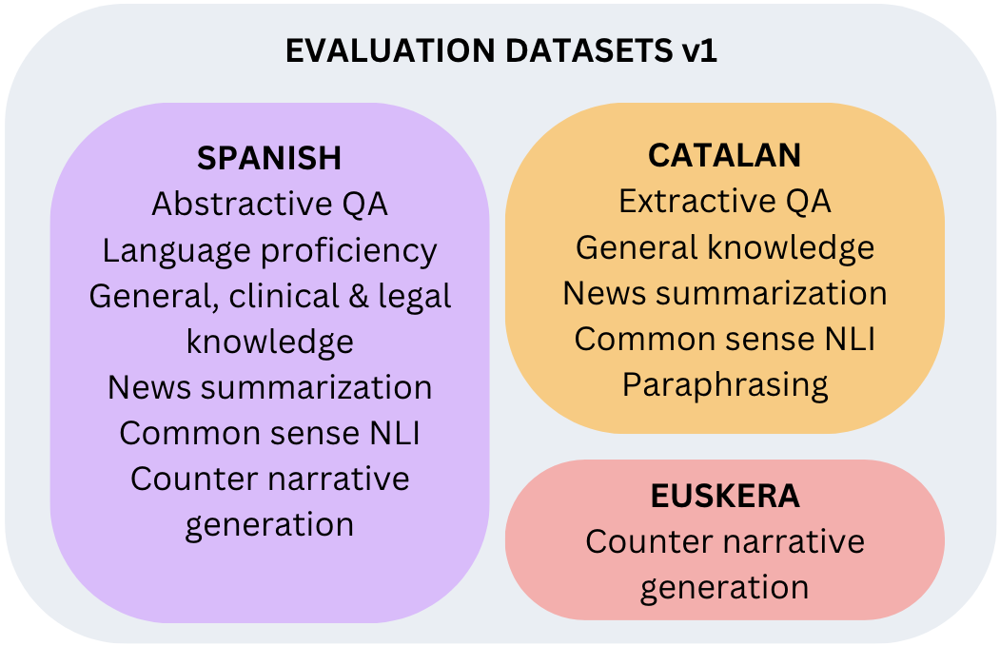
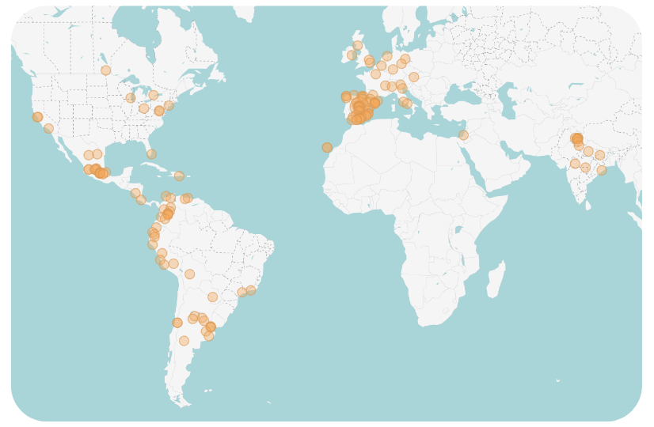
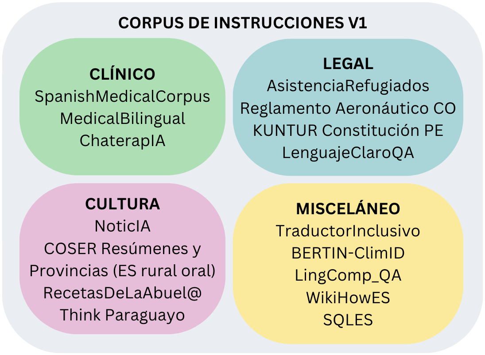
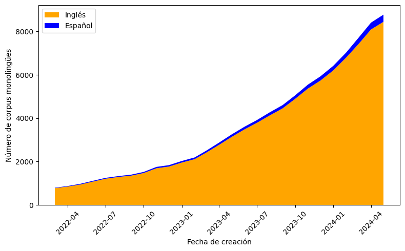

# #Somos600M 项目旨在创造反映拉丁美洲、加勒比海及西班牙语言多样性的NLP资源。

发布时间：2024年07月01日

`LLM应用` `人工智能`

> The #Somos600M Project: Generating NLP resources that represent the diversity of the languages from LATAM, the Caribbean, and Spain

# 摘要

> 我们是6亿西班牙语使用者，为了在AI系统中体现拉丁美洲、加勒比和西班牙的语言多样性，我们启动了#Somos600M项目。尽管我们占全球人口的7.5%，但缺乏用于LLMs指令调整的开放数据集和评估排行榜。本文展示了我们如何作为国际开源社区，成功创建了首批指令和评估数据集，这些资源对于推动我们语言的NLP发展至关重要。

> We are 600 million Spanish speakers. We launched the #Somos600M Project because the diversity of the languages from LATAM, the Caribbean and Spain needs to be represented in Artificial Intelligence (AI) systems. Despite being the 7.5% of the world population, there is no open dataset to instruction-tune large language models (LLMs), nor a leaderboard to evaluate and compare them. In this paper, we present how we have created as an international open-source community the first versions of the instruction and evaluation datasets, indispensable resources for the advancement of Natural Language Processing (NLP) in our languages.

[Arxiv](https://arxiv.org/abs/2407.17479)