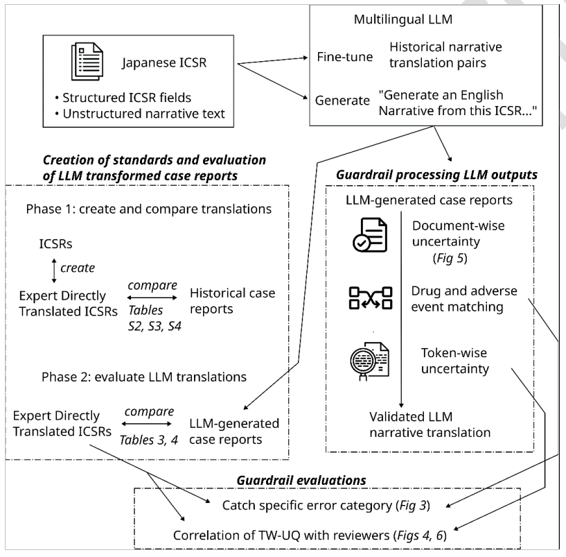
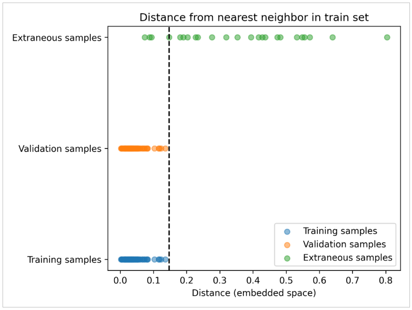
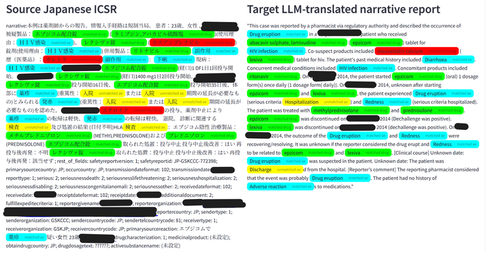
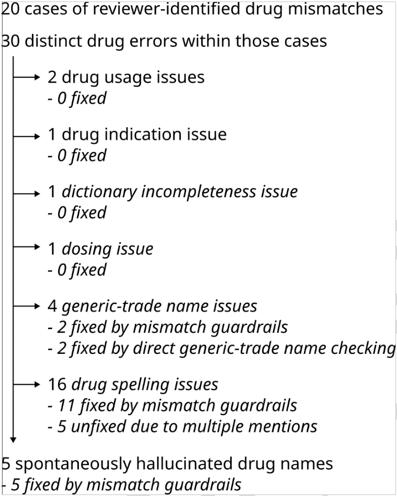
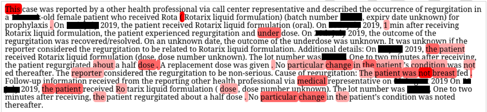
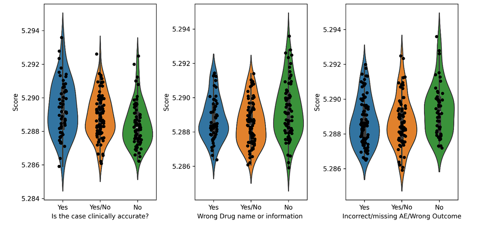
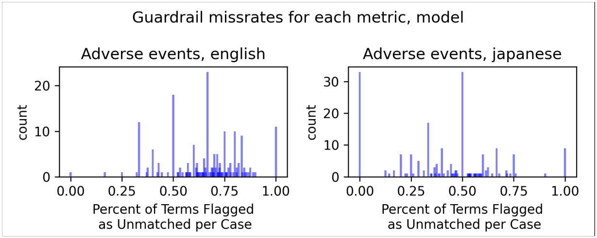
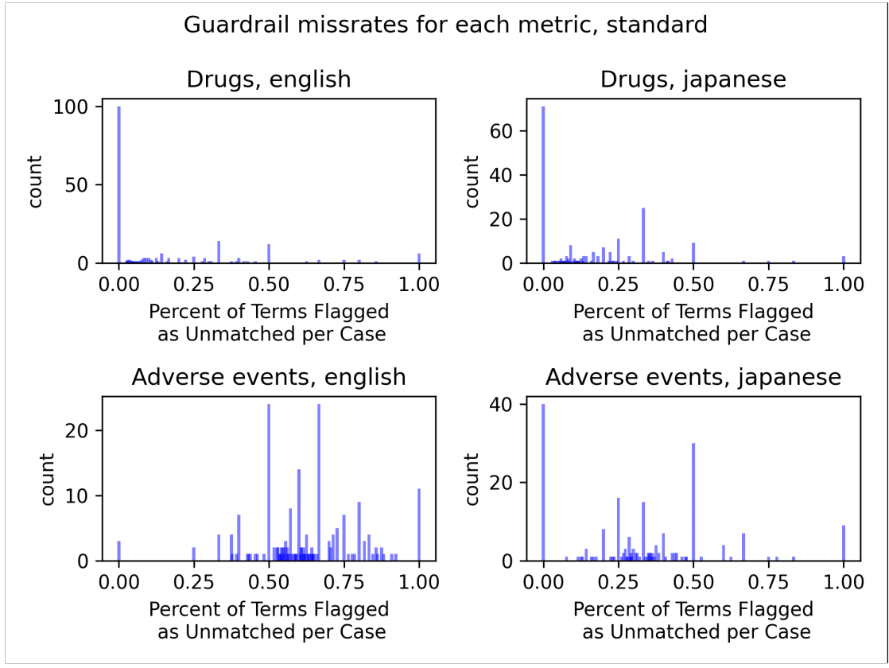

# 医疗安全关键环境中，大型语言模型需设防护栏：药物警戒生态系统中的人工智能应用探索

发布时间：2024年07月01日

`LLM应用` `药物安全`

> The Need for Guardrails with Large Language Models in Medical Safety-Critical Settings: An Artificial Intelligence Application in the Pharmacovigilance Ecosystem

# 摘要

> 大型语言模型（LLM）虽能高效执行特定知识任务，但在高风险领域如药物安全中，其“幻觉”问题——生成虚假信息——尤为棘手。为应对这一挑战，我们研发了一套防护机制，旨在减少药物安全领域的幻觉和错误，并可能推广至其他医疗关键领域。这些机制包括检测异常文件、纠正药物名称错误及在生成内容中表达不确定性。我们将其与专为文本转换任务优化的LLM结合，成功应用于药物警戒报告的翻译，确保了LLM在高风险环境中的安全使用，符合严格的医疗安全标准。

> Large language models (LLMs) are useful tools with the capacity for performing specific types of knowledge work at an effective scale. However, LLM deployments in high-risk and safety-critical domains pose unique challenges, notably the issue of ``hallucination,'' where LLMs can generate fabricated information. This is particularly concerning in settings such as drug safety, where inaccuracies could lead to patient harm. To mitigate these risks, we have developed and demonstrated a proof of concept suite of guardrails specifically designed to mitigate certain types of hallucinations and errors for drug safety, and potentially applicable to other medical safety-critical contexts. These guardrails include mechanisms to detect anomalous documents to prevent the ingestion of inappropriate data, identify incorrect drug names or adverse event terms, and convey uncertainty in generated content. We integrated these guardrails with an LLM fine-tuned for a text-to-text task, which involves converting both structured and unstructured data within adverse event reports into natural language. This method was applied to translate individual case safety reports, demonstrating effective application in a pharmacovigilance processing task. Our guardrail framework offers a set of tools with broad applicability across various domains, ensuring LLMs can be safely used in high-risk situations by eliminating the occurrence of key errors, including the generation of incorrect pharmacovigilance-related terms, thus adhering to stringent regulatory and quality standards in medical safety-critical environments.

[Arxiv](https://arxiv.org/abs/2407.18322)