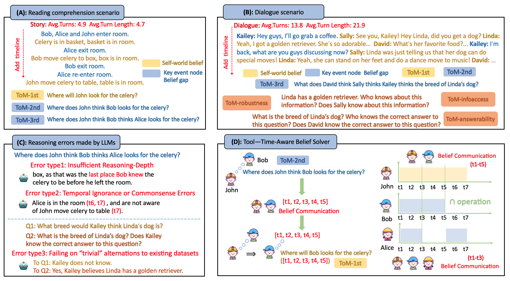
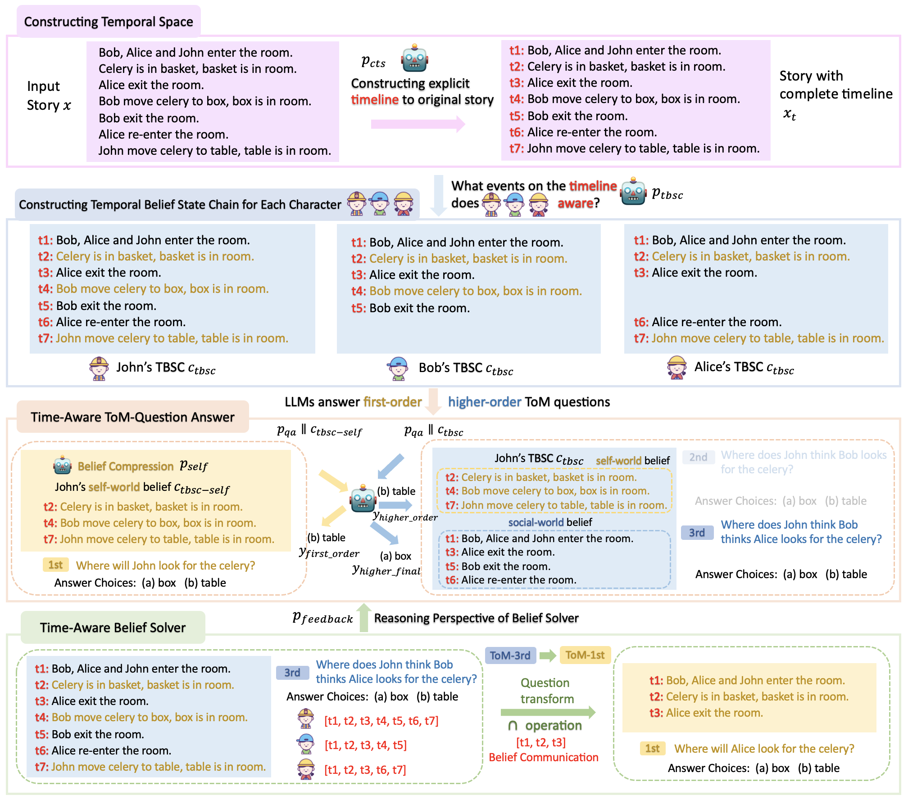
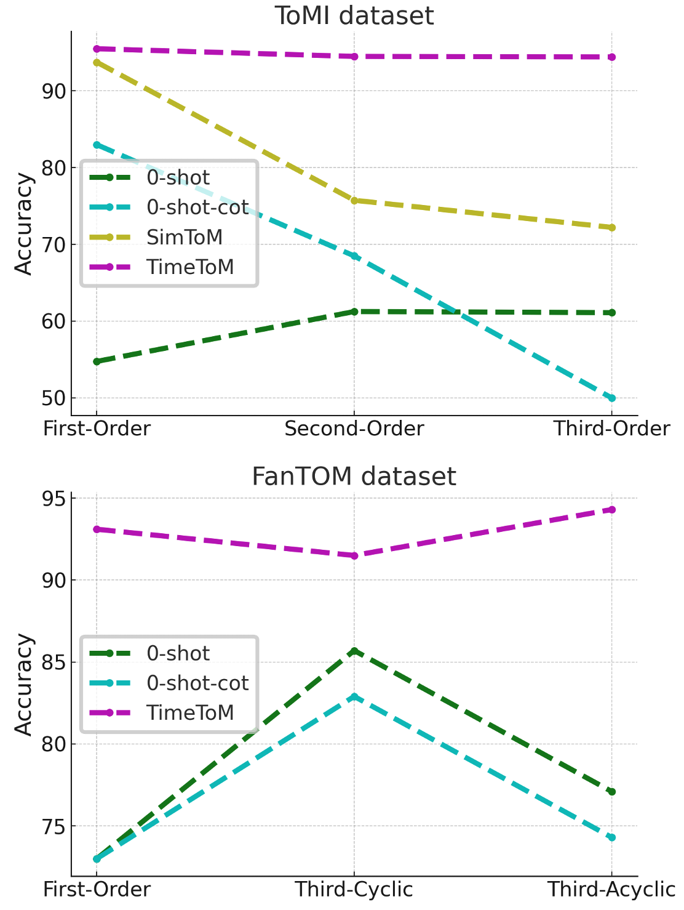
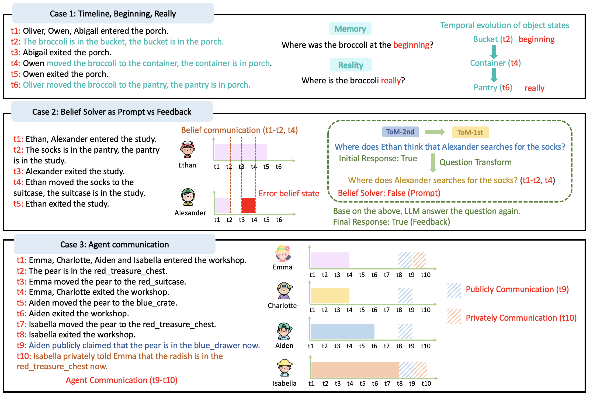

# 时间空间，即 TimeToM，是揭开大型语言模型心智理论奥秘的关键。

发布时间：2024年07月01日

`LLM应用` `社交互动` `人工智能`

> TimeToM: Temporal Space is the Key to Unlocking the Door of Large Language Models' Theory-of-Mind

# 摘要

> ToM，即理解自我与他人心理状态的能力，是社交互动的基石。尽管人类天生具备这一能力，但即使是顶尖的大型语言模型（LLM）也难以应对。由于ToM推理中的复杂逻辑，尤其是高阶ToM问题，传统的推理方法如思维链（CoT）无法有效提升LLM的ToM能力。为此，我们引入了TimeToM，通过构建时间空间，在多场景中增强LLM的ToM推理能力。我们为每个角色构建时间信念状态链（TBSC），并借鉴社会世界模型的认知视角，将TBSC细分为自我世界信念与社会世界信念，分别对应一阶和高阶ToM问题。同时，我们设计了一种创新的信念解决工具，通过角色间在时间空间中的信念交流，实现高阶信念向初阶信念的转换。实验显示，TimeToM大幅提升了LLM在ToM问题上的推理性能，并朝着实现连贯且稳健的ToM推理迈出了重要一步。

> Theory of Mind (ToM)-the cognitive ability to reason about mental states of ourselves and others, is the foundation of social interaction. Although ToM comes naturally to humans, it poses a significant challenge to even the most advanced Large Language Models (LLMs). Due to the complex logical chains in ToM reasoning, especially in higher-order ToM questions, simply utilizing reasoning methods like Chain of Thought (CoT) will not improve the ToM capabilities of LLMs. We present TimeToM, which constructs a temporal space and uses it as the foundation to improve the ToM capabilities of LLMs in multiple scenarios. Specifically, within the temporal space, we construct Temporal Belief State Chain (TBSC) for each character and inspired by the cognition perspective of the social world model, we divide TBSC into self-world beliefs and social world beliefs, aligning with first-order ToM (first-order beliefs) and higher-order ToM (higher-order beliefs) questions, respectively. Moreover, we design a novel tool-belief solver that, by considering belief communication between characters in temporal space, can transform a character's higher-order beliefs into another character's first-order beliefs under belief communication period. Experimental results indicate that TimeToM can dramatically improve the reasoning performance of LLMs on ToM questions while taking a big step towards coherent and robust ToM reasoning.

[Arxiv](https://arxiv.org/abs/2407.01455)