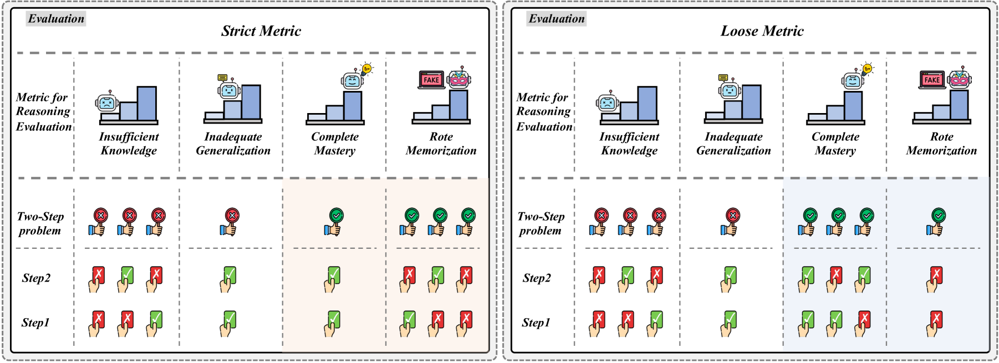

# We-Math：探寻大型多模态模型是否已具备人类般的数学推理能力。

发布时间：2024年07月01日

`LLM应用` `人工智能`

> We-Math: Does Your Large Multimodal Model Achieve Human-like Mathematical Reasoning?

# 摘要

> 视觉数学推理作为一项基础能力，备受大型多模态模型（LMMs）社区瞩目。然而，现有基准如MathVista和MathVerse过于侧重结果，忽略了知识获取与泛化的深层原理。受人类数学推理启发，我们推出WE-MATH，首个专注于探索问题解决原则的基准。我们精心整理了6.5K个视觉数学问题，涵盖67个知识层次与五层知识粒度，并根据知识需求分解复合问题为子问题。我们创新引入四维指标——知识不足（IK）、泛化不足（IG）、完全掌握（CM）和机械记忆（RM），以层次化评估LMMs推理过程。通过WE-MATH，我们全面评估了现有LMMs，并发现解决步骤与问题性能呈负相关。我们证实，通过知识增强策略可有效改善LMMs的IK问题。尤为突出的是，GPT-4o已从IK转向IG，成为首个迈向知识泛化阶段的LMM。而其他LMMs则倾向于机械记忆，虽能解决复合问题，却未能解答子问题。我们期待WE-MATH为LMMs在视觉数学推理领域的进步开辟新路。WE-MATH数据与评估代码已公开于https://github.com/We-Math/We-Math。

> Visual mathematical reasoning, as a fundamental visual reasoning ability, has received widespread attention from the Large Multimodal Models (LMMs) community. Existing benchmarks, such as MathVista and MathVerse, focus more on the result-oriented performance but neglect the underlying principles in knowledge acquisition and generalization. Inspired by human-like mathematical reasoning, we introduce WE-MATH, the first benchmark specifically designed to explore the problem-solving principles beyond end-to-end performance. We meticulously collect and categorize 6.5K visual math problems, spanning 67 hierarchical knowledge concepts and five layers of knowledge granularity. We decompose composite problems into sub-problems according to the required knowledge concepts and introduce a novel four-dimensional metric, namely Insufficient Knowledge (IK), Inadequate Generalization (IG), Complete Mastery (CM), and Rote Memorization (RM), to hierarchically assess inherent issues in LMMs' reasoning process. With WE-MATH, we conduct a thorough evaluation of existing LMMs in visual mathematical reasoning and reveal a negative correlation between solving steps and problem-specific performance. We confirm the IK issue of LMMs can be effectively improved via knowledge augmentation strategies. More notably, the primary challenge of GPT-4o has significantly transitioned from IK to IG, establishing it as the first LMM advancing towards the knowledge generalization stage. In contrast, other LMMs exhibit a marked inclination towards Rote Memorization - they correctly solve composite problems involving multiple knowledge concepts yet fail to answer sub-problems. We anticipate that WE-MATH will open new pathways for advancements in visual mathematical reasoning for LMMs. The WE-MATH data and evaluation code are available at https://github.com/We-Math/We-Math.

[Arxiv](https://arxiv.org/abs/2407.01284)