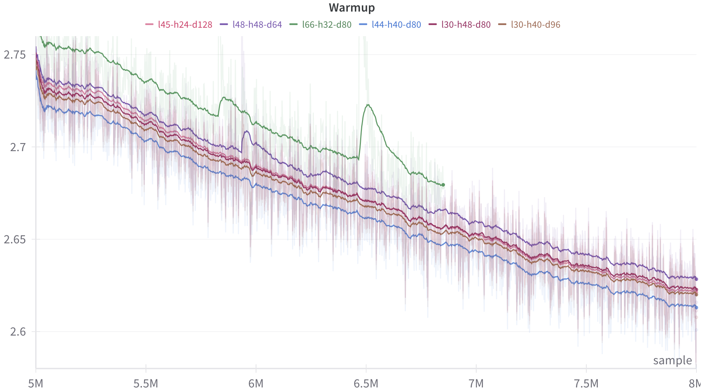
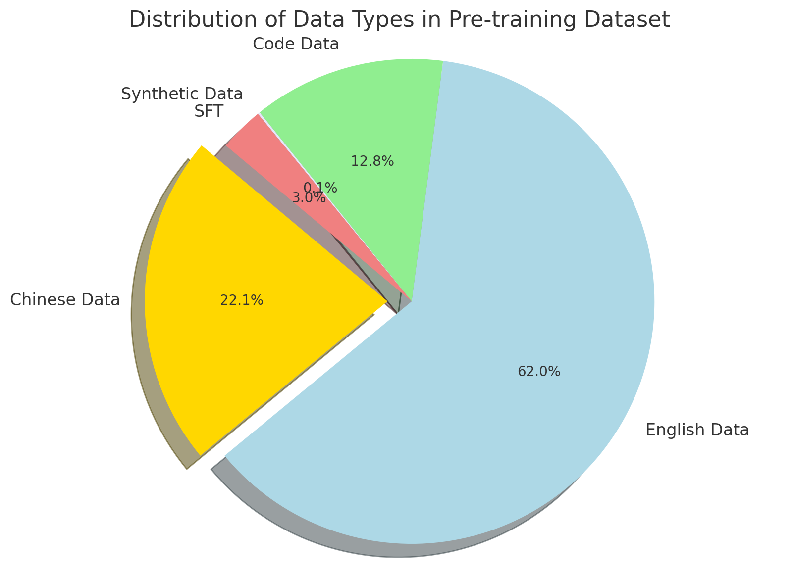

# 语言建模中的显式记忆技术

发布时间：2024年07月01日

`LLM理论` `人工智能`

> : Language Modeling with Explicit Memory

# 摘要

> 受人类大脑记忆层次的启发，我们通过为大型语言模型（LLM）配备显式记忆，有效降低了训练和推理的高昂成本。这种显式记忆不仅成本低于模型参数和文本检索增强生成（RAG），还能使LLM在保持较小参数规模的同时，降低训练和推理成本。我们成功训练了一个2.4B参数的LLM，名为$\text{Memory}^3$，其性能超越了更大规模的LLM和RAG模型，且解码速度更快。此外，我们提出了一种记忆电路理论和相关技术，如记忆稀疏化机制和两阶段预训练方案，以支持知识的外部化和记忆的形成。

> The training and inference of large language models (LLMs) are together a costly process that transports knowledge from raw data to meaningful computation. Inspired by the memory hierarchy of the human brain, we reduce this cost by equipping LLMs with explicit memory, a memory format cheaper than model parameters and text retrieval-augmented generation (RAG). Conceptually, with most of its knowledge externalized to explicit memories, the LLM can enjoy a smaller parameter size, training cost, and inference cost, all proportional to the amount of remaining "abstract knowledge". As a preliminary proof of concept, we train from scratch a 2.4B LLM, which achieves better performance than much larger LLMs as well as RAG models, and maintains higher decoding speed than RAG. The model is named $\text{Memory}^3$, since explicit memory is the third form of memory in LLMs after implicit memory (model parameters) and working memory (context key-values). We introduce a memory circuitry theory to support the externalization of knowledge, and present novel techniques including a memory sparsification mechanism that makes storage tractable and a two-stage pretraining scheme that facilitates memory formation.

[Arxiv](https://arxiv.org/abs/2407.01178)