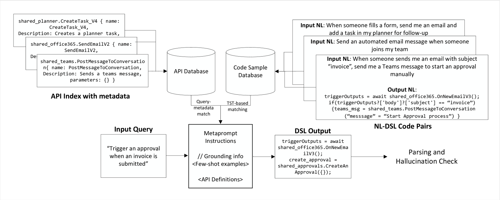

# 比较 DSL 代码生成的两种方法：微调与优化检索增强

发布时间：2024年07月02日

`RAG` `软件开发` `人工智能`

> A Comparative Study of DSL Code Generation: Fine-Tuning vs. Optimized Retrieval Augmentation

# 摘要

> 近年来，自然语言到代码生成在大型语言模型（LLM）的推动下取得了长足进步。尽管LLM在处理C、C++和Python等通用语言时表现出色，但在特定领域语言（DSL）中，面对自定义函数名称时却显得力不从心，导致幻觉率和语法错误频发。此外，函数名称的频繁更新也给LLM带来了挑战。本文中，我们针对DSL生成，结合检索增强生成（RAG）技术，对LLM进行了优化，并通过消融研究验证了这些策略的有效性。我们创建了一个涵盖约700个公共API的DSL训练和测试数据集，并利用该数据集对Codex模型进行了微调。实验结果表明，微调模型在代码相似度方面表现最佳，而经过RAG优化的模型在相似度上与之持平。尽管如此，两种模型在编译过程中仍不时出现语法错误，RAG方法略胜一筹。然而，在幻觉率方面，RAG模型在API名称和参数键上稍显逊色。总体而言，优化的RAG模型不仅能够媲美微调模型的性能，还能为处理新API提供更多优势。

> Natural Language to Code Generation has made significant progress in recent years with the advent of Large Language Models(LLMs). While generation for general-purpose languages like C, C++, and Python has improved significantly, LLMs struggle with custom function names in Domain Specific Languages or DSLs. This leads to higher hallucination rates and syntax errors, specially for DSLs having a high number of custom function names. Additionally, constant updates to function names add to the challenge as LLMs need to stay up-to-date. In this paper, we present optimizations for using Retrieval Augmented Generation (or RAG) with LLMs for DSL generation along with an ablation study comparing these strategies. We generated a train as well as test dataset with a DSL to represent automation tasks across roughly 700 APIs in public domain. We used the training dataset to fine-tune a Codex model for this DSL. Our results showed that the fine-tuned model scored the best on code similarity metric. With our RAG optimizations, we achieved parity for similarity metric. The compilation rate, however, showed that both the models still got the syntax wrong many times, with RAG-based method being 2 pts better. Conversely, hallucination rate for RAG model lagged by 1 pt for API names and by 2 pts for API parameter keys. We conclude that an optimized RAG model can match the quality of fine-tuned models and offer advantages for new, unseen APIs.

[Arxiv](https://arxiv.org/abs/2407.02742)