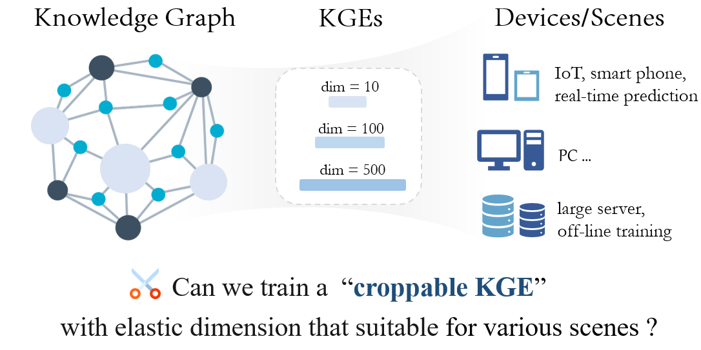
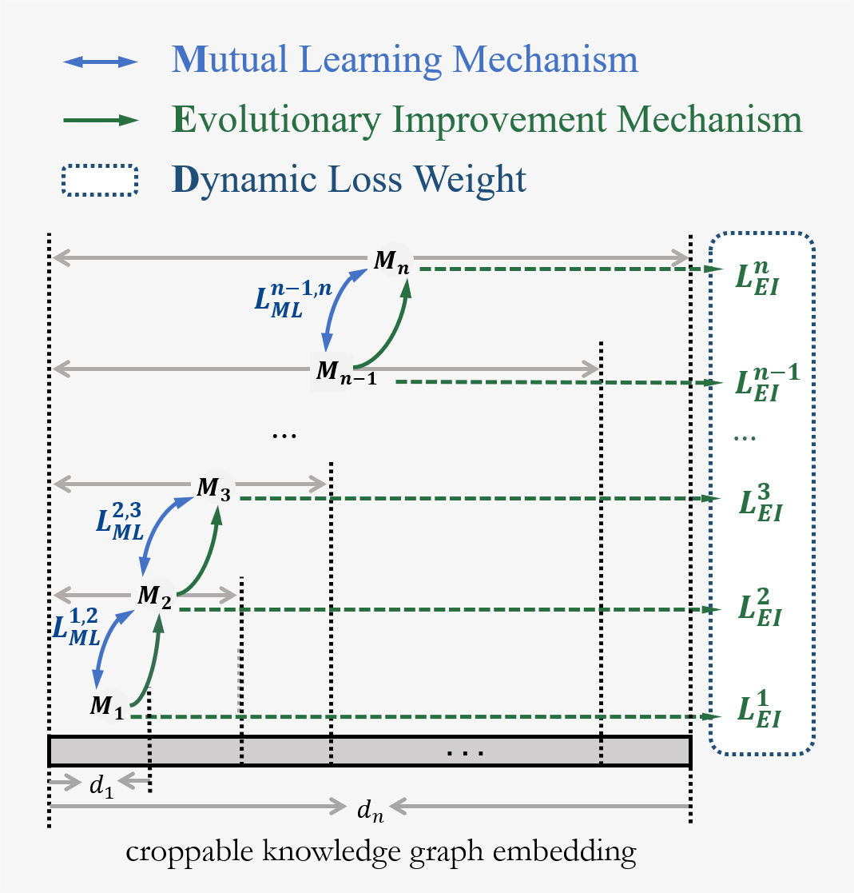
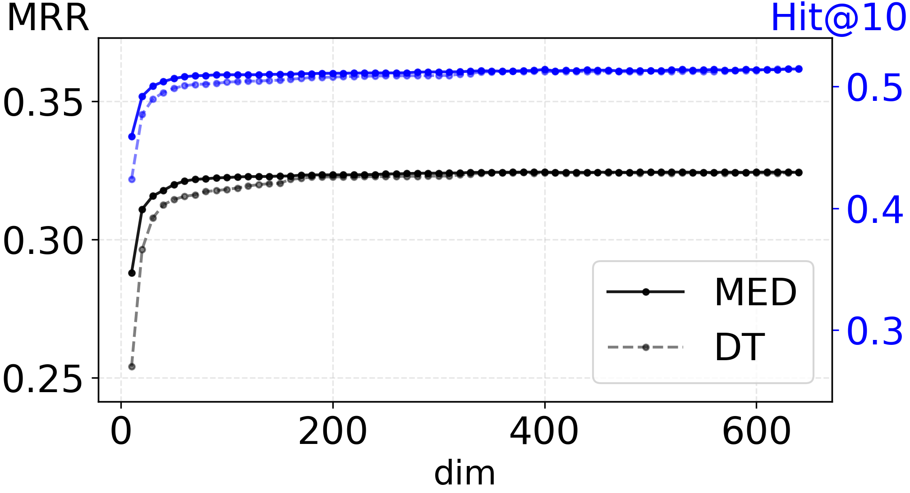
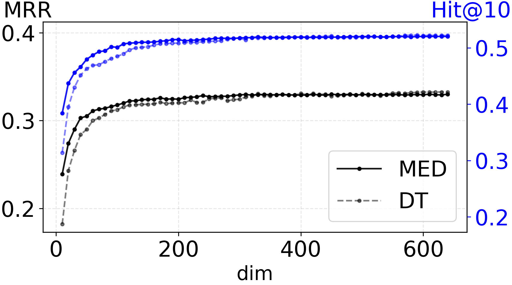
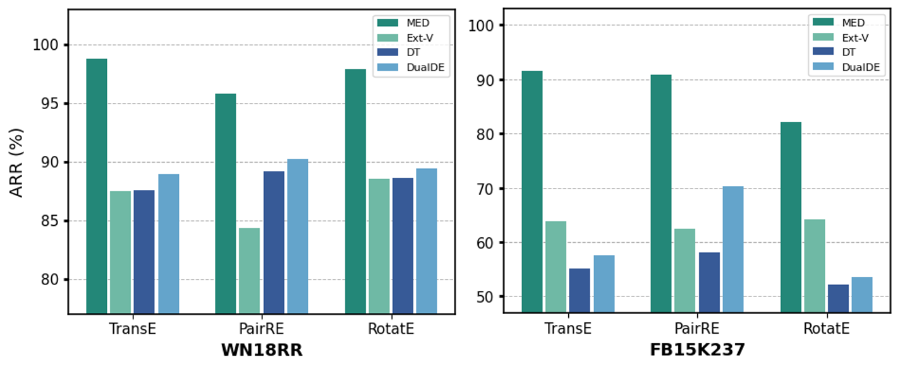
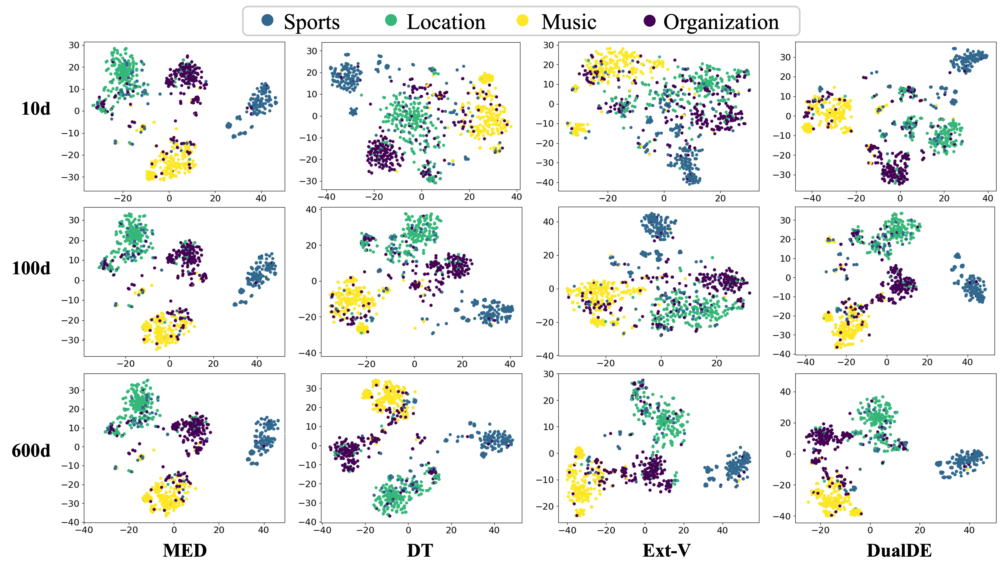
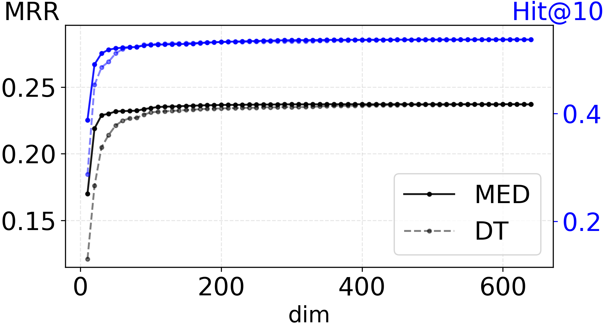
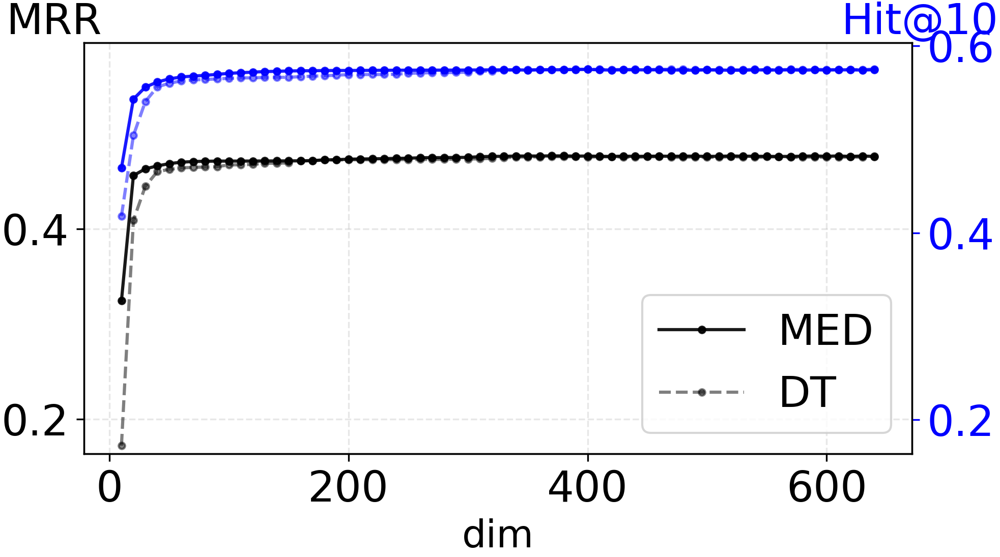
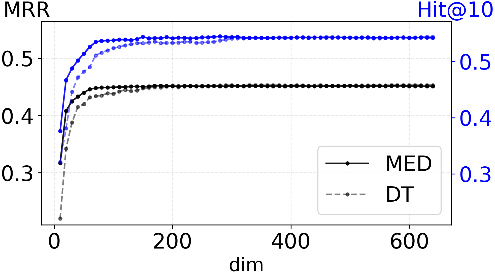
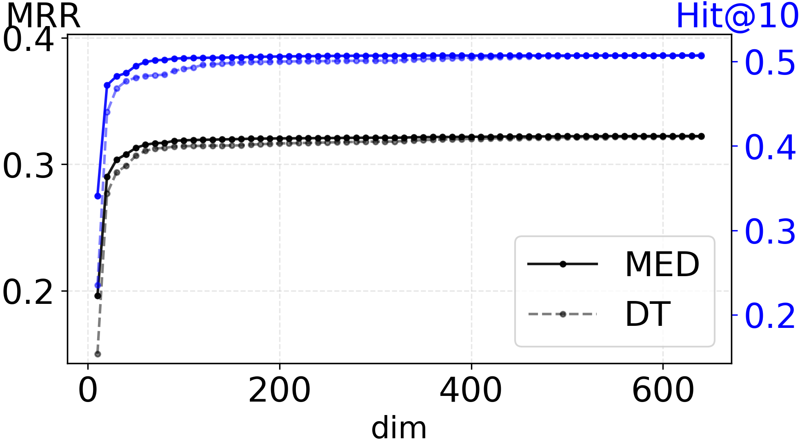

# 知识图谱嵌入的可裁剪性

发布时间：2024年07月02日

`LLM应用` `人工智能` `知识图谱`

> Croppable Knowledge Graph Embedding

# 摘要

> 知识图谱嵌入（KGE）是知识图谱服务于多种AI任务的常用技术。然而，每当需要新的嵌入维度时，就必须从头开始训练新的KGE模型，这不仅增加了成本，还限制了KGE的效率和灵活性。为此，我们推出了MED框架，只需一次训练，即可生成适用于不同维度需求的可裁剪KGE模型。MED框架内含相互学习、进化改进和动态损失权重三大机制，确保了模型的高效性和灵活性。实验证明，MED在多个数据集和实际应用场景中表现出色，且能无缝扩展至BERT等语言模型。

> Knowledge Graph Embedding (KGE) is a common method for Knowledge Graphs (KGs) to serve various artificial intelligence tasks. The suitable dimensions of the embeddings depend on the storage and computing conditions of the specific application scenarios. Once a new dimension is required, a new KGE model needs to be trained from scratch, which greatly increases the training cost and limits the efficiency and flexibility of KGE in serving various scenarios. In this work, we propose a novel KGE training framework MED, through which we could train once to get a croppable KGE model applicable to multiple scenarios with different dimensional requirements, sub-models of the required dimensions can be cropped out of it and used directly without any additional training. In MED, we propose a mutual learning mechanism to improve the low-dimensional sub-models performance and make the high-dimensional sub-models retain the capacity that low-dimensional sub-models have, an evolutionary improvement mechanism to promote the high-dimensional sub-models to master the knowledge that the low-dimensional sub-models can not learn, and a dynamic loss weight to balance the multiple losses adaptively. Experiments on 3 KGE models over 4 standard KG completion datasets, 3 real application scenarios over a real-world large-scale KG, and the experiments of extending MED to the language model BERT show the effectiveness, high efficiency, and flexible extensibility of MED.

[Arxiv](https://arxiv.org/abs/2407.02779)