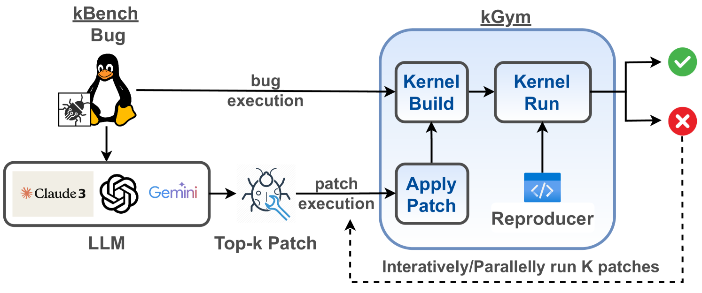
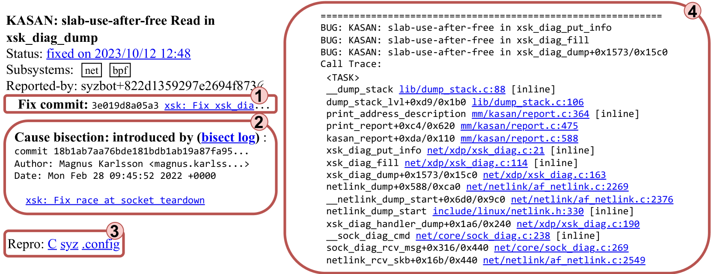
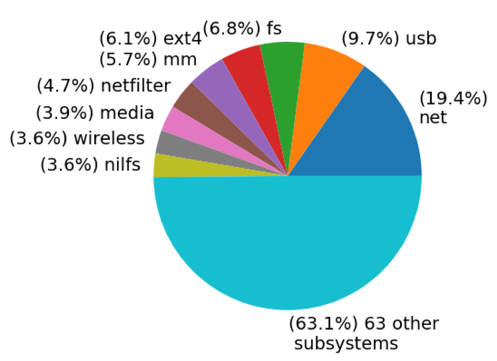
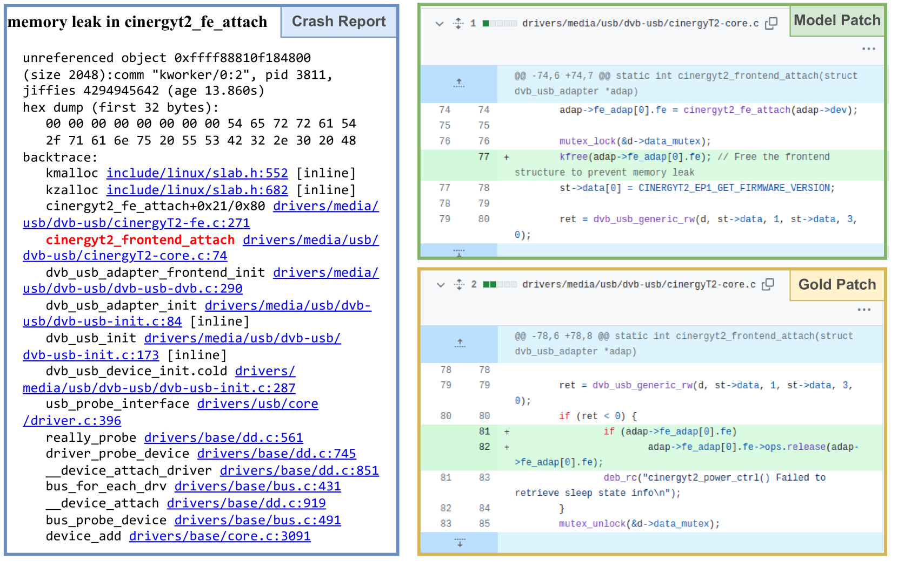
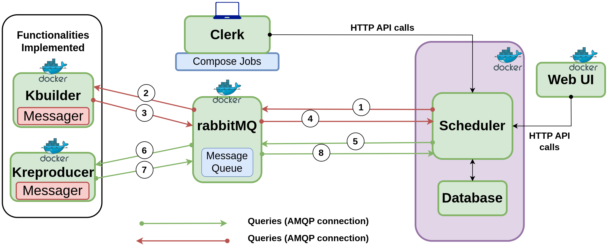

# KGym 是一个专为 Linux 内核崩溃解决而设计，用于评估大型语言模型性能的平台和数据集。

发布时间：2024年07月02日

`LLM应用` `软件工程` `系统软件`

> KGym: A Platform and Dataset to Benchmark Large Language Models on Linux Kernel Crash Resolution

# 摘要

> 大型语言模型（LLM）在处理日益复杂的软件工程任务中不断进步。在实际软件开发中，大量精力投入于基础系统软件，如Linux内核的构建。与应用层软件不同，Linux代码库庞大（超2000万行）、多语言（C/汇编/Bash/Rust）、关键性高（影响全球数十亿设备）且高度并发。为评估ML模型在此类大规模系统软件开发中的实用性，我们推出了kGym平台和kBench数据集。kGym支持在多个虚拟机上并行编译、运行Linux内核，并进行操作检测、崩溃分析、日志审查及代码库查询与修补。我们利用kGym在kBench上评估模型，kBench包含真实Linux内核错误，提供崩溃信息、重现文件、修复方案等。初步测试显示，最佳LLM在无辅助与有辅助条件下分别达到0.72%和5.38%的解决率，凸显了提升模型在软件工程任务中性能的研究需求。提升kBench性能要求模型掌握新技能，如崩溃原因分析、故障修复、内存安全与硬件感知代码编写及并发理解。此研究为机器学习与系统软件领域交叉研究开辟了新路径。

> Large Language Models (LLMs) are consistently improving at increasingly realistic software engineering (SE) tasks. In real-world software stacks, significant SE effort is spent developing foundational system software like the Linux kernel. Unlike application-level software, a systems codebase like Linux is multilingual (low-level C/Assembly/Bash/Rust); gigantic (>20 million lines); critical (impacting billions of devices worldwide), and highly concurrent (involving complex multi-threading). To evaluate if ML models are useful while developing such large-scale systems-level software, we introduce kGym (a platform) and kBench (a dataset). The kGym platform provides a SE environment for large-scale experiments on the Linux kernel, including compiling and running kernels in parallel across several virtual machines, detecting operations and crashes, inspecting logs, and querying and patching the code base. We use kGym to facilitate evaluation on kBench, a crash resolution benchmark drawn from real-world Linux kernel bugs. An example bug in kBench contains crashing stack traces, a bug-reproducer file, a developer-written fix, and other associated data. To understand current performance, we conduct baseline experiments by prompting LLMs to resolve Linux kernel crashes. Our initial evaluations reveal that the best performing LLM achieves 0.72% and 5.38% in the unassisted and assisted (i.e., buggy files disclosed to the model) settings, respectively. These results highlight the need for further research to enhance model performance in SE tasks. Improving performance on kBench requires models to master new learning skills, including understanding the cause of crashes and repairing faults, writing memory-safe and hardware-aware code, and understanding concurrency. As a result, this work opens up multiple avenues of research at the intersection of machine learning and systems software.

[Arxiv](https://arxiv.org/abs/2407.02680)