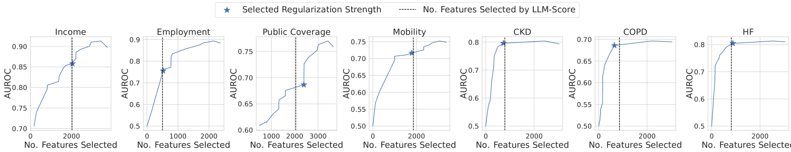

# LLM-Select：借助大型语言模型实现特征选择

发布时间：2024年07月02日

`LLM应用` `数据科学`

> LLM-Select: Feature Selection with Large Language Models

# 摘要

> 本研究揭示了大型语言模型（LLM）的一项惊人能力：仅凭输入特征名称和预测任务描述，LLM便能精准挑选出最具预测性的特征，其表现堪比数据科学领域的标准工具。这些模型在多种查询机制下均展现出此能力。例如，我们通过零-shot提示，让LLM为某个特征（如“血压”）在预测特定结果（如“心脏病”）中的重要性打分，无需额外信息。最新模型如GPT-4，无论查询方式或提示策略如何变化，都能稳定识别关键特征。我们在真实数据上的实验证实，基于LLM的特征选择始终保持强劲性能，与LASSO等数据驱动方法不相上下，尽管未曾接触下游训练数据。这表明LLM不仅可用于优化训练特征，还能指导数据收集决策，对医疗等高成本数据收集领域具有潜在价值。

> In this paper, we demonstrate a surprising capability of large language models (LLMs): given only input feature names and a description of a prediction task, they are capable of selecting the most predictive features, with performance rivaling the standard tools of data science. Remarkably, these models exhibit this capacity across various query mechanisms. For example, we zero-shot prompt an LLM to output a numerical importance score for a feature (e.g., "blood pressure") in predicting an outcome of interest (e.g., "heart failure"), with no additional context. In particular, we find that the latest models, such as GPT-4, can consistently identify the most predictive features regardless of the query mechanism and across various prompting strategies. We illustrate these findings through extensive experiments on real-world data, where we show that LLM-based feature selection consistently achieves strong performance competitive with data-driven methods such as the LASSO, despite never having looked at the downstream training data. Our findings suggest that LLMs may be useful not only for selecting the best features for training but also for deciding which features to collect in the first place. This could potentially benefit practitioners in domains like healthcare, where collecting high-quality data comes at a high cost.

[Arxiv](https://arxiv.org/abs/2407.02694)