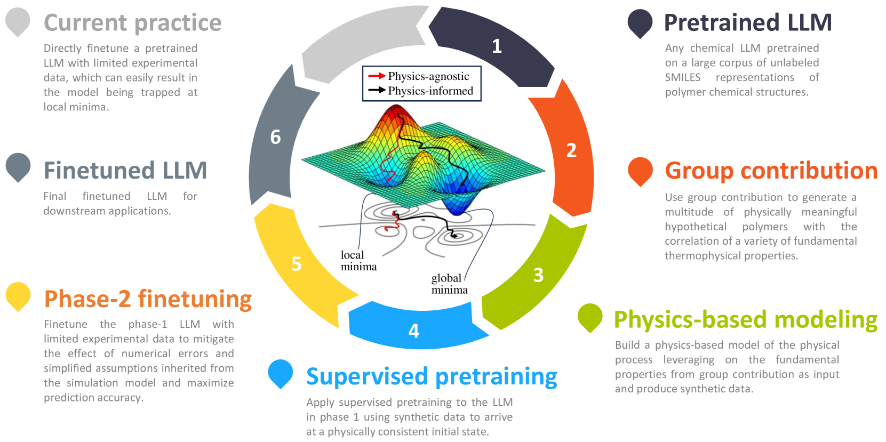
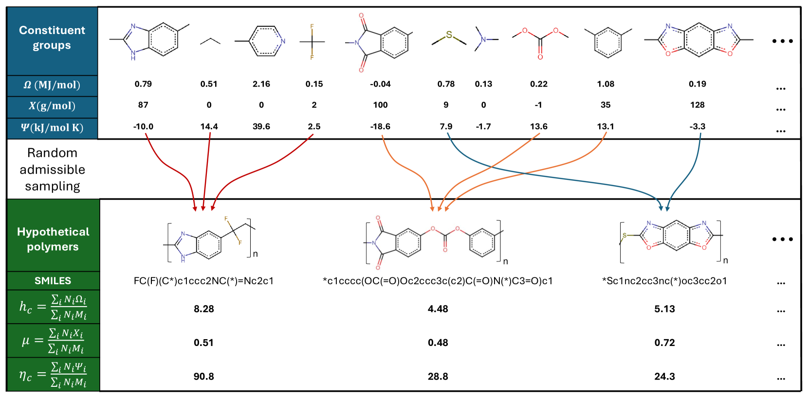

# 大型语言模型、物理建模与实验测量，三者共同构成了聚合物特性数据稀缺学习的核心。

发布时间：2024年07月02日

`LLM应用` `材料科学` `物理学`

> Large language models, physics-based modeling, experimental measurements: the trinity of data-scarce learning of polymer properties

# 摘要

> 大型语言模型 (LLM) 在材料建模领域展现出高效且精准的潜力，但其庞大的参数规模要求海量数据以确保准确性并防止过拟合。然而，实验数据的获取往往受限且成本高昂，难以满足微调需求。为此，我们设计了一套基于物理学的训练流程，专门应对数据稀缺的挑战。核心在于一个基于物理的建模框架，它能生成大量合成数据，确保 LLM 在微调前处于与物理事实一致的初始状态。我们的训练框架分为两个阶段：首先，利用大量但精度稍逊的合成数据进行监督预训练；其次，用有限的实验数据对预训练模型进行微调。通过研究聚合物可燃性指标（其中锥形量热仪数据稀缺），我们实证了监督预训练对于获得精准微调 LLM 的关键作用。

> Large language models (LLMs) bear promise as a fast and accurate material modeling paradigm for evaluation, analysis, and design. Their vast number of trainable parameters necessitates a wealth of data to achieve accuracy and mitigate overfitting. However, experimental measurements are often limited and costly to obtain in sufficient quantities for finetuning. To this end, we present a physics-based training pipeline that tackles the pathology of data scarcity. The core enabler is a physics-based modeling framework that generates a multitude of synthetic data to align the LLM to a physically consistent initial state before finetuning. Our framework features a two-phase training strategy: (1) utilizing the large-in-amount while less accurate synthetic data for supervised pretraining, and (2) finetuning the phase-1 model with limited experimental data. We empirically demonstrate that supervised pretraining is vital to obtaining accurate finetuned LLMs, via the lens of learning polymer flammability metrics where cone calorimeter data is sparse.

[Arxiv](https://arxiv.org/abs/2407.02770)