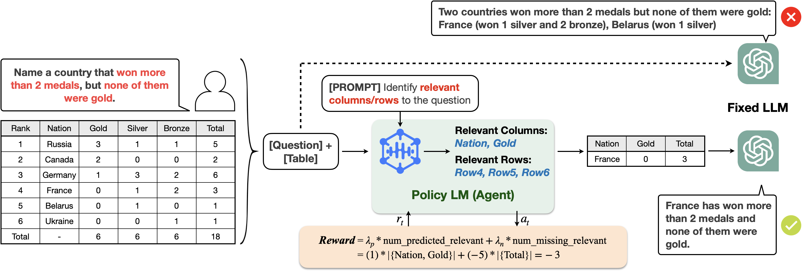
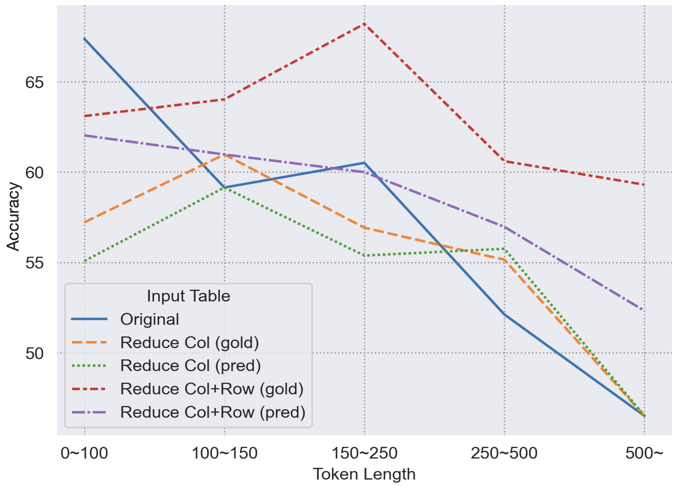
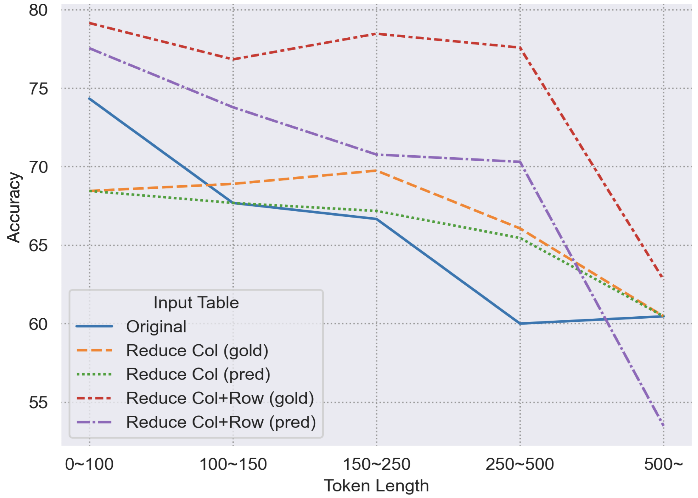

# 探索优化之道：提升大型语言模型在结构化数据处理中的表现

发布时间：2024年07月02日

`LLM应用` `人工智能` `数据处理`

> Learning to Reduce: Towards Improving Performance of Large Language Models on Structured Data

# 摘要

> 尽管大型语言模型 (LLM) 在众多下游任务中表现出色，但在结构化数据上的推理仍是一大挑战。为此，我们提出了“学习减少”框架，通过策略学习微调模型，生成简化版的结构化数据。相较于 GPT-4 等顶尖模型，“学习减少”不仅在简化数据方面表现卓越，还展现了跨数据集的泛化能力。此外，该框架微调的模型在长上下文的表格问答任务中尤为有效，显著提升了 LLM 的性能。

> Large Language Models (LLMs) have been achieving competent performance on a wide range of downstream tasks, yet existing work shows that inference on structured data is challenging for LLMs. This is because LLMs need to either understand long structured data or select the most relevant evidence before inference, and both approaches are not trivial. This paper proposes a framework, Learning to Reduce, that fine-tunes a language model with On-Policy Learning to generate a reduced version of an input structured data. When compared to state-of-the-art LLMs like GPT-4, Learning to Reduce not only achieves outstanding performance in reducing the input, but shows generalizability on different datasets. We further show that the model fine-tuned with our framework helps LLMs better perform on table QA tasks especially when the context is longer.

[Arxiv](https://arxiv.org/abs/2407.02750)