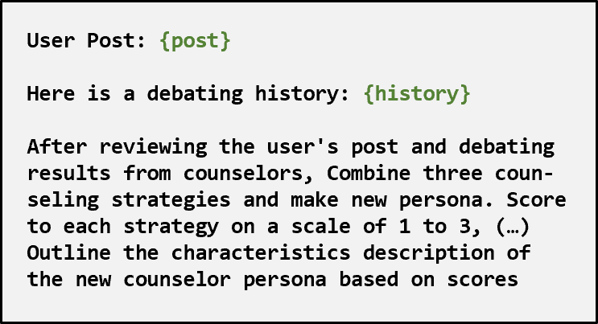
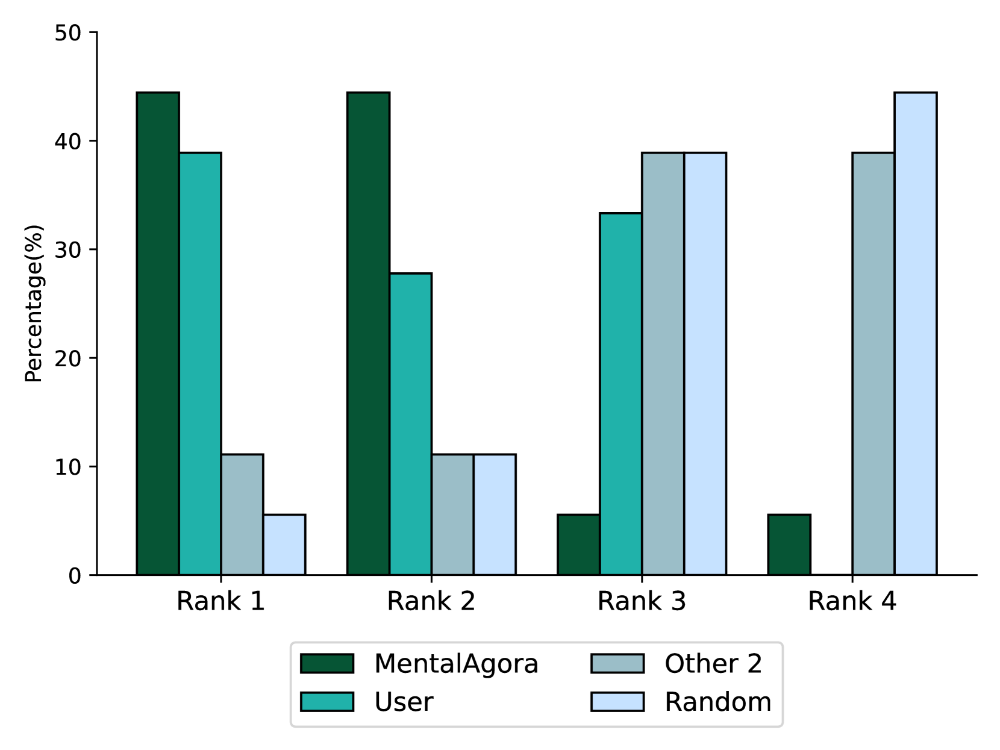

# MentalAgora：借助多代理辩论与属性控制，开启心理健康高级个性化护理之门

发布时间：2024年07月02日

`Agent` `心理健康` `数字医疗`

> MentalAgora: A Gateway to Advanced Personalized Care in Mental Health through Multi-Agent Debating and Attribute Control

# 摘要

> 随着全球心理健康问题的日益严重，急需先进的数字支持系统。我们推出的MentalAgora框架，通过多代理交互增强的大型语言模型，提供个性化心理健康支持。该框架通过战略辩论、定制咨询师创建和响应生成三个阶段，根据用户偏好和治疗需求动态调整响应。实验表明，MentalAgora生成的响应既符合专家标准，又强化了用户偏好。评估结果显示，MentalAgora不仅符合专业标准，还能有效满足用户需求，为数字心理健康干预树立了新标杆。

> As mental health issues globally escalate, there is a tremendous need for advanced digital support systems. We introduce MentalAgora, a novel framework employing large language models enhanced by interaction between multiple agents for tailored mental health support. This framework operates through three stages: strategic debating, tailored counselor creation, and response generation, enabling the dynamic customization of responses based on individual user preferences and therapeutic needs. We conduct experiments utilizing a high-quality evaluation dataset TherapyTalk crafted with mental health professionals, shwoing that MentalAgora generates expert-aligned and user preference-enhanced responses. Our evaluations, including experiments and user studies, demonstrate that MentalAgora aligns with professional standards and effectively meets user preferences, setting a new benchmark for digital mental health interventions.

[Arxiv](https://arxiv.org/abs/2407.02736)