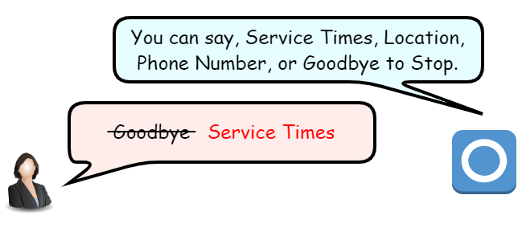
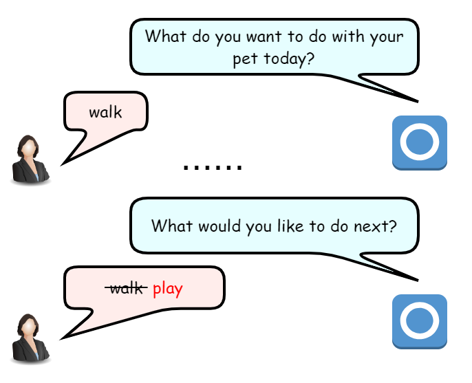
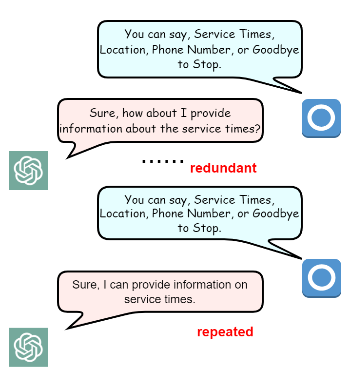
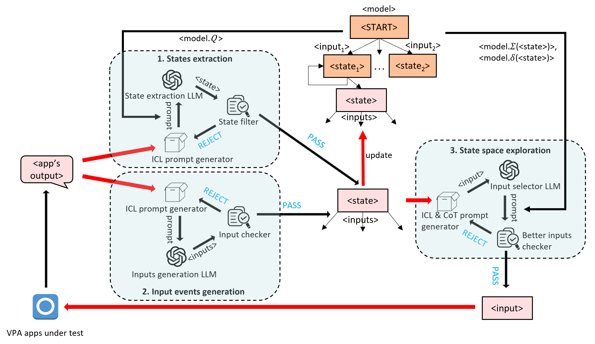
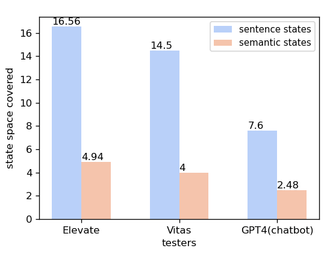
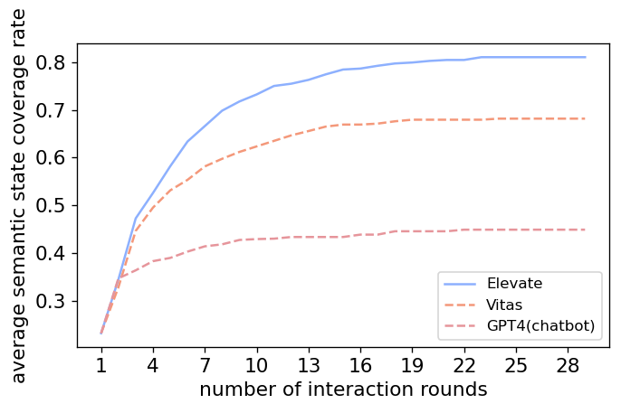
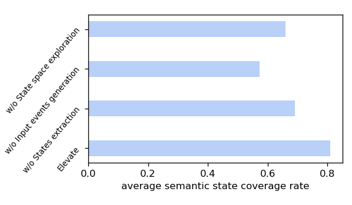
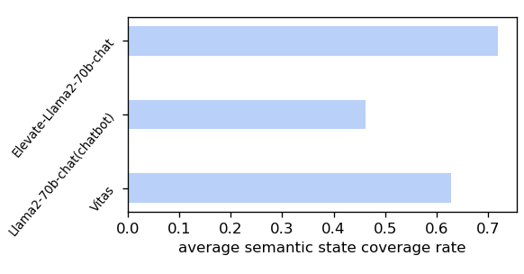
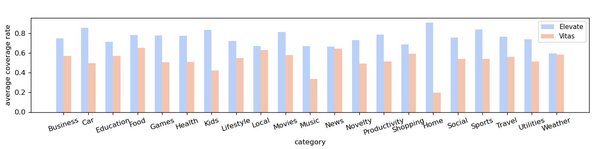

# 基于模型增强的 LLM 驱动，对 VPA 应用进行 VUI 测试

发布时间：2024年07月02日

`LLM应用` `智能家居` `语音助手`

> Model-Enhanced LLM-Driven VUI Testing of VPA Apps

# 摘要

> 围绕语音助手（如Amazon Alexa）的繁荣生态系统催生了大量VPA应用。尽管这些应用广受欢迎，但其开放性和易获取性也引发了安全、隐私和质量方面的担忧。为此，研究者提出了多种测试方法来系统评估VPA应用。针对VPA应用缺乏可视界面的特点，测试中采用了聊天机器人式和基于模型的两种策略。然而，前者在扩展搜索空间上缺乏有效指导，后者则在构建精确全面的行为模型上存在局限。为此，我们推出了Elevate框架，它结合了大型语言模型（LLM）的强大自然语言处理能力，以弥补基于模型测试中的语义信息损失。Elevate通过引导LLM从应用输出中提取状态并生成上下文相关输入，逐步构建行为模型，从而提高发现新状态的可能性。通过创新地将行为模型融入提示和基于上下文选择输入，Elevate有效连接了LLM与行为模型。在4,000个真实Alexa技能的测试中，Elevate相较于Vitas在状态空间覆盖率上提升了15%，并在效率上取得了显著进步。

> The flourishing ecosystem centered around voice personal assistants (VPA), such as Amazon Alexa, has led to the booming of VPA apps. The largest app market Amazon skills store, for example, hosts over 200,000 apps. Despite their popularity, the open nature of app release and the easy accessibility of apps also raise significant concerns regarding security, privacy and quality. Consequently, various testing approaches have been proposed to systematically examine VPA app behaviors. To tackle the inherent lack of a visible user interface in the VPA app, two strategies are employed during testing, i.e., chatbot-style testing and model-based testing. The former often lacks effective guidance for expanding its search space, while the latter falls short in interpreting the semantics of conversations to construct precise and comprehensive behavior models for apps. In this work, we introduce Elevate, a model-enhanced large language model (LLM)-driven VUI testing framework. Elevate leverages LLMs' strong capability in natural language processing to compensate for semantic information loss during model-based VUI testing. It operates by prompting LLMs to extract states from VPA apps' outputs and generate context-related inputs. During the automatic interactions with the app, it incrementally constructs the behavior model, which facilitates the LLM in generating inputs that are highly likely to discover new states. Elevate bridges the LLM and the behavior model with innovative techniques such as encoding behavior model into prompts and selecting LLM-generated inputs based on the context relevance. Elevate is benchmarked on 4,000 real-world Alexa skills, against the state-of-the-art tester Vitas. It achieves 15% higher state space coverage compared to Vitas on all types of apps, and exhibits significant advancement in efficiency.

[Arxiv](https://arxiv.org/abs/2407.02791)