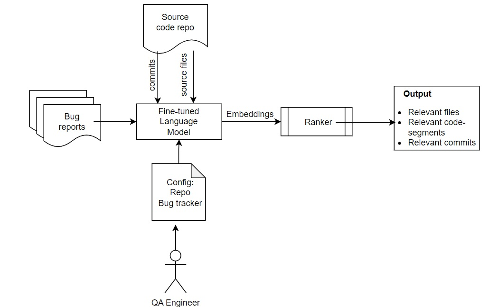
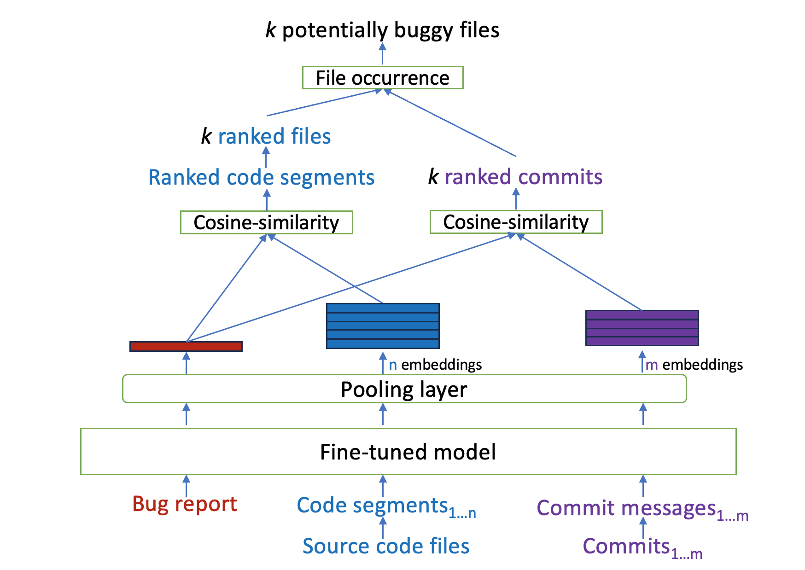
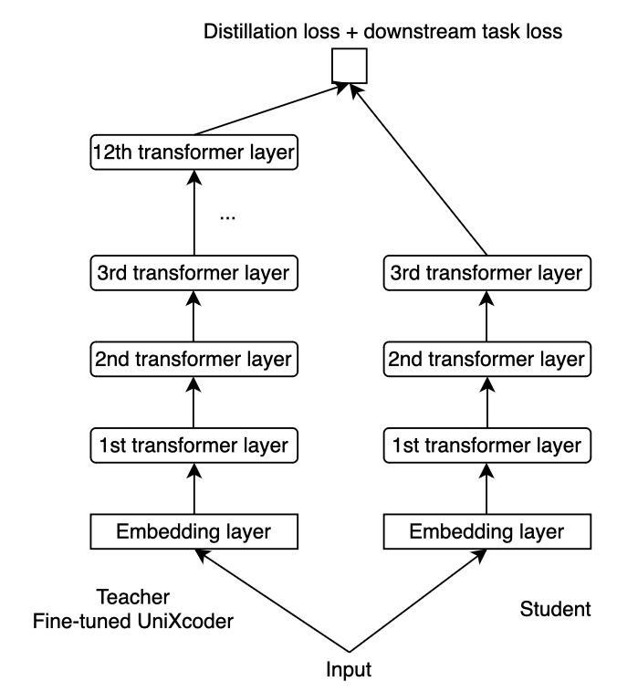

# 借助预训练语言模型，实现跨语言与跨项目的错误定位支持。

发布时间：2024年07月02日

`LLM应用` `软件开发` `人工智能`

> Supporting Cross-language Cross-project Bug Localization Using Pre-trained Language Models

# 摘要

> 在大型代码库中自动定位错误对开发者而言仍是一大挑战。现有技术因依赖特定应用数据和大型模型而难以通用和部署。本文提出一种基于预训练语言模型的创新技术，突破项目和语言限制，通过对比学习强化错误报告与源代码的表征，并结合提交信息与代码段进行精准排名。同时，引入知识蒸馏技术，在不损性能的前提下缩小模型尺寸，便于实际应用。本技术通过融合代码段与提交消息分析，提升错误定位精度，且在通用性上表现卓越，能有效识别新代码库中的错误。为应对计算限制，我们设计了CPU兼容方案。总之，这项技术高效、通用，极具实际应用潜力。

> Automatically locating a bug within a large codebase remains a significant challenge for developers. Existing techniques often struggle with generalizability and deployment due to their reliance on application-specific data and large model sizes. This paper proposes a novel pre-trained language model (PLM) based technique for bug localization that transcends project and language boundaries. Our approach leverages contrastive learning to enhance the representation of bug reports and source code. It then utilizes a novel ranking approach that combines commit messages and code segments. Additionally, we introduce a knowledge distillation technique that reduces model size for practical deployment without compromising performance.
  This paper presents several key benefits. By incorporating code segment and commit message analysis alongside traditional file-level examination, our technique achieves better bug localization accuracy. Furthermore, our model excels at generalizability - trained on code from various projects and languages, it can effectively identify bugs in unseen codebases. To address computational limitations, we propose a CPU-compatible solution. In essence, proposed work presents a highly effective, generalizable, and efficient bug localization technique with the potential to real-world deployment.

[Arxiv](https://arxiv.org/abs/2407.02732)