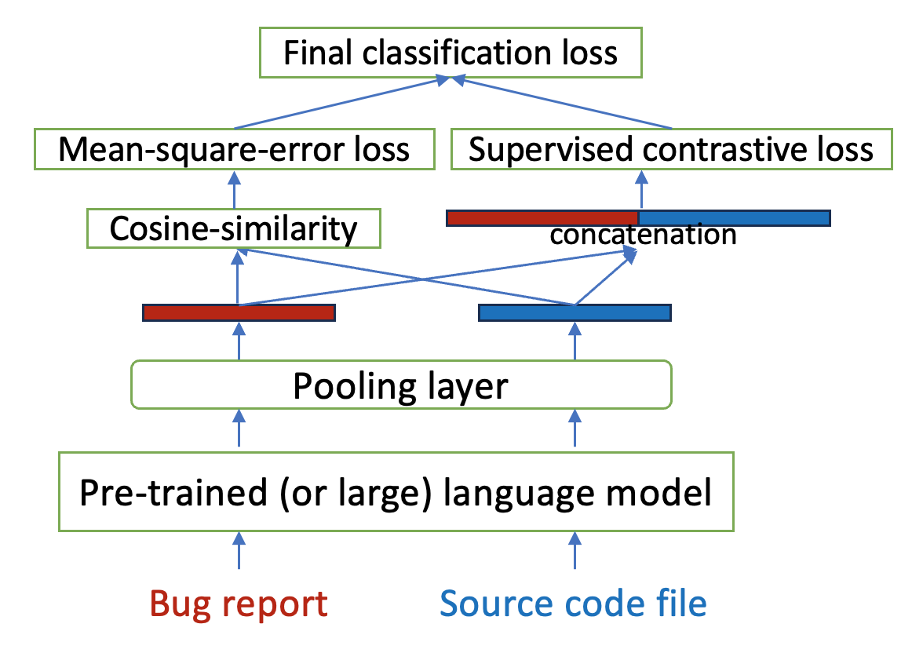

# 借助预训练语言模型，实现跨语言与跨项目的错误定位支持。

发布时间：2024年07月02日

`LLM应用` `软件开发` `人工智能`

> Supporting Cross-language Cross-project Bug Localization Using Pre-trained Language Models

# 摘要

> 在庞大的代码库中自动查找错误，一直是开发者的一大难题。现有技术因依赖特定应用数据和大型模型而难以广泛应用。本文介绍了一种创新的预训练语言模型（PLM）技术，能跨越项目和语言的限制进行错误定位。我们采用对比学习强化错误报告与源代码的特征，并结合提交信息与代码片段进行精准排序。同时，通过知识蒸馏技术，我们缩小了模型尺寸，确保了实际应用中的高效性能。我们的方法不仅提升了错误定位的精确度，还展现了卓越的通用性——在多样化的代码训练后，能有效识别新代码库中的错误。为应对计算资源限制，我们设计了兼容CPU的解决方案。总之，这项技术高效、通用，且具备实际应用的潜力。

> Automatically locating a bug within a large codebase remains a significant challenge for developers. Existing techniques often struggle with generalizability and deployment due to their reliance on application-specific data and large model sizes. This paper proposes a novel pre-trained language model (PLM) based technique for bug localization that transcends project and language boundaries. Our approach leverages contrastive learning to enhance the representation of bug reports and source code. It then utilizes a novel ranking approach that combines commit messages and code segments. Additionally, we introduce a knowledge distillation technique that reduces model size for practical deployment without compromising performance.
  This paper presents several key benefits. By incorporating code segment and commit message analysis alongside traditional file-level examination, our technique achieves better bug localization accuracy. Furthermore, our model excels at generalizability - trained on code from various projects and languages, it can effectively identify bugs in unseen codebases. To address computational limitations, we propose a CPU-compatible solution. In essence, proposed work presents a highly effective, generalizable, and efficient bug localization technique with the potential to real-world deployment.

[Arxiv](https://arxiv.org/abs/2407.02732)