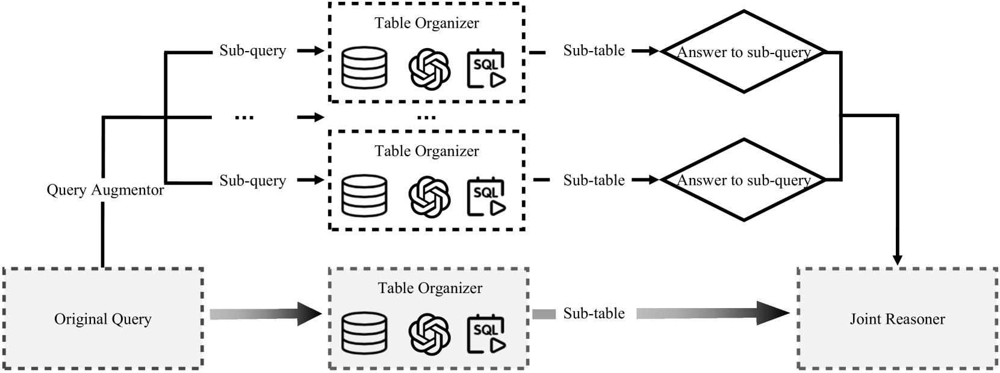
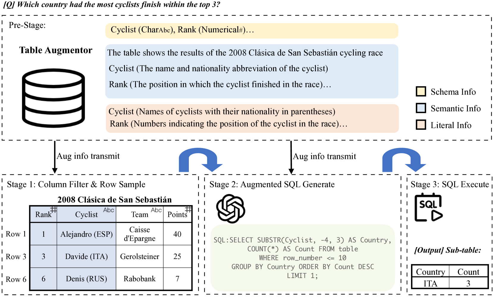
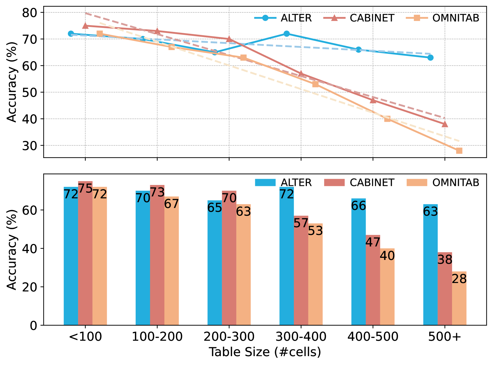
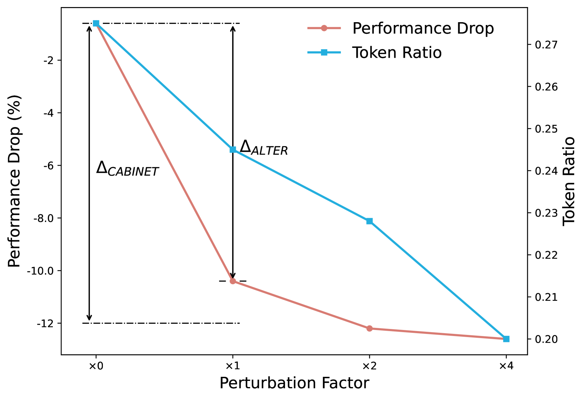
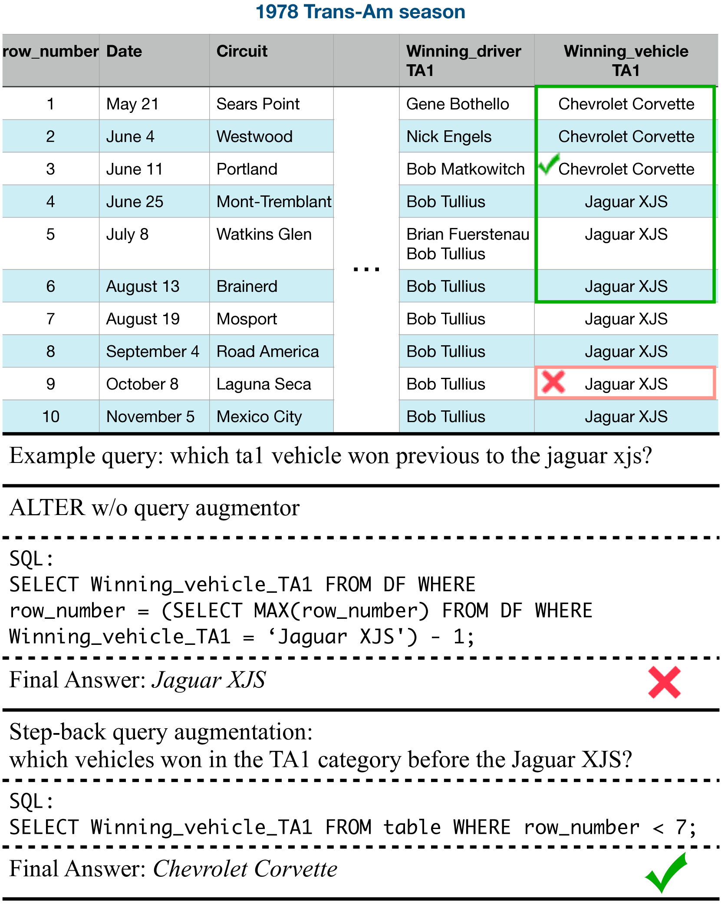
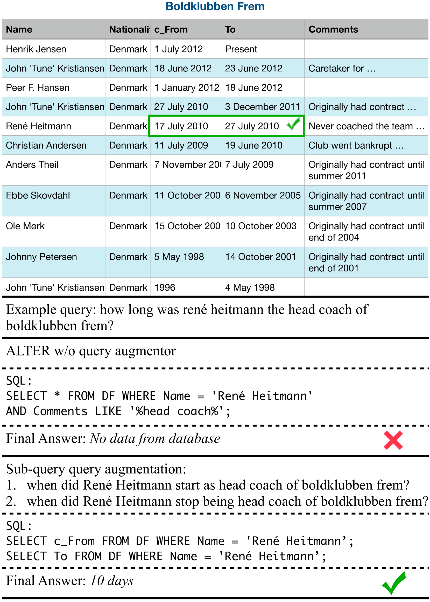
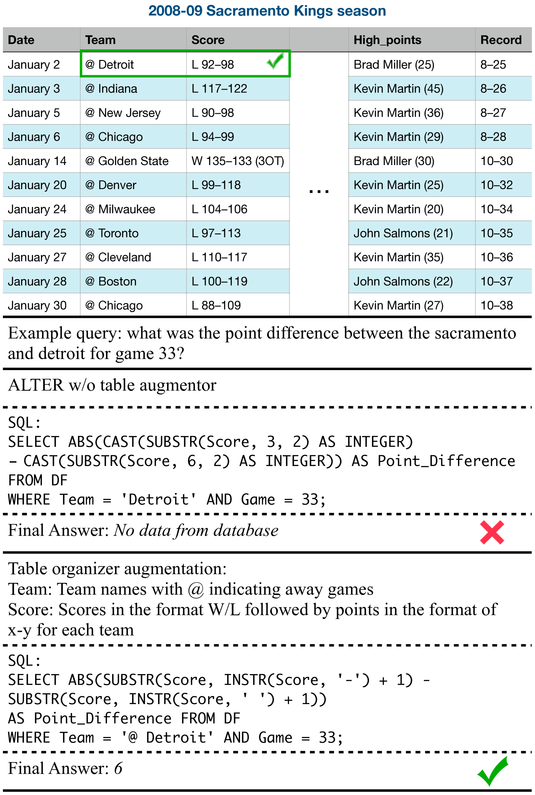

# ALTER：大型表格推理的增强方案

发布时间：2024年07月03日

`LLM应用` `数据分析` `人工智能`

> ALTER: Augmentation for Large-Table-Based Reasoning

# 摘要

> 尽管已有研究尝试利用大型语言模型 (LLM) 进行基于表格的推理，但多数方法在处理大型表格时面临可扩展性挑战。为此，我们推出了 ALTER 框架，该框架通过查询增强器和表格增强器，有效利用自然语言问题和半结构化表格数据的潜在增强能力。ALTER 通过精选表格数据子集并结合预增强的信息，显著提升了基于表格推理任务的性能。此外，我们还深入分析了大型表格应用场景，对比了多种方法和分区策略。在这些复杂场景中，ALTER 不仅表现卓越，还展现了出色的鲁棒性和效率。

> While extensive research has explored the use of large language models (LLMs) for table-based reasoning, most approaches struggle with scalability when applied to large tables. To maintain the superior comprehension abilities of LLMs in these scenarios, we introduce ALTER(Augmentation for Large-Table-Based Reasoning)-a framework designed to harness the latent augmentation potential in both free-form natural language (NL) questions, via the query augmentor, and semi-structured tabular data, through the table augmentor. By utilizing only a small subset of relevant data from the table and supplementing it with pre-augmented schema, semantic, and literal information, ALTER achieves outstanding performance on table-based reasoning benchmarks. We also provide a detailed analysis of large-table scenarios, comparing different methods and various partitioning principles. In these scenarios, our method outperforms all other approaches and exhibits robustness and efficiency against perturbations.

[Arxiv](https://arxiv.org/abs/2407.03061)