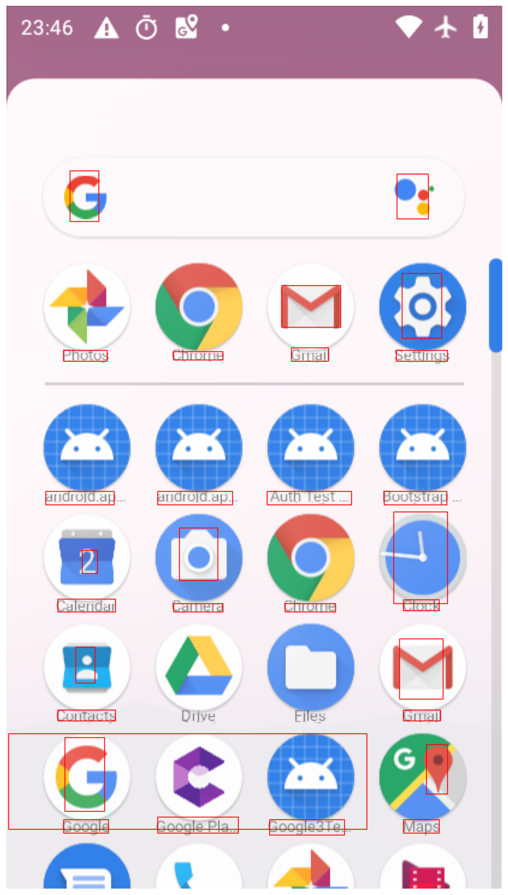
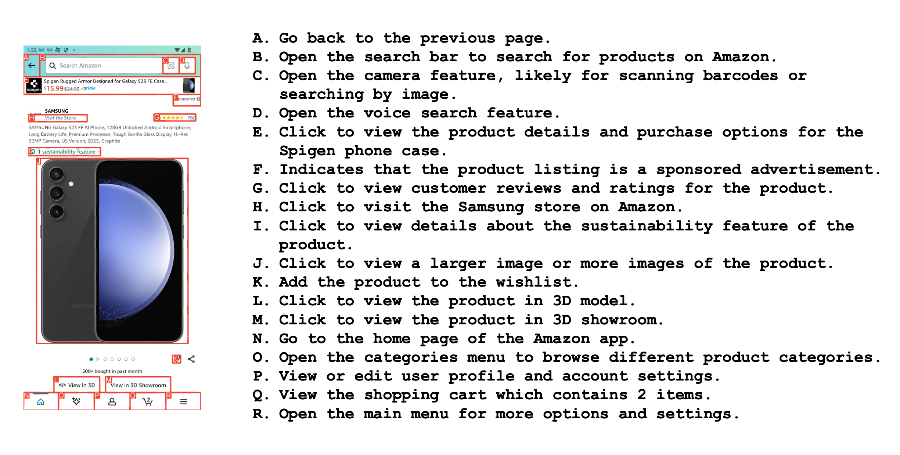

# AMEX：专为移动 GUI 代理设计的 Android 多注释数据集

发布时间：2024年07月03日

`Agent` `移动应用` `人工智能`

> AMEX: Android Multi-annotation Expo Dataset for Mobile GUI Agents

# 摘要

> AI代理因其感知环境、理解任务和自主实现目标的能力而备受瞩目。为推动移动场景中AI代理的研究，我们推出了Android Multi-annotation EXpo（AMEX），一个专为通用移动GUI控制代理设计的大型综合数据集。该数据集通过直接与移动设备上的图形用户界面（GUI）交互，训练和评估代理完成复杂任务的能力。AMEX包含来自110个流行应用的104K张高分辨率截图，并在多个层级上进行了详细标注。与现有数据集不同，AMEX提供三个级别的标注：GUI交互元素定位、GUI屏幕和元素功能描述以及复杂的自然语言指令，每个指令平均包含13个步骤，每个步骤都有详细的GUI动作链。我们从更具指导性和详细性的角度开发了AMEX，补充了现有数据集的一般设置。此外，我们还开发了基准模型SPHINX Agent，并将其性能与其他数据集上训练的最先进代理进行了比较。为促进进一步研究，我们开源了数据集、模型和相关评估工具，项目详情请访问https://yuxiangchai.github.io/AMEX/。

> AI agents have drawn increasing attention mostly on their ability to perceive environments, understand tasks, and autonomously achieve goals. To advance research on AI agents in mobile scenarios, we introduce the Android Multi-annotation EXpo (AMEX), a comprehensive, large-scale dataset designed for generalist mobile GUI-control agents. Their capabilities of completing complex tasks by directly interacting with the graphical user interface (GUI) on mobile devices are trained and evaluated with the proposed dataset. AMEX comprises over 104K high-resolution screenshots from 110 popular mobile applications, which are annotated at multiple levels. Unlike existing mobile device-control datasets, e.g., MoTIF, AitW, etc., AMEX includes three levels of annotations: GUI interactive element grounding, GUI screen and element functionality descriptions, and complex natural language instructions, each averaging 13 steps with stepwise GUI-action chains. We develop this dataset from a more instructive and detailed perspective, complementing the general settings of existing datasets. Additionally, we develop a baseline model SPHINX Agent and compare its performance across state-of-the-art agents trained on other datasets. To facilitate further research, we open-source our dataset, models, and relevant evaluation tools. The project is available at https://yuxiangchai.github.io/AMEX/

[Arxiv](https://arxiv.org/abs/2407.17490)