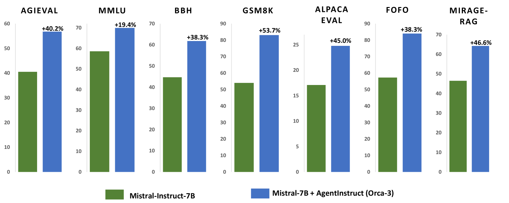
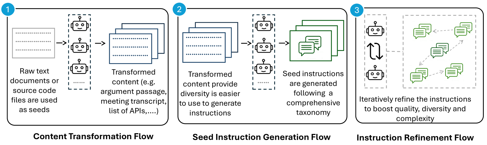
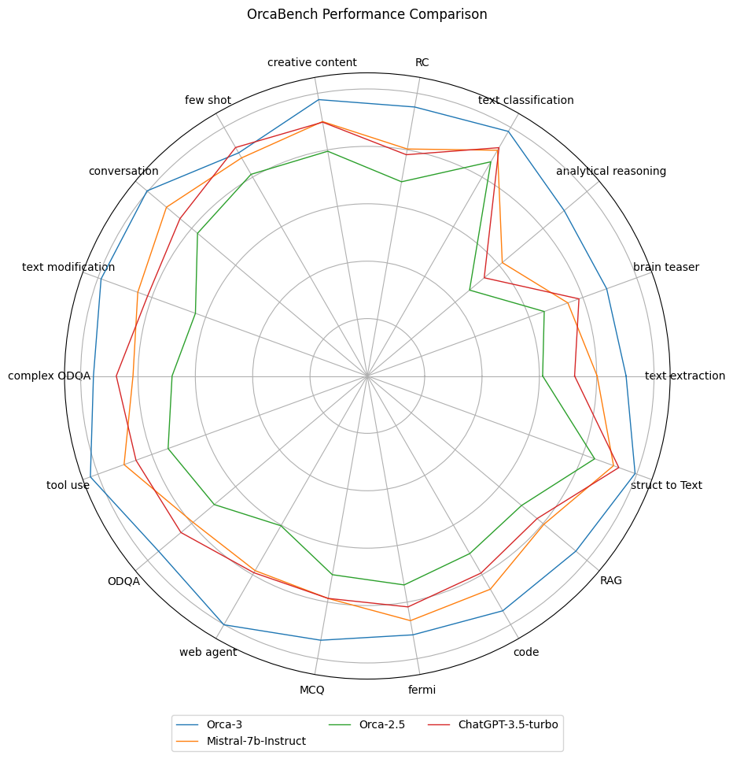

# AgentInstruct：迈向结合生成教学与代理流的新境界

发布时间：2024年07月03日

`Agent` `人工智能`

> AgentInstruct: Toward Generative Teaching with Agentic Flows

# 摘要

> 合成数据在推动语言模型发展中扮演着日益关键的角色。尽管其应用已取得一些成功，但模型崩溃和模仿缺陷的问题也引起了关注。这些问题的根源在于合成数据的质量和多样性参差不齐。要有效利用合成数据，往往需要大量的人工筛选。我们专注于利用合成数据进行模型后训练，即通过高级模型生成数据，传授新技能给其他模型，这一过程我们称之为“生成教学”。为此，我们开发了AgentInstruct框架，它能自动生成大量高质量且多样化的合成数据。该框架仅需文本和代码等原始数据作为种子，即可生成提示和响应。我们通过构建一个包含2500万对的数据集，展示了AgentInstruct的实际应用，该数据集涵盖了文本编辑、创意写作、工具操作、编程和阅读理解等多种技能。这一数据集可广泛应用于各类基础模型的指令微调。我们利用这些数据对Mistral-7b进行了后训练，结果显示，与基于相同基础模型的Mistral-7b-Instruct相比，新模型Orca-3在多项基准测试中取得了显著进步，如在AGIEval上提升了40%，在MMLU上提升了19%，在GSM8K上提升了54%，在BBH上提升了38%，在AlpacaEval上提升了45%。此外，Orca-3在性能上持续超越了LLAMA-8B-instruct和GPT-3.5-turbo等其他模型。

> Synthetic data is becoming increasingly important for accelerating the development of language models, both large and small. Despite several successful use cases, researchers also raised concerns around model collapse and drawbacks of imitating other models. This discrepancy can be attributed to the fact that synthetic data varies in quality and diversity. Effective use of synthetic data usually requires significant human effort in curating the data. We focus on using synthetic data for post-training, specifically creating data by powerful models to teach a new skill or behavior to another model, we refer to this setting as Generative Teaching. We introduce AgentInstruct, an extensible agentic framework for automatically creating large amounts of diverse and high-quality synthetic data. AgentInstruct can create both the prompts and responses, using only raw data sources like text documents and code files as seeds. We demonstrate the utility of AgentInstruct by creating a post training dataset of 25M pairs to teach language models different skills, such as text editing, creative writing, tool usage, coding, reading comprehension, etc. The dataset can be used for instruction tuning of any base model. We post-train Mistral-7b with the data. When comparing the resulting model Orca-3 to Mistral-7b-Instruct (which uses the same base model), we observe significant improvements across many benchmarks. For example, 40% improvement on AGIEval, 19% improvement on MMLU, 54% improvement on GSM8K, 38% improvement on BBH and 45% improvement on AlpacaEval. Additionally, it consistently outperforms other models such as LLAMA-8B-instruct and GPT-3.5-turbo.

[Arxiv](https://arxiv.org/abs/2407.03502)