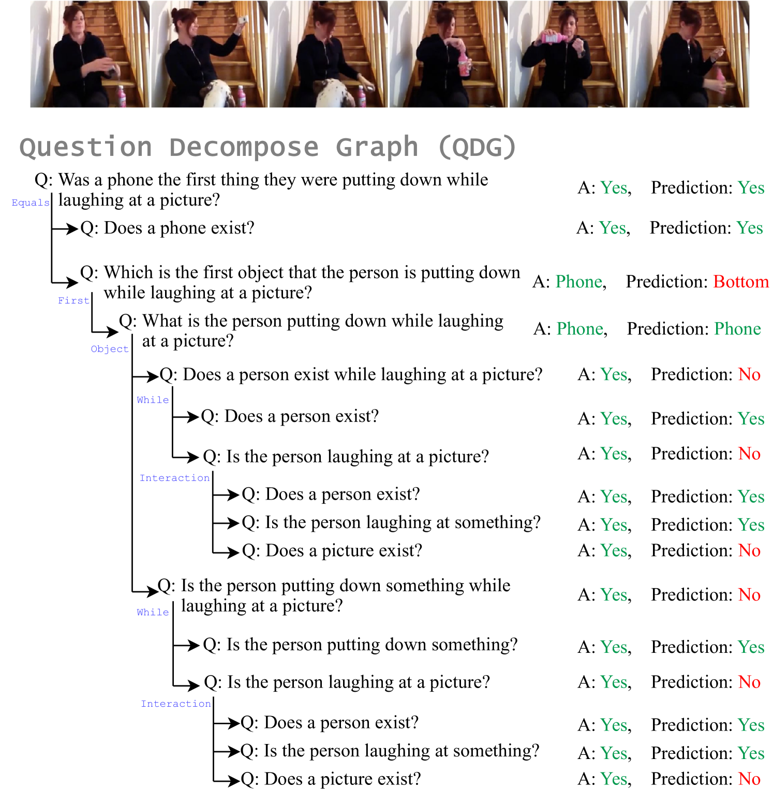
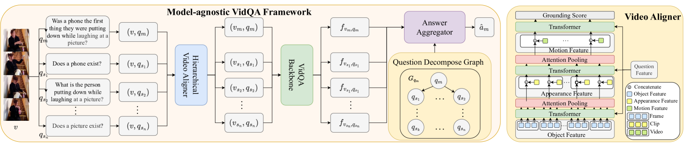
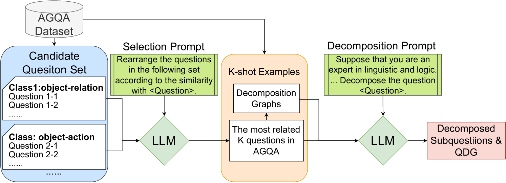
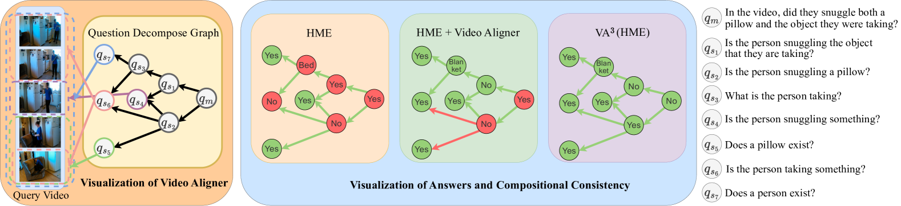

# 通过视频对齐与答案聚合，实现组合推理，提升视频问答的准确性。

发布时间：2024年07月03日

`LLM应用` `视频处理` `问答系统`

> Align and Aggregate: Compositional Reasoning with Video Alignment and Answer Aggregation for Video Question-Answering

# 摘要

> 尽管视频问答 (VideoQA) 领域近期有所进展，但这些方法常作为黑箱，难以理解其推理过程和保持组合推理的一致性。为此，我们设计了一个模型无关的视频对齐与答案聚合框架 (VA$^{3}$)，通过整合视频对齐器和答案聚合器，提升现有 VidQA 方法的组合一致性和准确性。视频对齐器根据问题筛选相关视频片段，答案聚合器则依据子问题推导答案，确保组合一致性。我们在 AGQA-Decomp 数据集上进行了评估，并引入了新指标来全面衡量组合一致性。此外，我们利用大型语言模型 (LLM) 开发了自动问题分解流程，扩展了 MSVD 和 NExT-QA 数据集，以广泛评估 VA$^3$ 框架。实验结果显示，该框架有效提升了方法的组合一致性和准确性，使实际 VidQA 模型更具解释性。

> Despite the recent progress made in Video Question-Answering (VideoQA), these methods typically function as black-boxes, making it difficult to understand their reasoning processes and perform consistent compositional reasoning. To address these challenges, we propose a \textit{model-agnostic} Video Alignment and Answer Aggregation (VA$^{3}$) framework, which is capable of enhancing both compositional consistency and accuracy of existing VidQA methods by integrating video aligner and answer aggregator modules. The video aligner hierarchically selects the relevant video clips based on the question, while the answer aggregator deduces the answer to the question based on its sub-questions, with compositional consistency ensured by the information flow along question decomposition graph and the contrastive learning strategy. We evaluate our framework on three settings of the AGQA-Decomp dataset with three baseline methods, and propose new metrics to measure the compositional consistency of VidQA methods more comprehensively. Moreover, we propose a large language model (LLM) based automatic question decomposition pipeline to apply our framework to any VidQA dataset. We extend MSVD and NExT-QA datasets with it to evaluate our VA$^3$ framework on broader scenarios. Extensive experiments show that our framework improves both compositional consistency and accuracy of existing methods, leading to more interpretable real-world VidQA models.

[Arxiv](https://arxiv.org/abs/2407.03008)